## Od virov do pametnejših agentov {.motivation-infographic}

{.motivation-art}

::: notes :::
To je zgodba današnje delavnice v eni sliki.

Na levi imamo podatke, ki obstajajo, vendar so razpršeni po tabelah, bazah, dokumentih in zemljevidih. Vsak vir je zase uporaben, skupaj pa še ne govorijo istega jezika.

Ko vire enolično poimenujemo, jim dodamo formalen pomen in jih povežemo, dobimo semantični graf oziroma podatke v obliki 5 ★.

Tak graf ni cilj sam po sebi. Je zanesljiva osnova, na kateri lahko inteligentni agent poveže dejstva iz več virov, razume njihove odnose ter pripravi boljši in preverljiv odgovor ali dejanje.

Danes bomo ta prehod naredili korak za korakom: od tabele prek RDF-ja in ontologije do povezanega grafa in poizvedovanja.
:::

## Agenda

1. Uvod: Zakaj semantično opisovanje podatkov?
2. Od izvornih podatkov (1 ★) do odprtih podatkov (3 ★)
3. Raven 4 ★: semantični opis podatkov z RDF
4. Formalizacija podatkovnega modela z ontologijami
5. Raven 5 ★: povezani podatki in zunanji viri
6. Uporaba semantično opisanih podatkov s SPARQL
7. Sklepanje: prehod od podatkov k znanju
8. Za konec: kdaj se semantika izplača

::: notes :::
Najprej si bomo pogledali, zakaj sploh govorimo o semantičnem opisovanju podatkov in kakšen problem v praksi rešujemo.

Potem bomo postopno šli čez model 5 ★ odprtih podatkov:

– od osnovnih izvornih podatkov,  
– prek odprtih formatov,  
– do semantičnega opisa z RDF in ontologijami.

V zadnjem delu pa bomo pokazali, kaj pridobimo s povezovanjem podatkov in kako iz podatkov pridemo do znanja z uporabo sklepanja.

Posamezna poglavja bomo obravnavali z realnimi primeri in demonstracijami v urejevalniku besedil Visual Studio Code in urejevalniku ontologij Protégé.

Na koncu pa bomo pogledali, kdaj se semantika izplača v praksi – z merljivimi primeri iz gospodarstva in z napotki, kako začeti.

Začnimo torej pri vprašanju, zakaj klasični podatkovni pristopi danes pogosto ne zadoščajo.
:::

# 1. Uvod: Zakaj semantično opisovanje podatkov?

::: notes :::
Najprej postavimo kontekst:

– zakaj klasični podatkovni pristopi niso več dovolj,  
– zakaj imamo danes veliko podatkov, a malo uporabnih, da poiščemo odgovore,  
– in zakaj je semantična interoperabilnost ključna za povezovanje sistemov. 
:::

## GenUI in semantične tehnologije

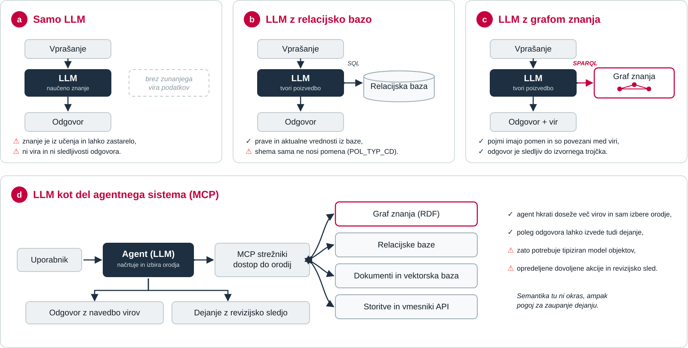

::: notes :::
Preden se lotimo podatkov, postavimo okvir: kje v današnjih rešitvah z umetno inteligenco sploh nastopi semantika.

Poglejmo štiri postavitve, ki jih danes srečamo v praksi.

Prva, samo LLM. Model odgovarja iz tega, kar se je naučil med učenjem. Za pisanje besedil je to povsem dovolj, za poslovno odločanje pa ne: znanje je lahko zastarelo, predvsem pa odgovor nima vira, ki bi ga lahko preverili.

Druga, LLM z relacijsko bazo. Model iz vprašanja tvori poizvedbo SQL in vrne prave, aktualne vrednosti. To je danes najpogostejša postavitev. Njena šibka točka je, da shema baze pomena ne nosi – stolpec s kratico kot POL_TYP_CD modelu ne pove ničesar in prav tu nastane večina napak.

Tretja, LLM z grafom znanja. Podatki so opisani s pojmi in povezavami, model pa tvori poizvedbo SPARQL. Poleg odgovora dobimo tudi pot do izvornega trojčka, torej sledljivost. To je točno tisto, kar bomo danes gradili od začetka do konca.

Četrta, agentni sistem. Agent ima prek strežnikov MCP na voljo več virov hkrati – graf znanja, relacijske baze, dokumente z vektorsko bazo in zunanje storitve – ter sam izbere, katero orodje bo uporabil. Ključna razlika je, da lahko poleg odgovora tudi ukrepa.

In prav zato, ker agent ukrepa, potrebuje tipiziran model objektov, opredeljene dovoljene akcije in revizijsko sled. Semantika tu ni okras, ampak pogoj, da dejanju sploh lahko zaupamo.

Namig za izvedbo: vprašajte dvorano, katero od teh štirih postavitev že uporabljajo. Praviloma se večina javi pri prvi in drugi – kar je dobra iztočnica za celoten dan.
:::

## Namen delavnice

### Problem &gt; tehnologija

- Zakaj objava podatkov ni dovolj?
- Kaj dejansko rešuje semantika?
- Pomen interoperabilnosti in ponovne uporabe podatkov.

::: notes :::
V okviru delavnice želimo praktično pojasniti štiri ključne stvari.

1. Zakaj klasično objavljanje podatkov – tudi če so odprti in v CSV obliki – v praksi pogosto ne zadostuje za odgovarjanje na kompleksna vprašanja.
2. Kako postopno dosežemo višje ravni odprtosti podatkov in kaj vsaka od teh ravni dejansko pomeni v praksi.
3. Kakšen problem semantično opisovanje podatkov sploh rešuje: ne gre za tehnologijo samo, temveč za povezovanje razdrobljenih podatkov.
4. Zakaj je to še posebej pomembno pri interoperabilnosti in ponovni uporabi, kjer se podatki pogosto zbirajo večkrat, niso povezljivi in niso pripravljeni za ponovno uporabo.

Pomembni poudarki:

- poudarek delavnice ni na tehnologiji, ampak **na problemu**,
- in **dodani vrednosti**, ki jo **semantično opisovanje** prinaša.

:::

## Motivacija

### Podatki obstajajo – odgovori na vprašanje pa ne

- Razpršeni podatki,
- različni viri,
- različni pomeni.

::: notes :::
Poglejmo realen problem, s katerim se pogosto srečamo v praksi.

Vprašanje je: "Katere občine imajo največ prebivalcev, katere šole imajo tam sedež in kakšna je nadmorska višina teh območij?"

Na prvi pogled se zdi, da so vsi ti podatki že na voljo. V resnici pa so razpršeni po različnih institucijah: CRP, SURS, MIZŠ, OSM, Wikidata.

Poleg tega uporabljajo različne identifikatorje, različna poimenovanja in različne strukture podatkov.

Z eno Excel ali CSV datoteko tega vprašanja preprosto ne moremo rešiti.

Zato potrebujemo način, kjer podatki govorijo isti jezik, so medsebojno povezljivi in računalniku razumljivi. Tu nastopi semantično opisovanje podatkov.
:::

## Od podatkov do znanja

### Struktura ≠ pomen

- **Podatek** (npr. `298.000`),
- **Informacija** (Število prebivalcev Ljubljane.),
- **Metapodatek** (Kaj ta številka pomeni, za katero leto, vir, metodologija.),
- **Znanje** (Sklepanje, povezovanje, odgovori na kompleksna vprašanja, npr. Ljubljana je največje mesto v Sloveniji z 298.000 prebivalci (podatki iz leta 2023, SURS).).

::: notes :::
Zelo pogosta napačna predstava je, da so strukturirani podatki že semantično bogati podatki. To ne drži.

Primer: Številka `298.000` je sama po sebi samo podatek.

Ko rečemo, da gre za število prebivalcev Ljubljane, smo že na ravni informacije.

Ko dodamo še leto, vir in metodologijo, govorimo o metapodatkih.

Znanje pa nastane šele takrat, ko lahko iz teh podatkov sklepamo in odgovarjamo na vprašanja, na primer da je Ljubljana največje mesto v Sloveniji na podlagi podatkov SURS za določeno leto.

Ključno sporočilo: lepo strukturirana CSV datoteka ne pove, kaj stolpci dejansko pomenijo. Struktura ne predstavlja semantike.
:::

## Zakaj je to pomembno?

### Interoperabilnost in ponovna uporaba

- veliko podatkov,
- veliko podvajanja,
- malo povezovanja.

::: notes :::
V današnjem času upravljamo z zelo velikimi količinami podatkov.

Ti podatki se pogosto zbirajo večkrat, niso enotno opisani in niso pripravljeni za povezovanje ali ponovno uporabo.

Semantična interoperabilnost omogoča:

– zmanjševanje podvajanja,  
– ponovno uporabo podatkov,  
– boljše, podatkovno podprto odločanje.

Ta pristop je neposredno povezan s cilji digitalne preobrazbe javne uprave in z načeli **FAIR**: Findable, Accessible, Interoperable, Reusable.

Semantično opisovanje ni nekaj dodatnega, ampak temelj za smiselno upravljanje podatkov v javnem sektorju.
:::

## Kaj ni semantično opisovanje?

### Pogoste zmote

- ❌ _"Samo za raziskovalce."_
- ❌ _"Najprej moramo razviti ontologijo."_
- ❌ _"Preveč kompleksno za praktično uporabo."_

::: notes :::
Pogosto obstajajo napačne predstave o semantičnem opisovanju podatkov.

Na primer:

- da je to namenjeno samo raziskovalcem,
- da je treba najprej zgraditi ontologijo,
- ali da je to preveč kompleksno za prakso.

Ključno vodilo delavnice je ravno obratno: ne gradimo ontologije zaradi ontologije.

Rešujemo konkreten problem povezovanja podatkov z namenom odgovarjanja na kompleksna vprašanja. Tehnologija je samo sredstvo.
:::

## Ključni pojmi - poenostavljeno

### Enostavne analogije

- URI
- RDF
- Ontologija
- SPARQL
- Linked Data

::: notes :::
Pri delavnici bomo uporabljali zelo preproste razlage pojmov.

**URI** je enoličen, nespremenljiv naslov, ne samo ID v tabeli.

**RDF** je način, kako računalniku povemo, kdo je kdo in kako so stvari povezane.

**Ontologija** je formalen opis pojmov in odnosov, nekakšna nadgradnja sheme.

**SPARQL** je poizvedovalni jezik, primerljiv z Googlom za splet ali SQL-om za relacijske baze, le da deluje nad grafi.

**Povezani podatki** pa pomenijo, da podatke povezujemo z uporabo URI-jev in jih lahko integriramo iz različnih virov.
:::

## 🧑‍💻 Primer iz prakse

### Semantika dandanes

- Spletni članki,
- iskanje,
- povezovanje vsebin.

<div class="exercise-promo-compact">
  <p class="exercise-promo-label"><strong>INTERAKTIVNA VAJA</strong></p>
  <p class="exercise-promo-title">
    <a href="./vaje/semantika-na-spletu/json-ld/kaj-pove-json-ld/" target="_blank" rel="noopener">Kaj pove JSON-LD? ↗</a>
  </p>
</div>

::: columns

:::: column

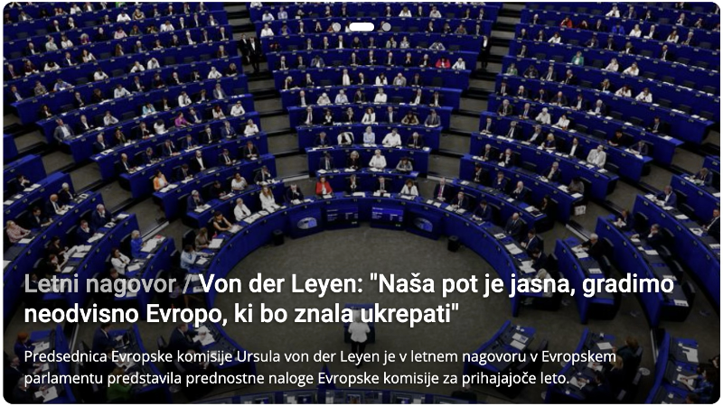

::::

:::: column

```{text}
{
  "@context": "https://schema.org",
  "@type": "NewsArticle",
  "mainEntityOfPage": {
    "@type": "WebPage",
    ...
  },
  "headline": ...,
  "image": ...,
  "datePublished": "2026-09-16 06:53:59",
  "author": { ... },
  "publisher": {
    "@type": "Organization",
    "name": "RTV Slovenija",
    "logo": { ... }
  }
}
```


::::

:::

::: notes :::
Če pogledamo poljuben članek na RTV Slovenija, lahko opazimo, da je delno semantično opisan.

V izvorni kodi strani je prisoten JSON-LD zapis, ki uporablja standard schema.org.

S tem so formalno opisani pojmi, kot so novica, naslov, avtor, datum objave in izdajatelj.

To omogoča boljše iskanje, indeksiranje in povezovanje vsebin.

Pomembno je sporočilo: semantično opisovanje ni teorija prihodnosti, ampak nekaj, kar se že danes uporablja v praksi.

Schema.org ni edini tak primer. Poznamo še številne druge formalne opredelitve
v obliki besednjakov in ontologij, kot so:

– **FOAF (Friend Of A Friend)** za opis oseb in njihovih povezav,  
– **Dublin Core (DC)** za splošne metapodatke,  
– **SKOS (Simple Knowledge Organization System)** za šifrante in taksonomije,  
– in **DCAT (Data Catalog Vocabulary)**,
ki se uporablja predvsem za opis podatkovnih naborov v katalogih odprtih podatkov.

**INTERAKTIVNA VAJA 1:** »Kaj pove JSON-LD?«. Udeleženci v lokalnem posnetku prepoznajo `@context` in `@type`, nato na schema.org preverijo hierarhijo `NewsArticle` ter pričakovane tipe lastnosti `datePublished` in `publisher`.

Po skupnem pregledu odprem [novico Predstavništva Evropske komisije v Sloveniji](https://slovenia.representation.ec.europa.eu/novice-dogodki/novice/govor-o-stanju-v-uniji-2026-2026-09-16_sl), v izvorni kodi poiščem `application/ld+json` in pokažem ločena zapisa `BreadcrumbList` ter `NewsArticle`. Živi primer je dodaten korak; uspešno dokončanje vaje ni odvisno od zunanje strani.
:::

# 2. Od izvornih podatkov (1 ★) do odprtih podatkov (3 ★)

::: notes :::
Sedaj bomo prikazali razvoj razvoj od:

– objavljenih podatkov (PDF),  
– strukturiranih podatkov (Excel),  
– do odprtih formatov (CSV).

Ključno sporočilo je, da struktura podatkov še ne pomeni razumevanja njihovega pomena.

Čeprav so CSV-ji odprti in strojno berljivi, še vedno ne povedo, kaj podatki dejansko pomenijo – in tu nastopi naslednji korak.
:::

## Model 5 ★ odprtosti podatkov

| Stopnja | Zvezdice | Raven                      | Značilnosti podatkov          |
| :-----: | :------- | -------------------------- | ----------------------------- |
|    1    | ★        | Objavljeni podatki         | PDF, HTML, poročila           |
|    2    | ★★       | Strukturirani podatki      | Excel, lastni formati         |
|    3    | ★★★      | Odprti podatki             | CSV, strojno berljivi formati |
|    4    | ★★★★     | Semantično opisani podatki | RDF, URI-ji, ontologije       |
|    5    | ★★★★★    | Povezani podatki           | Zunanji viri, Linked Data     |

::: notes :::
V okviru delavnice želimo praktično pojasniti, zakaj klasično objavljanje podatkov ni dovolj in kako postopno dosežemo višje ravni odprtosti podatkov.

Model petih stopenj odprtosti prikazuje, da objava podatkov sama po sebi še ne pomeni, da so podatki uporabni ali ponovno uporabni.

Na prvi ravni so podatki zgolj objavljeni, pogosto v obliki PDF dokumentov ali spletnih strani.

Na drugi ravni so podatki že strukturirani, na primer v Excel datotekah, vendar so še vedno vezani na konkretna orodja in niso primerni za enostavno avtomatsko obdelavo.

Na tretji ravni govorimo o odprtih podatkih, kjer so podatki objavljeni v odprtih, strojno berljivih formatih, kot je CSV.

Pomembno pa je poudariti, da tudi lepo strukturirana datoteka CSV še ne pove, kaj stolpci dejansko pomenijo. Struktura podatkov ne predstavlja pomena.

Ravni 4 ★ in 5 ★ presegajo zgolj strukturo: na teh ravneh podatkom dodamo pomen in jih povežemo z drugimi viri, kar omogoča odgovarjanje na kompleksna vprašanja, česar z eno datoteko Excel ali CSV ne moremo doseči.

V nadaljevanju se bomo zato osredotočili predvsem na prve tri ravni odprtosti, ki predstavljajo izhodišče za semantično opisovanje podatkov.
:::

## 🧑‍💻 Izvorni podatki (1 ★ in 2 ★): ko podatki obstajajo, a niso uporabni

- Podatki CRP iz [🌐 NIO ↗](https://nio.gov.si/sl/products/nio%2Bcentralni%2Bregister%2Bprebivalstva%2Bcrp%2Bvpogled%2Bpreko%2Bemso?release=0.1){target="\_blank"},
  - [📊 Nabor podatkov NIO CRP.xls ↗](./assets/data/raw/CRP/Nabor%20podatkov%20NIO%20CRP.xls){target="\_blank"},
  - [📊 Sifranti IO CRP.xls ↗](./assets/data/raw/CRP/Sifranti%20IO%20CRP.xls){target="\_blank"},

- pomanjkljivosti,
  - razpršeni po datotekah in zavihkih,
  - pomeni stolpcev ni jasen,
  - brez konteksta,
  - iste vrednosti &rarr; različen koncept.

::: notes :::
**Odpremo datoteko** v programu Excel.

Po pregledu podatkov opazimo:

- podatki so **razpršeni po več datotekah in zavihkih**,
- pomen stolpcev **ni jasno razložen** (npr. kaj pomeni 4 v stolpcu OBC_ID in v katerem registru je enolična oznaka; ali je ta oznaka nespremenljiva in uporabna tudi izven Excel datoteke?),
- podatki so predstavljeni **brez konteksta**,
- iste vrednosti se lahko nanašajo na **različne koncepte** (npr. Ljubljana kot občina, naselje, upravna enota), ker ni eksplicitne definicije pojma.

Gre za tipičen primer, kjer so podatki objavljeni (1 ★) in strukturirani (2 ★), vendar brez jasnega pomena in konteksta, kar onemogoča njihovo učinkovito uporabo in zato **niso interoperabilni**.

Excel datoteka je primerna za uporabniško branje, ne pa za povezovanje podatkov.
:::

## 🧑‍💻 Prehod v odprti format (3 ★)

- Pretvorba v **CSV** (odprt in strojno berljiv format), kot prvi korak k tehnični interoperabilnosti,
- preprost 2D besedilni zapis (vrstice, stolpci, ločila),
- izboljša **dostopnost**, ne pa še **pomena**.

::: notes :::
Naslednji korak je pretvorba podatkov v **odprt** in **strojno berljiv format**, kot je CSV. To omogoča lažjo obdelavo in izmenjavo podatkov med različnimi sistemi.

Format CSV je preprost besedilni format, kjer so podatki organizirani v vrstice in stolpce, ločene z vejicami ali drugimi ločili (npr. `;`). Vsaka vrstica predstavlja en zapis, prvi vrstici pa običajno vsebujejo imena stolpcev. Je odprt standard, neodvisen od orodij, primeren za avtomatsko obdelavo in podprt praktično v vseh okoljih.

V nadaljevanju bomo podatke iz Excela izvozili v podatke CSV, odstranili nepotrebne zavihke, poenotili kodiranje (UTF-8) in zagotovili konsistentna imena stolpcev.

S tem postopkom zapisa v obliki CSV smo **izboljšali dostopnost**, **ne** pa še **pomena**.

**Struktura ≠ semantika.** Brez opredeljenega pomena računalnik podatkov ne razume in jih ne more povezovati.
:::

## 🧑‍💻 Podatki SURS (3 ★)

- Podatki o prebivalcih po občinah ([🌐 SURS ↗](https://www.stat.si/obcine/sl/Theme/Index/PrebivalstvoStevilo){target="\_blank"}, 2025),
- prenos v **odprtem formatu (CSV/TSV)**,
- vrednosti in kratice stolpcev ([📊 `data.tsv` ↗](./assets/data/raw/SURS/2025/data.tsv){target="\_blank"}),
- pomen stolpec zapisan **ločeno** ([📄 `info.txt` ↗](./assets/data/raw/SURS/2025/info.txt){target="\_blank"}),
- **odprti podatki brez vgrajene semantike**.

<div class="exercise-promo">
  <p class="exercise-promo-label"><strong>INTERAKTIVNA VAJA</strong></p>
  <a href="./vaje/od-tabele-do-grafa/podatki/kaj-nam-tsv-ne-pove/" target="_blank" rel="noopener">
    
  </a>
  <p class="exercise-promo-title">
    <a href="./vaje/od-tabele-do-grafa/podatki/kaj-nam-tsv-ne-pove/" target="_blank" rel="noopener">Kaj nam TSV ne pove? ↗</a>
  </p>
</div>

::: notes :::
Nadaljujemo s podatki SURS, ki so na voljo na portalu odprtih podatkov SURS, v okviru tematskih člankov o prebivalstvu.

<https://www.stat.si/obcine/sl/Theme/Index/PrebivalstvoStevilo>

Če želimo pridobiti podatke o številu prebivalcev po občinah za leto 2025, to naredimo prek interaktivnega zemljevida, kjer nastavimo leto in zahtevamo prenos podatkov v obliki CSV.

Rezultat prenosa je ZIP datoteka, ki vsebuje podatkovno datoteko `data.tsv` ter spremljajoči datoteki `info.html` in `info.txt`.

V datoteki `data.tsv` so zapisane zgolj vrednosti in kratice stolpcev, na primer `ob_id`, `ob_ime` in `tot_p`. Iz same strukture podatkov ni razvidno, kaj posamezen stolpec pomeni.

Pomen stolpcev je zapisan ločeno, v datoteki `info.txt`, kjer so navedeni polni nazivi kazalnikov v slovenskem in angleškem jeziku ter njihova hierarhična umestitev.

Ta primer lepo ponazarja raven 3 ★: podatki so odprti in strojno berljivi, vendar pomen ni del podatkov samih, ampak je zapisan v spremljajoči dokumentaciji.

**Za računalniško obdelavo to pomeni, da je treba ta pomen interpretirati ročno ali z dodatno logiko, saj ni formalne, enolične povezave med stolpci in njihovim pomenom. Zato podatki še niso primerni za avtomatsko povezovanje z drugimi viri.**

**INTERAKTIVNA VAJA 2:** odpremo portal in rešimo »Kaj nam TSV ne pove?«. Po preverjanju skupaj primerjamo identifikator, podatkovni tip in manjkajoči kontekst meritve.
:::

## Omejitve ravni 3 ★

- Odprti in strojno berljivi podatki (CSV),
- brez skupnih identifikatorjev,
- različna imena in strukture,
- pomen ni formalno opredeljen,
- **struktura ≠ semantika**.

<br><br>

:::: columns
::: column

<div style="text-align: center;">**CRP · izvoz iz ([📊 Excela ↗](./assets/data/raw/CRP/Sifranti%20IO%20CRP.xls){target="\_blank"})**</div>

| `OBC_ID` | `OBC_IME_SLO_MLC` |
| -------: | ----------------- |
|        1 | Ajdovščina        |

:::
::: column

<div style="text-align: center;">**SURS · ([📊 data.tsv ↗](./assets/data/raw/SURS/2025/data.tsv){target="\_blank"})**</div>

| `ob_id` | `ob_ime`   | `tot_p` |
| ------: | ---------- | ------: |
|     001 | Ajdovščina |   19895 |

:::
::::

<div style="text-align: center;">**1 ↔ 001:** ista občina, različna imena stolpcev in različna oblika identifikatorja.</div>

::: notes :::
Na tej točki smo zdaj posamezne podatke, na primer podatke iz CRP in SURS, pretvorili v odprt in strojno berljiv format CSV.

Naravno vprašanje je: kako zdaj ta dva nabora podatkov medsebojno povežemo?

Tu se pojavijo konkretne težave. Najprej nimamo skupnega identifikatorja.
Na primer, `OBC_ID` v CRP ni popolnoma enak `ob_id` v SURS.

Poleg tega se razlikujejo tudi imena stolpcev, recimo `OBC_IME_SLO_MLC` v CRP in `ob_ime` v SURS.

Še pomembneje pa je, da ni jasne formalne definicije pojmov, kot so občina, pošta, upravna enota ali naselje.

Računalnik pri samodejni obdelavi ne razume, da `Ajdovščina` v CRP in `Ajdovščina` v SURS predstavljata isto občino.

Na primer: Ajdovščina ima v CRP `OBC_ID = 1`, v SURS pa `ob_id = 001`. Človeški uporabnik to zlahka ugane, računalnik pa brez dodatnih informacij ne more vedeti, da gre za isti entiteti.

Pri 3 ★ smo s formatom CSV dosegli strojno berljivost in odprt format, vendar podatki še vedno nimajo enoličnih identifikatorjev in formalno opredeljenega pomena.

Zato bomo v nadaljevanju uvedli URI-je in RDF, da omogočimo povezovanje podatkov in semantično interoperabilnost.
:::

# 3. Raven 4 ★: semantični opis podatkov z RDF

::: notes
Na tej 4. ravni prvič vpeljemo semantiko:

– RDF kot osnovni podatkovni model,  
– URI-je kot enolične identifikatorje,  
– ontologije kot formalni opis pomena podatkov.

Poudarek bo na razliki med podatki in njihovim pomenom ter na vlogi terminološke komponente (TBox) in in dejanskih primerov (ABox).

Ko enkrat podatkom dodamo pomen, se pojavi naslednje vprašanje: kako ta pomen formalno opišemo in ga naredimo konsistentnega.
:::

## Zakaj CSV ni več dovolj?

- Odprti in strojno berljivi podatki (3 ★),
- brez pomena za računalnik,
- enaki nizi ≠ ista entiteta,
- manjkajo enolični identifikatorji,
- potrebujemo **URI-je**, **RDF** in **formalni pomen**.

::: notes :::
Na tej točki naredimo ključni preskok od zgolj odprtih in strojno berljivih podatkov na ravni 3 ★ k semantično opisanim podatkom na ravni 4 ★.

Pomembno je poudariti, da z RDF-jem podatkom ne dodajamo nove vsebine. Podatkom dodamo jasen, formalen in strojno razumljiv pomen.

Kot primer lahko ponovno vzamemo Ajdovščino. Za človeškega uporabnika `Ajdovščina` v CRP in `Ajdovščina` v SURS pomenita isto občino.

Za računalnik pa gre zgolj za enak niz znakov, brez kakršnegakoli pomena ali konteksta.

Če želimo ta problem rešiti, moramo vpeljati tri ključne elemente.

1. **Enolične identifikatorje** oziroma URI-je, s katerimi jasno določimo, da gre za isto entiteto ne glede na vir podatkov.
2. **Formalen opis pomena**, ki bo opredelil, kaj občina sploh je, katere lastnosti ima in kako se povezuje z drugimi pojmi. Ta opis kasneje zajamemo z ontologijo.
3. **Podatkovni model**, ki presega tabelarično strukturo CSV in omogoča predstavitev kompleksnih odnosov med pojmi. Za to uporabimo RDF.

To je razlog, zakaj CSV na tej točki ni več dovolj in zakaj v naslednjih korakih preidemo na 4 ★.
:::

## RDF: opis podatkov v obliki trojčkov

- **Osebek** – kaj opisujemo,
- **povedek** – katero lastnost opisujemo,
- **predmet** – vrednost ali povezava,
- eksplicitno izražen pomen,
- podatki kot **graf**, ne tabela.

<br>

:::: columns
::: column

<div style="text-align: center;">**SURS · [📊 data.tsv ↗](./assets/data/raw/SURS/2025/data.tsv){target="\_blank"}**

| `ob_id` | `ob_ime`   | `tot_p` |
| ------: | ---------- | ------: |
|     001 | Ajdovščina |   19895 |

`Ajdovščina` (osebek) &rarr; `tot_p` (povedek) &rarr; `1985` (vrednost).

</div>

:::
::::

::: notes :::
RDF oz. Resource Description Framework je standard za predstavitev podatkov v obliki tako imenovanih trojčkov.

Vsak RDF zapis je sestavljen iz treh delov.

1. Prvi del je **osebek** oziroma **subject**. To je tisto, kar opisujemo, na primer **občina Ajdovščina**.
2. Drugi del je **povedek** oziroma **predicate**. To je lastnost ali odnos, ki ga opisujemo, na primer da **ima občina določeno število prebivalcev**.
3. Tretji del je **predmet** oziroma **object**. To je bodisi **vrednost**, na primer število **19895**, ali pa povezava na drug pojem.

Takšna struktura omogoča, da pomen podatkov izrazimo eksplicitno in na način, ki je razumljiv računalniku.

Podatki v RDF niso več organizirani v tabele, ampak v graf, kjer so pojmi med seboj povezani.

Pomembna lastnost RDF-ja je tudi razširljivost. Nove lastnosti in povezave lahko dodajamo brez spremembe obstoječih zapisov, kar pri tabelaričnih strukturah ni enostavno.

To je temelj, na katerem bomo v nadaljevanju gradili semantično interoperabilnost podatkov.
:::

## URI: enolična identifikacija pojmov

### Od ID-ja v tabeli do globalnega pomena

- Enolični in stabilni identifikatorji,
- globalno naslovljivi (splet),
- osnova povezovanja podatkov.

<br>

<div style="text-align: center;">

[🌐 https://sl.wikipedia.org/wiki/Ajdovščina ↗](https://sl.wikipedia.org/wiki/Ajdov%C5%A1%C4%8Dina){target="\_blank"}

[🌐 https://dbpedia.org/page/Ajdovščina ↗](https://sl.wikipedia.org/wiki/Ajdov%C5%A1%C4%8Dina){target="\_blank"}

</div>

::: notes :::
Osnova jezika RDF je uporaba **URI-jev**, ki predstavljajo stabilne, globalno enolične in spletno naslovljive identifikatorje.

Do sedaj smo v CSV-jih uporabljali lokalne identifikatorje, kot je na primer `OBC_ID = 1`. Tak identifikator ima pomen samo znotraj ene konkretne tabele ali enega sistema.

V semantičnem svetu namesto tega uporabimo URI, na primer `https://sl.wikipedia.org/wiki/Ajdov%C5%A1%C4%8Dina`.

Ta URI jasno in nedvoumno identificira občino Ajdovščina, ne glede na to, iz katerega vira podatkov prihaja ali v kakšnem formatu je zapisana.

S tem ločimo pojem, torej občino kot entiteto, od njenega zapisa v posamezni tabeli ali datoteki.

URI-ji nam omogočijo:

- odpravo dvoumnosti,
- povezovanje podatkov iz različnih virov,
- in integracijo podatkov v skupni podatkovni graf.

Ključno sporočilo tega koraka je, da **URI ni le identifikator**, ampak **nosilec pomena**, ki omogoča semantično interoperabilnost podatkov.

To je temelj, na katerem lahko v naslednjih korakih gradimo RDF zapise, ontologije in povezane podatke.
:::

## Zapis RDF v obliki Turtle (TTL)

- RDF ima več zapisov (serializacij),
- **Turtle (TTL)** je najbolj berljiv,
- pogosto uporabljen v praksi.

```turtle
<https://onto.mdp.gov.si/obcina/ajdovscina> <https://onto.mdp.gov.si/shema/steviloPrebivalcev> 19895 .
```

```turtle
@prefix obcina: <https://onto.mdp.gov.si/obcina/> .
@prefix shema: <https://onto.mdp.gov.si/shema/> .

obcina:ajdovscina shema:steviloPrebivalcev 19895 .
```

```turtle
<?xml version="1.0"?>
<rdf:RDF
    xmlns:rdf="http://www.w3.org/1999/02/22-rdf-syntax-ns#"
    xmlns:shema="https://onto.mdp.gov.si/shema/">
  <rdf:Description rdf:about="https://onto.mdp.gov.si/obcina/ajdovscina">
    <shema:steviloPrebivalcev rdf:datatype="http://www.w3.org/2001/XMLSchema#integer">
      19895
    </shema:steviloPrebivalcev>
  </rdf:Description>
</rdf:RDF>
```

::: notes :::
RDF podatke lahko zapišemo v različnih formatih, temu pravimo serializacije RDF.

Eden izmed najbolj razširjenih in praktičnih zapisov je Turtle oziroma TTL, ker je človeško berljiv in se pogosto uporablja v praksi.

V nadaljevanju se bomo zato osredotočili prav na zapis RDF v obliki Turtle.
:::

## TSV → RDF

### Vsaka vrstica → več trojčkov

::: columns
:::: column

- Vrstica = entiteta,
- stolpci = lastnosti,
- RDF preseže tabelo.

::::
:::: column

<div style="text-align: center;">[📊 data.tsv ↗](./assets/data/raw/SURS/2025/data.tsv){target="\_blank"}</div>

| `ob_id` | `ob_ime`   | `tot_p` |
| ------- | ---------- | ------- |
| 001     | Ajdovščina | 19895   |
| 213     | Ankaran    | 3446    |
| ...     | ...        | ...     |

::::
:::

<div class="exercise-promo">
  <p class="exercise-promo-label"><strong>INTERAKTIVNA VAJA</strong></p>
  <a href="./vaje/od-tabele-do-grafa/podatki/tsv-v-rdf/" target="_blank" rel="noopener">
    
  </a>
  <p class="exercise-promo-title">
    <a href="./vaje/od-tabele-do-grafa/podatki/tsv-v-rdf/" target="_blank" rel="noopener">TSV v RDF-trojčke ↗</a>
  </p>
</div>

::: notes :::
Izhajamo iz podatkov v obliki TSV, ki smo jih pridobili iz SURS-a.

V TSV datoteki so stolpci ločeni s tabulatorji, vsaka vrstica pa predstavlja eno občino z njenimi lastnostmi.

Pri pretvorbi v RDF vsake vrstice ne pretvorimo v eno celico, ampak v več RDF trojčkov.

Eden izmed trojčkov določa tip entitete, ostali trojčki pa opisujejo posamezne lastnosti, kot so naziv ali število prebivalcev.

**INTERAKTIVNA VAJA 3:** »TSV v RDF-trojčke«. Udeleženci iz vrstice za Ajdovščino sestavijo štiri ločene trojčke s polnimi URI-ji, brez predpon in podpičij. Imena lastnosti so navedena v navodilu vaje; predpone in krajši zapis sledijo pozneje.
:::

## 🧑‍💻 RDF trojčki – polni zapis

<div style="text-align: center;">[📊 data.tsv ↗](./assets/data/raw/SURS/2025/data.tsv){target="\_blank"}</div>

| `ob_id` | `ob_ime`   | `tot_p` |
| ------- | ---------- | ------- |
| 001     | Ajdovščina | 19895   |
| ...     | ...        | ...     |

<div style="text-align: center;">↓</div>

- **Subjekt**
  - **Povedek** **Predmet** .

```turtle
<https://onto.mdp.gov.si/obcina/ajdovscina>
  <http://www.w3.org/1999/02/22-rdf-syntax-ns#type> <https://onto.mdp.gov.si/shema/Obcina> .

<https://onto.mdp.gov.si/obcina/ajdovscina>
  <https://onto.mdp.gov.si/shema/idObcinaSurs> "001" .

<https://onto.mdp.gov.si/obcina/ajdovscina>
  <https://onto.mdp.gov.si/shema/naziv> "Ajdovščina" .

<https://onto.mdp.gov.si/obcina/ajdovscina>
  <https://onto.mdp.gov.si/shema/steviloPrebivalcev> 19895 .
```

::: notes :::
Za razumevanje RDF-ja je koristen tako imenovani polni zapis, kjer so vsi URI-ji zapisani v celoti.

Vsak RDF zapis je sestavljen iz treh delov: subjekta, povedka in predmeta.

Na ta način je zelo jasno vidno, kateri pojem opisujemo, katero lastnost in kakšna je vrednost ali povezava.

V praksi tak zapis hitro postane nepregleden, zato si kmalu pomagamo s predponami.

Omenimo URI-je in literale (navadne vrednosti).

V polnem zapisu Turtle morajo biti URI-ji v kotnih oklepajih. Predpone in združevanje trditev s podpičjem bomo uvedli na naslednjih prosojnicah.
:::

## 🧑‍💻 Predpone _(angl. prefix)_

- Skrajšanje URI-jev (`rdf:type` &rarr; `a`), bolj berljiv zapis, standardna praksa.

```turtle
<https://onto.mdp.gov.si/obcina/ajdovscina>
  <http://www.w3.org/1999/02/22-rdf-syntax-ns#type> <https://onto.mdp.gov.si/shema/Obcina> .

<https://onto.mdp.gov.si/obcina/ajdovscina>
  <https://onto.mdp.gov.si/shema/idObcinaSurs> "001" .

<https://onto.mdp.gov.si/obcina/ajdovscina>
  <https://onto.mdp.gov.si/shema/naziv> "Ajdovščina" .

<https://onto.mdp.gov.si/obcina/ajdovscina>
  <https://onto.mdp.gov.si/shema/steviloPrebivalcev> 19895 .
```

<div style="text-align: center;">↓</div>

```turtle
@prefix obcina: <https://onto.mdp.gov.si/obcina/> .
@prefix  shema: <https://onto.mdp.gov.si/shema/> .

obcina:ajdovscina a shema:Obcina .
obcina:ajdovscina shema:idObcinaSurs "001" .
obcina:ajdovscina shema:naziv "Ajdovščina" .
obcina:ajdovscina shema:steviloPrebivalcev 19895 .
```

::: notes :::
Ko se količina podatkov povečuje, polni zapisi URI-jev postanejo nepregledni.

Zato v RDF skoraj vedno uporabljamo predpone, s katerimi si skrajšamo zapise.

Predpone ne spremenijo pomena podatkov, ampak zgolj izboljšajo berljivost zapisa, kar je zelo pomembno pri delu z večjimi datotekami.
:::

## 🧑‍💻 Krajši zapis (TTL sintaksa)

- Podpičje `;` za isti subjekt,
- bolj jedrnato.

```turtle
@prefix obcina: <https://onto.mdp.gov.si/obcina/> .
@prefix shema:  <https://onto.mdp.gov.si/shema/> .

obcina:ajdovscina a shema:Obcina .
obcina:ajdovscina shema:idObcinaSurs "001" .
obcina:ajdovscina shema:naziv "Ajdovščina" .
obcina:ajdovscina shema:steviloPrebivalcev 19895 .
```

::: columns
:::: column

<div class="exercise-promo exercise-promo-inline">
  <p class="exercise-promo-label"><strong>INTERAKTIVNA VAJA</strong></p>
  <a href="./vaje/od-tabele-do-grafa/podatki/popravi-turtle/" target="_blank" rel="noopener">
    
  </a>
  <p class="exercise-promo-title">
    <a href="./vaje/od-tabele-do-grafa/podatki/popravi-turtle/" target="_blank" rel="noopener">Popravi Turtle ↗</a>
  </p>
</div>

::::
:::: column

<div style="text-align: center;">↓</div>

```turtle
@prefix obcina:
  <https://onto.mdp.gov.si/obcina/> .
@prefix shema:
  <https://onto.mdp.gov.si/shema/> .

obcina:ajdovscina a shema:Obcina ;
    shema:idObcinaSurs "001" ;
    shema:naziv "Ajdovščina" ;
    shema:steviloPrebivalcev 19895 .
```

::::
:::

::: notes :::
Turtle omogoča tudi zelo jedrnat zapis.

Če se subjekt ponavlja, ga lahko izpustimo in nadaljujemo zapis z uporabo podpičja.

Tak zapis je krajši, a ohranja popolnoma enak pomen, zato se v praksi uporablja zelo pogosto.

Omeni še uporabo vejice `,`, če v novi vrstici izpustimo osebek in povedek.

**INTERAKTIVNA VAJA 4:** »Popravi Turtle«. Udeleženci naj najprej uporabijo povratno informacijo parserja, šele nato namig.
:::

## Od tabele do grafa

- **CSV** = 2D tabela,
- **RDF** = graf,
- priprava na povezovanje.

<br>

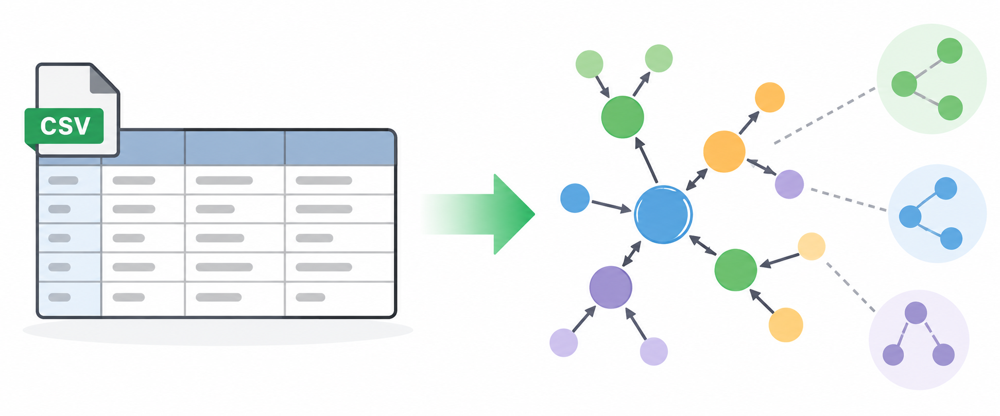{width=50%}

::: notes :::
Če na CSV gledamo kot na dvodimenzionalno tabelo, potem posamezno vrstico pretvorimo v več RDF trojčkov.

S tem podatke iz tabelarične oblike pretvorimo v grafovno obliko.

To je ključni korak, ki omogoča fleksibilno predstavitev podatkov, razširljivost in kasneje povezovanje z drugimi viri.
:::

## Kako določimo URI-je?

- Stabilni in trajni identifikatorji,
- berljivi in enolični,
- brez posebnih znakov,
- niso vezani izključno na interne ID-je.

| ✅ Dober, delujoč URI                                   | ❌ Slab URI                                          | Zakaj?                                                     |
| ------------------------------------------------------- | ---------------------------------------------------- | ---------------------------------------------------------- |
| `https://dbpedia.org/`<br>&nbsp;`resource/Ljubljana`    | `https://primer.si/`<br>&nbsp;`mesto/Ljubljana 2026` | Brez presledkov in časovno spremenljivih dodatkov.         |
| `https://dbpedia.org/`<br>&nbsp;`resource/Slovenia`     | `https://primer.si/`<br>&nbsp;`drzava?id=17`         | URI jasno identificira entiteto, ne le internega ID-ja.    |
| `https://dbpedia.org/`<br>&nbsp;`resource/Berlin`       | `https://primer.si/`<br>&nbsp;`mesto/Berlin!`        | Brez nepotrebnih posebnih znakov.                          |
| `https://dbpedia.org/`<br>&nbsp;`resource/Semantic_Web` | `https://primer.si/`<br>&nbsp;`pojem/Semantic Web`   | Stabilna in konsistentna struktura URI-ja.                 |
| `https://dbpedia.org/`<br>&nbsp;`resource/The_Beatles`  | `https://interni-sistem.local/entity/84723`          | Javni in trajni identifikator, ne vezan na interni sistem. |

::: notes :::
Pri prehodu na raven 4 ★ je ena od ključnih odločitev, kako entitetam dodelimo stabilne in smiselne URI-je.

URI naj se s časom ne spreminja, tudi če se spremeni naziv entitete, saj stabilnost omogoča trajne povezave med podatki.

URI naj bo berljiv in človeku razumljiv, hkrati pa enoličen znotraj problemske domene in v idealnem primeru tudi globalno.

Pri zapisu URI-jev se izogibamo posebnim znakom, uporabljamo male črke, brez presledkov, šumnike pa pretvorimo (č → c, š → s, ž → z).

Pomembno je tudi, da se ne zanašamo izključno na interne identifikatorje, ki so vezani na posamezen sistem. Takšne ID-je raje hranimo kot lastnost entitete, ne pa kot edini del URI-ja.
:::

## Vzorec URI-jev na delavnici

- Entitete: `/obcina/{naziv}`,
- pojmi (shema): `/shema/{pojem}`,
- jasna ločitev pomena.

::: notes :::
V okviru delavnice bomo uporabljali preprost in dosleden vzorec URI-jev.

Za entitete, ki predstavljajo konkretne stvari v realnem svetu, uporabljamo obliko
`https://onto.mdp.gov.si/obcina/{naziv-obcine}`.

Za pojme v shemi oziroma podatkovnem modelu pa obliko `https://onto.mdp.gov.si/shema/{naziv-pojma}`.

S tem jasno ločimo entitete, kot so posamezne občine, od pojmov, ki jih uporabljamo za njihov opis, kot so razredi in lastnosti.

Ta ločitev poenostavi razumevanje RDF zapisa in nadaljnje povezovanje podatkov.
:::

## Kaj dobimo z ravnjo 4 ★?

- **Enolična identifikacija** entitet,
- **povezljivost** med različnimi viri,
- **grafovska struktura** podatkov,
- osnova za **poizvedovanje** in **sklepanje**,
- priprava na **ontologije**.

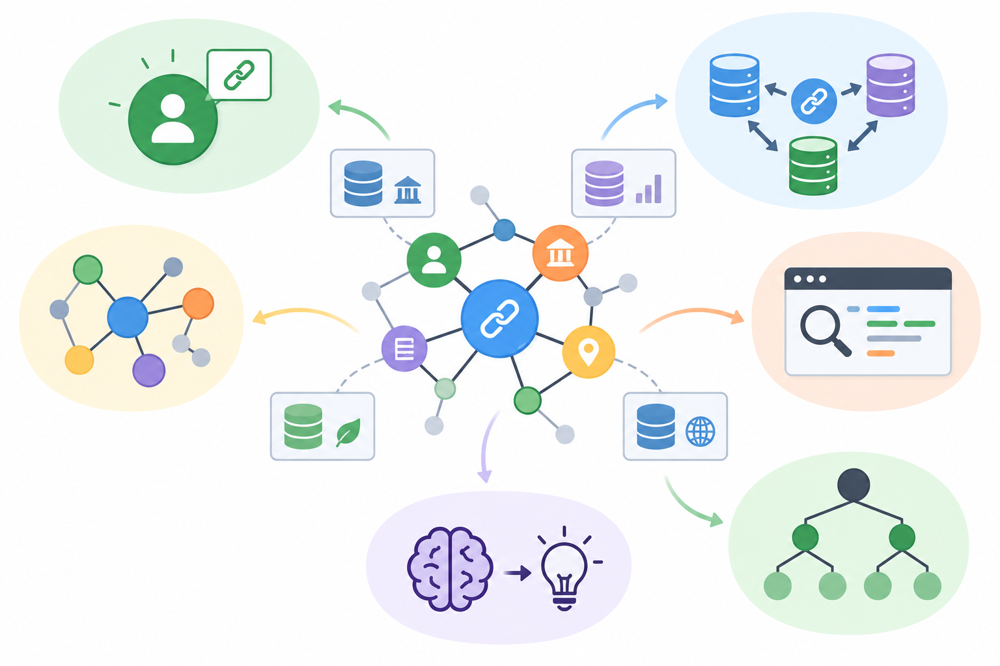{width=50%}

::: notes :::
Ko podatke zapišemo v RDF in uporabimo URI-je, ne dosežemo zgolj zapisa v drugem formatu, ampak bistveno več.

Imena entitet niso več dvoumna, saj ima vsaka entiteta enoličen identifikator.

Isti URI se lahko uporablja v različnih podatkovnih virih, na primer v kontekstu CRP in SURS, kar omogoča neposredno povezovanje podatkov.

Podatki niso več omejeni na dvodimenzionalno tabelo, ampak so zapisani v grafovski strukturi, ki omogoča predstavitev kompleksnih odnosov med pojmi.

Tak zapis predstavlja boljšo osnovo za poizvedovanje s SPARQL-om in kasneje tudi za sklepanje.

Raven 4 ★ je tudi predpogoj za naslednji korak, kjer pomen podatkov formaliziramo z ontologijo.

Na tej točki podatki postanejo dejansko semantično interoperabilni: ne le prenosljivi, ampak tudi razumljivi in povezljivi, kar je ključno za odgovarjanje na kompleksna vprašanja, ki zahtevajo integracijo več virov.
:::

# 4. Formalizacija podatkovnega modela z ontologijami

::: notes
Zdaj pa bomo pokazali, kaj se zgodi, ko lastne podatke povežemo z zunanjimi viri, kot so npr.:

– Wikidata,  
– prostorski podatki,  
– drugi javni registri.

Na tem mestu bi rad poudaril koncept povezanih podatkov (Linked Data) in mrežni učinek, ki potem nastane ob povezovanju virov.

Ko imamo podatke formalno opisane, lahko naredimo še zadnji korak in jih povežemo v širši podatkovni ekosistem.
:::

## Zakaj RDF sam po sebi ni dovolj?

- RDF zagotovi zapis in povezljivost,
- pomen pojmov ni formalno opredeljen,
- pravila so implicitna,
- računalnik/agent jih ne razume,
- potrebujemo **ontologijo**.

::: notes :::
V prejšnjem koraku smo podatke zapisali v obliki RDF in jim dodelili URI-je.

S tem smo dosegli enolično identifikacijo entitet, osnovno povezljivost ter strojno berljiv in razširljiv zapis podatkov.

Vendar nam RDF sam po sebi še ne pove, kaj natančno pomeni posamezen pojem, na primer kaj je občina.

Ne vemo, katere lastnosti so za občino smiselne, ali ima lahko občina več nazivov, ali je podatek o številu prebivalcev obvezen.

Brez uporabe ontologije so ta pravila zgolj implicitna. Zapisana so v dokumentaciji ali pa obstajajo kot tacitno znanje razvijalcev.

Takšna pravila so nedostopna računalniški interpretaciji.

Ontologija ta pravila formalizira, eksplicitno opredeli pomen pojmov, njihove lastnosti in medsebojne odnose ter jih naredi strojno razumljive.

Zato RDF predstavlja osnovo, ontologija pa je naslednji nujni korak.
:::

## Kaj je ontologija _(v kontekstu delavnice)_?

- Formalni opis pomena,
- razredi, lastnosti in relacije,
- pravila in omejitve,
- **model pomenskega področja** (ne podatki).

::: notes :::
V kontekstu delavnice ontologijo razumemo kot formalen opis pojmov, njihovih lastnosti in medsebojnih odnosov na določenem področju, na primer pri opisu občin ali šol.

Ontologija opredeljuje, kaj v nekem področju sploh obstaja, to so razredi, kot so `Obcina`, `Naselje` ali `UpravnaEnota`.

Določa tudi, kako so ti pojmi opisani, torej katere lastnosti imajo, na primer `naziv` ali `steviloPrebivalcev`.

Poleg tega ontologija opredeli, kako so pojmi med seboj povezani, na primer z relacijami, kot sta `jeDelObcine` ali `imaNaselje`.

In nenazadnje določa pravila in omejitve, na primer da mora imeti občina vsaj en naziv.

Pomembno je poudariti, da ontologija ni slovar pojmov in ni podatkovna baza.

Ontologija je **model pomena**, ki omogoča, da so podatki strojno razumljivi in dosledno interpretirani.
:::

## Ločevanje modela in podatkov: TBox in ABox

- **TBox** – model, struktura in pravila,
- **ABox** – konkretni podatki in primerki,
- isti model, različni podatki,
- lažje vzdrževanje in nadgradnje.

<br>

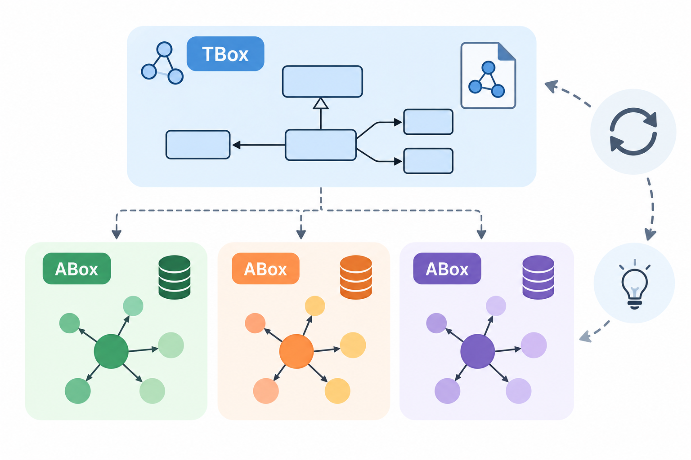{width=50%}

::: notes :::
Pri delu z ontologijami jasno ločimo dve ravni, ki imata različni vlogi:

- Prva je **TBox**, terminološka raven. Ta opisuje strukturo ontologije in pravila domene: katere razrede imamo, kako so razredi povezani, katere lastnosti obstajajo in na katere pojme se nanašajo.
  - Na primer: da je `Obcina` vrsta `AdministrativnaEnota` in da je `steviloPrebivalcev` lastnost, ki se nanaša na `Obcina`.
- Druga raven je **ABox**, raven primerkov. Ta vsebuje konkretne podatke oziroma primerke in njihove lastnosti.
  - Na primer: da je `obcina:ajdovscina` primerek razreda `Obcina` in da ima lastnost `steviloPrebivalcev` z vrednostjo `19895`.

Takšno ločevanje je pomembno, ker omogoča ponovno uporabo istega modela za različne podatkovne nize, jasno loči domensko znanje od podatkov in bistveno olajša vzdrževanje ter nadgradnje ontologije.
:::

## 🧑‍💻 Uvoz podatkov TTL v Protégé

:::: columns

::: column

- Začnemo z **realnimi podatki SURS**<br>([🐢 SURS_obcine.ttl ↗](./assets/data/processed/SURS_obcine.ttl){target="\_blank"})
  - 848 trditev (axioms),
  - 212 primerkov (občin),
  - 3 lastnosti (še brez formalnega pomena),
- RDF/TTL brez formalnega modela,
- fokus na podatkih (ABox).

:::

::: column

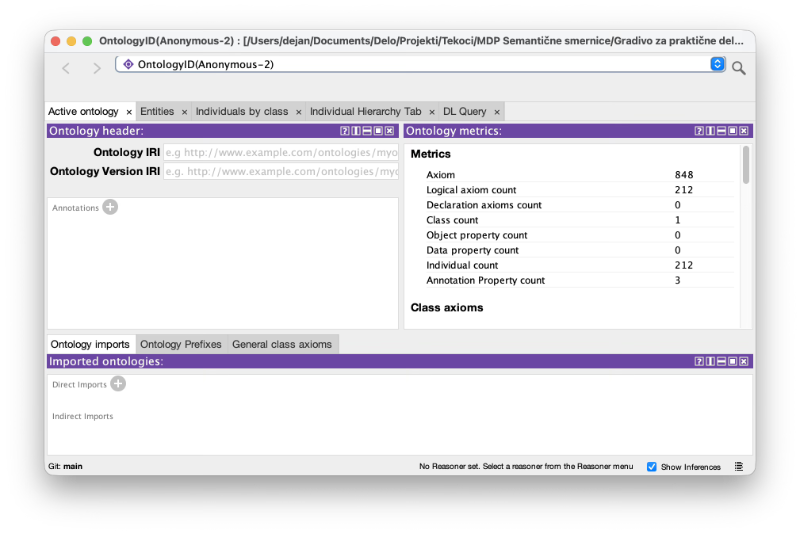

:::

::::

> 📥 Orodje **Protégé** je odprtokodno in je na voljo na [https://**protege**.stanford.edu/](https://protege.stanford.edu/){target="\_blank"}.

::: notes :::
V tem koraku se še ne bomo ukvarjali z ontologijo oziroma formalnim modelom.

Začnemo z realnimi podatki Statističnega urada Republike Slovenije, ki smo jih v prejšnjem koraku pretvorili iz CSV v RDF in zapisali v obliki Turtle.

Trenutna datoteka vsebuje:

– posamezne občine kot RDF entitete,  
– osnovne lastnosti, kot so naziv, število prebivalcev in SURS-ov ID,  
– vendar še nima formalno opredeljenega modela oziroma TBox-a.

To pomeni, da imamo podatke, nimamo pa še jasno opredeljenega pomena teh podatkov.

Za delo bomo uporabili orodje Protégé, ki je odprtokodno orodje za urejanje ontologij in RDF podatkov in je standardno uporabljeno v semantičnih projektih.

**Povzetek uvoženih podatkov**

Na začetnem zaslonu Protégé lahko izpostavimo nekaj ključnih informacij.

Število trditev oziroma axioms je 848. Pri čistem RDF zapisu to pogosto sovpada s številom trojčkov. V našem primeru imamo 212 občin in za vsako občino 4 trditve, kar skupaj da 848.

Število primerkov je 212, kar ustreza številu občin v Sloveniji glede na podatke SURS za leto 2025.

Število lastnosti je 3. Gre za lastnosti `idObcinaSurs`, `naziv` in `steviloPrebivalcev`.

Pomembno je poudariti, da Protégé te lastnosti trenutno interpretira kot annotation properties, ker še nimajo formalne opredelitve v modelu.

To je tipično stanje, ko imamo RDF podatke, a še nimamo ontologije.
:::

## 🧑‍💻 Pregled podatkov: Individuals

:::: columns

::: column

- Vsi primerki v zavihku **Individuals**,
- brez formalnega opisa modela.

:::

::: column

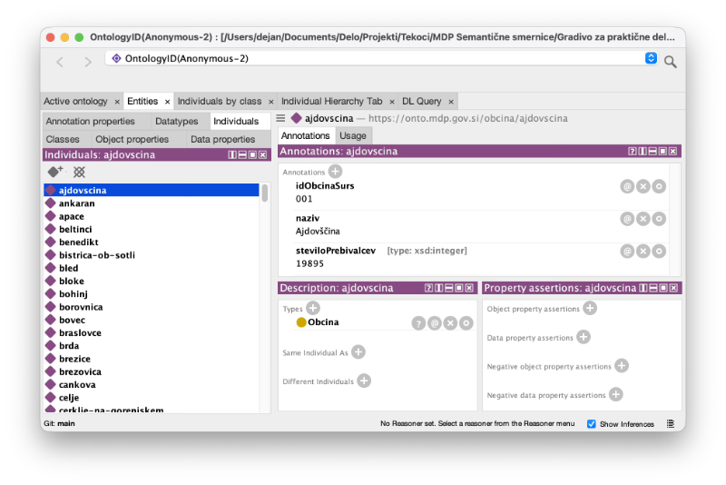

:::

::::

::: notes :::
Po uvozu podatkov si lahko ogledamo zavihek Individuals, kjer vidimo seznam vseh občin.

Če izberemo posamezen primerek, na primer `ajdovscina`, vidimo njegove lastnosti in vrednosti, kot so naziv in število prebivalcev.
:::

## 🧑‍💻 Pregled podatkov: Classes

:::: columns

::: column

- En sam razred: `Obcina`,
- brez formalnega opisa modela.

:::

::: column

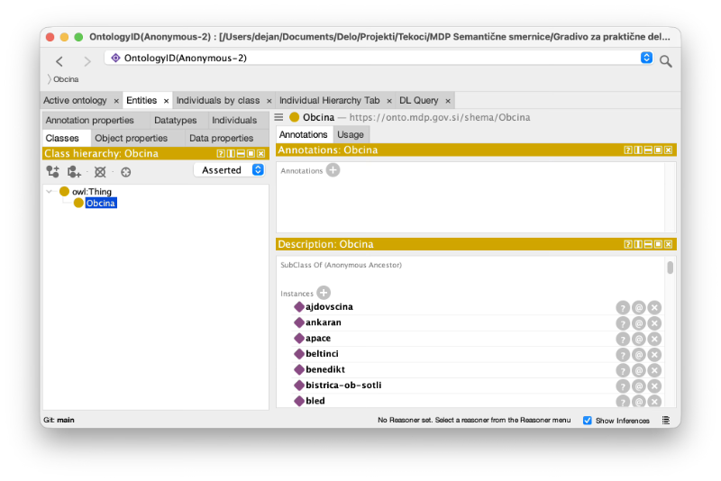

:::

::::

::: notes :::
V zavihku Classes vidimo, da imamo opredeljen zgolj razred `Obcina`, ki je uporabljen v RDF zapisu, ni pa dodatno opisan.

Vidimo samo seznam primerkov, brez hierarhije, brez omejitev in brez formalnih pravil.

To je zelo tipično začetno stanje: imamo podatke oziroma ABox, nimamo pa še pravega modela oziroma TBox-a.

V naslednjem koraku bomo zato začeli z gradnjo ontologije, ki bo formalizirala pomen teh podatkov in jim dala semantično strukturo.
:::

## Prvi korak formalizacije: opis razreda

- Iz podatkov izluščimo pojme,
- v središču: **Občina**,
- prehod iz implicitnega v formalni model.

::: notes :::
V tem koraku naredimo prvi konkreten prehod iz zgolj podatkov v formalni model.

Iz obstoječih podatkov SURS izluščimo pojme, ki jih v resnici že implicitno uporabljamo.

Ugotovimo, da opisujemo občine, ki imajo SURS-ov identifikator, ime in število prebivalcev za določeno leto.

To nas pripelje do osnovnega pojma oziroma razreda `Obcina`, ki je v podatkih že prisoten, čeprav še ni formalno opredeljen v modelu.
:::

## 🧑‍💻 Razred `Obcina`

:::: columns

::: column

### Implicitna opredelitev ([🐢 SURS_obcine.ttl ↗](./assets/data/processed/SURS_obcine.ttl){target="\_blank"})

```turtle
obcina:ajdovscina a shema:Obcina .
```

<div style="text-align: center;">↓</div>

### Formalna opredelitev

```turtle
shema:Obcina rdf:type owl:Class ;
  rdfs:label "Občina"@sl ;
  rdfs:label "Municipality"@en .
```

:::

::: column


:::

::::

::: notes :::
Če pogledamo RDF zapise, vidimo, da vsi naši primerki že pripadajo razredu `shema:Obcina`.

To pomeni, da razred že obstaja in ga dejansko že uporabljamo, vendar je njegova definicija implicitna.

V Protégé vidimo lokalno ime `Obcina`, v ozadju pa gre za polni URI `shema:Obcina`.

Naslednji korak je, da ta razred formalno opišemo v okviru ontologije.

Sedaj razred `Obcina` formalno definiramo kot razred OWL.

Uporabimo `owl:Class`, s čimer jasno povemo, da gre za koncept v našem modelu.

Dodamo tudi oznake z uporabo `rdfs:label`, in sicer v slovenskem in angleškem jeziku.

S tem razred dobi jasno semantično opredelitev in postane del terminološke ravni ontologije.

Na sliki vidimo, kako je razred `Obcina` prikazan v Protégé.

Vidimo dodane oznake razreda, ki omogočajo boljše razumevanje tako razvijalcem kot uporabnikom.

Protégé prikazuje razred v človeško berljivi obliki, v ozadju pa še vedno uporablja URI-je.
:::

## 🧑‍💻 Dodajanje oznak (večjezičnost)

:::: columns

::: column

- `rdfs:label`,
- jezikovne oznake
  - ročno (`@sl`, `@en`),
  - GUI (`@es`).

```turtle
shema:Obcina rdf:type owl:Class ;
  rdfs:label "Municipality"@en , "Občina"@sl ,
    "Municipio"@es .
```

:::

::: column

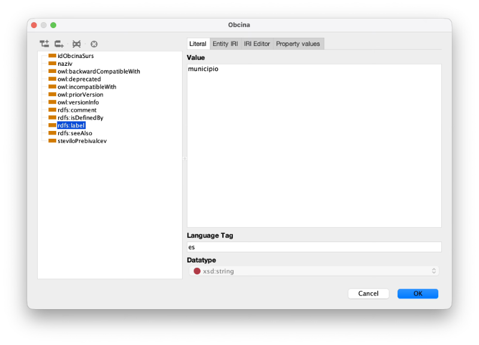

:::

::::

::: notes :::
Oznake lahko dodajamo tudi ročno prek uporabniškega vmesnika Protégé.

S klikom na znak plus pri Annotations izberemo lastnost `rdfs:label` in dodamo novo oznako.

V tem primeru dodamo še špansko oznako `Municipio` in jo označimo z jezikovno oznako `@es`.

To je zelo pomembno za večjezične in mednarodne podatkovne prostore.

Ko dodamo oznake v Protégé in ontologijo shranimo, se te spremembe zapišejo v izvorno TTL datoteko.

Vidimo, da ima razred `shema:Obcina` sedaj več oznak, vsako z ustrezno jezikovno oznako.

Uporabljamo lastnost `rdfs:label`, ki je standardni del RDF Schema in namenjena ravno opisovanju poimenovanj pojmov.
:::

## 🧑‍💻 Kaj Protégé doda samodejno (1/2)?

- Lastnosti še niso formalno opredeljene,
- zato se interpretirajo kot **oznake**.

```turtle
shema:idObcinaSurs rdf:type owl:AnnotationProperty .
shema:naziv rdf:type owl:AnnotationProperty .
shema:steviloPrebivalcev rdf:type owl:AnnotationProperty .
```

::: notes :::
Ko ontologijo shranimo, Protégé samodejno doda nekaj trditev.

Ker lastnosti še niso formalno definirane, jih Protégé interpretira kot `owl:AnnotationProperty`.

To pomeni, da jih trenutno obravnava kot oznake, ne pa kot podatkovne lastnosti.

To je pričakovano in povsem pravilno stanje v tej fazi.

V naslednjem koraku bomo te lastnosti formalno definirali kot podatkovne lastnosti z uporabo `owl:DatatypeProperty`.
:::

## 🧑‍💻 Kaj Protégé doda samodejno (2/2)?

### Primerki kot `owl:NamedIndividual`

```turtle
obcina:ajdovscina rdf:type owl:NamedIndividual ,
                           shema:Obcina .
```

### Osnovni imenski prostor in ontologija

```turtle
@base <https://onto.mdp.gov.si/shema/> .
<https://onto.mdp.gov.si/shema/> a owl:Ontology .
```

::: notes :::
Protégé vsakemu primerku doda tudi trditev, da gre za `owl:NamedIndividual`.

To pomeni, da gre za konkretno entiteto, ki je del ontologije.

Primerki so sedaj jasno ločeni od razredov in formalno vključeni v ontologijo, kar omogoča nadaljnjo obdelavo, sklepanje in poizvedovanje.

Protégé dodatno opredeli osnovni prostor imen z uporabo `@base` in določi aktivno ontologijo.

S tem omogoči krajši zapis URI-jev in jasno pove, kateri dokument predstavlja ontologijo.

To je tehnična, a zelo pomembna osnova za nadaljnje delo z ontologijo.
:::

## 🧑‍💻 Podatkovne lastnosti

- Formalizacija obstoječih lastnosti,
- prehod iz opisov v **podatkovne lastnosti**,
- lastnosti pripadajo razredu `Obcina`.

<br><br>

<div style="text-align: center;">**SURS · ([📊 data.tsv ↗](./assets/data/raw/SURS/2025/data.tsv){target="\_blank"})**</div>

| `ob_id` | `ob_ime`   | `tot_p` |
| ------: | ---------- | ------: |
|     001 | Ajdovščina |   19895 |
|     ... | ...        |     ... |

::: notes :::
Naslednji korak formalizacije ontologije je opis lastnosti, ki jih podatki SURS že vsebujejo.

Iz podatkov lahko razberemo, da za občine opisujemo:

– enolični identifikator občine po SURS-u,  
– ime občine,  
– in število prebivalcev.

Te lastnosti se nanašajo na literalne vrednosti, kot so besedilo in števila, zato jih bomo formalno opisali kot **podatkovne lastnosti** oziroma _Data Properties_.
:::

## 🧑‍💻 Dodajanje podatkovnih lastnosti v Protégé

:::: columns

::: column

- `Entities` → `Data properties`,
- lastnosti imajo **domeno** in **obseg** (tip podatka).

```turtle
shema:idObcinaSurs a owl:DatatypeProperty ;
  rdfs:domain shema:Obcina ;
  rdfs:range xsd:string ;
  rdfs:label "SURS ID občine"@sl .

shema:naziv a owl:DatatypeProperty ;
  rdfs:domain shema:Obcina ;
  rdfs:range xsd:string ;
  rdfs:label "naziv"@sl .

shema:steviloPrebivalcev a
    owl:DatatypeProperty ;
  rdfs:domain shema:Obcina ;
  rdfs:range xsd:integer ;
  rdfs:label "število prebivalcev"@sl .
```

:::

::: column

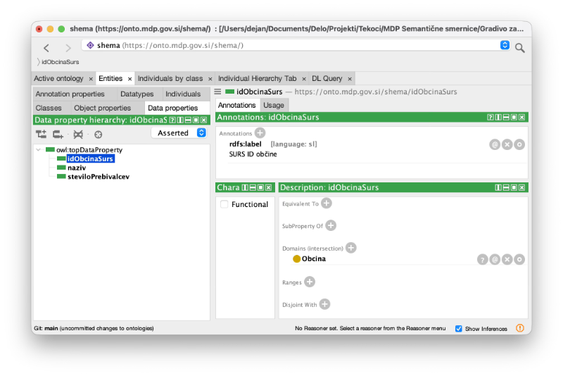

> Končna verzija s podatkovnimi lastnostmi je na voljo v [🐢 SURS_obcine_dp.ttl ↗](./assets/data/processed/SURS_obcine_dp.ttl){target="\_blank"}.

:::

::::

::: notes :::
V grafičnem vmesniku Protégé odpremo zavihek Data properties.

Prek možnosti "Create a new Data property" začnemo dodajati podatkovne lastnosti.

Podatkovne lastnosti uporabljamo, kadar lastnost povezuje entiteto z literalno vrednostjo, na primer z nizom ali številom.

Pri vsaki lastnosti določimo:

– ime lastnosti,  
– domeno, torej na kateri razred se nanaša,  
– in obseg oziroma tip podatka.

Za URI uporabimo predpono <https://onto.mdp.gov.si/shema/>.

Na enak način dodamo še preostali lastnosti.

Lastnost `naziv` opisuje ime občine in je besedilna, zato uporabimo `xsd:string`.

Lastnost `steviloPrebivalcev` predstavlja številski podatek, zato jo opredelimo z obsegom `xsd:integer`.

S tem formalno ločimo besedilne in številske vrednosti, kar je pomembno za nadaljnjo obdelavo in poizvedovanje.
:::

## Zakaj potrebujemo objektne lastnosti?

- Število prebivalcev ni trajna lastnost občine,
- gre za **opazovanje v času**,
- ena občina → več meritev,
- graf omogoča naravno razširitev.

<div style="text-align: center; font-size: 300%">🤔</div>

```turtle
shema:steviloPrebivalcev a owl:DatatypeProperty ;
  rdfs:domain shema:Obcina ;
  rdfs:range xsd:integer ;
  rdfs:label "število prebivalcev"@sl .

obcina:ajdovscina shema:steviloPrebivalcev 19895 .
```

::: notes :::
Pri podatkih, ki jih trenutno imamo, se zelo hitro pojavi vprašanje, kako vključiti zgodovinske podatke ali podatke za prihodnja leta.

Če ima občina lastnost `steviloPrebivalcev` kot enostavno številsko vrednost, lahko shranimo samo eno stanje.

V resnici pa število prebivalcev ni lastnost občine same po sebi, ampak rezultat opazovanja občine v določenem letu.

To je tipičen primer, kjer se izkaže prednost grafovske strukture v primerjavi s tabelarično.

Namesto da vrednost pripnemo neposredno občini, jo modeliramo ločeno, kar nam omogoča več meritev brez spreminjanja strukture razreda `Obcina`.
:::

## 🧑‍💻 Model z objektno lastnostjo

:::: columns

::: column

- Nov razred: `MeritevPrebivalcev`,
- lastnosti: `leto`, `vrednost`,
- objektna lastnost: `imaMeritevPrebivalcev`.

```turtle
shema:MeritevPrebivalcev a owl:Class ;
  rdfs:label "Meritev števila prebivalcev"@sl .

shema:leto a owl:DatatypeProperty ;
  rdfs:domain shema:MeritevPrebivalcev ;
  rdfs:range xsd:gYear ;
  rdfs:label "leto"@sl .

shema:vrednost a owl:DatatypeProperty ;
  rdfs:domain shema:MeritevPrebivalcev ;
  rdfs:range xsd:integer ;
  rdfs:label "vrednost"@sl .

shema:imaMeritevPrebivalcev a owl:ObjectProperty ;
  rdfs:domain shema:Obcina ;
  rdfs:range shema:MeritevPrebivalcev ;
  rdfs:label
    "ima meritev števila prebivalcev"@sl .
```

:::

::: column

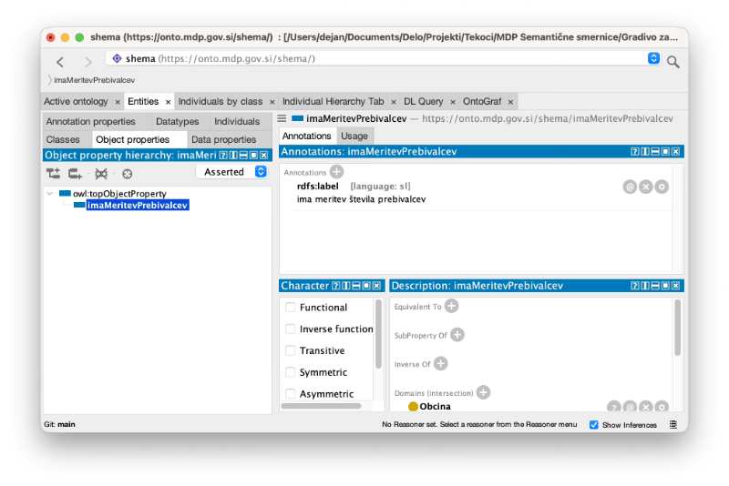

:::

::::

::: notes :::
V ta namen uvedemo nov razred `MeritevPrebivalcev`.

Ta razred predstavlja posamezno meritev in ima lastnosti:

– `leto`, tipa `xsd:gYear`,  
– `vrednost`, tipa `xsd:integer`.

Razred `Obcina` nato povežemo z meritvami prek objektne lastnosti `imaMeritevPrebivalcev`.

Gre za **object property**, kar pomeni, da lastnost ne kaže na literal, ampak na drug primerek v ontologiji.

S tem lahko ena občina povezana z več meritvami za različna leta.

Zato lastnosti `steviloPrebivalcev` ne uporabljamo več neposredno pri občini, ampak vrednost hranimo prek meritev.

To je konceptualno pravilnejši model in dobra osnova za nadaljnje analize, poizvedbe in časovne primerjave.
:::

## 🧑‍💻 Preoblikovanje podatkov z novo strukturo

:::: columns

::: column

- Vrednosti → povezave na meritve,
- več let brez spremembe razreda `Obcina`,
- podatki postanejo časovno razširljivi.

> Končna verzija s podatkovnimi lastnostmi je na voljo v [🐢 SURS_obcine_dp_op.ttl ↗](./assets/data/processed/SURS_obcine_dp_op.ttl){target="\_blank"}.

<div class="exercise-promo exercise-promo-inline">
  <p class="exercise-promo-label"><strong>INTERAKTIVNA VAJA</strong></p>
  <a href="./vaje/model-in-povezave/ontologije/formaliziraj-obcino/" target="_blank" rel="noopener">
    
  </a>
  <p class="exercise-promo-title">
    <a href="./vaje/model-in-povezave/ontologije/formaliziraj-obcino/" target="_blank" rel="noopener">Formaliziraj občino ↗</a>
  </p>
</div>

:::

::: column

```turtle
obcina:ajdovscina shema:steviloPrebivalcev
  19895 .
```

<div style="text-align: center;">↓</div>

```turtle
obcina:ajdovscina a shema:Obcina ;
  shema:imaMeritevPrebivalcev
   obcina:ajdovscina-stevilo-prebivalcev-2024,
   obcina:ajdovscina-stevilo-prebivalcev-2025 .

obcina:ajdovscina-stevilo-prebivalcev-2024
  a shema:MeritevPrebivalcev ;
  shema:leto "2024"^^xsd:gYear ;
  shema:vrednost 19891 .

obcina:ajdovscina-stevilo-prebivalcev-2025
  a shema:MeritevPrebivalcev ;
  shema:leto "2025"^^xsd:gYear ;
  shema:vrednost 19895 .
```

:::

::::

::: notes :::
V tem koraku preoblikujemo obstoječe podatke SURS, tako da število prebivalcev ni več shranjeno kot neposredna vrednost pri občini.

Namesto tega občina vsebuje povezavo na primerke razreda `MeritevPrebivalcev`, ki imajo lastnosti `leto` in `vrednost`.

To pomeni, da ima lahko ena občina več povezanih meritev, na primer za leto 2024 in 2025, ne da bi morali kakorkoli spreminjati strukturo razreda `Obcina`.

Za občino Ajdovščina to pomeni, da je povezana z dvema primerkoma meritev, vsak primerek pa predstavlja opazovanje v določenem letu z ustrezno vrednostjo.

Takšen zapis je veliko bolj fleksibilen kot tabelarični pristop in omogoča naravno razširjanje podatkov z novimi leti ali drugimi vrstami meritev.

Celotna datoteka z nadgrajenim modelom in preoblikovanimi podatki je na voljo v datoteki `SURS_obcine_dp_op.ttl`, ki jo lahko uporabimo za nadaljnje poizvedbe in analize.

**INTERAKTIVNA VAJA 5:** »Formaliziraj občino«. Po uspešnem preverjanju si skupaj ogledamo graf razredov in lastnosti.
:::

# 5. Raven 5 ★: povezani podatki in zunanji viri

::: notes :::
Zaključno poglavje pokaže praktično vrednost:

– kako s SPARQL poizvedbami dostopamo do povezanih podatkov,
– kako lahko sistem sam sklepa novo znanje,
– in zakaj je to razlika med podatki in znanjem.

To poglavje poveže celotno delavnico v smiselno celoto.

S tem se vrnemo na začetno vprašanje delavnice – kako iz razdrobljenih podatkov pridemo do odgovorov, ki jih posamezen vir sam ne more ponuditi.
:::

## Kaj pomeni raven 5 ★ v praksi?

- RDF + URI + ontologija (4 ★),
- podatki so še vedno izolirani,
- manjka povezava z drugimi viri,
- 5 ★ = **povezani podatki**.

<br>

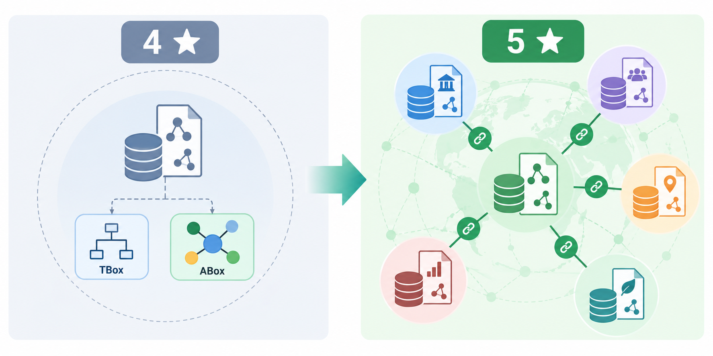{width=60%}

::: notes :::
Na ravni 4 ★ smo podatke zapisali v RDF, dodali enolične URI-je in formalizirali podatkovni model z ontologijo.

Imamo jasno ločen TBox in ABox, podatki so strojno razumljivi in semantično opisani.

Vendar so ti podatki še vedno izolirani. Ne uporabljajo skupnih pojmov ali standardov in niso povezani z drugimi podatkovnimi viri.

Raven 5 ★ dosežemo šele takrat, ko svoje podatke povežemo z drugimi viri in uporabimo skupne pojme iz obstoječih ontologij.

S tem naši podatki postanejo del širšega, globalnega ekosistema podatkov.

Ključna razlika je zelo jasna: pri 4 ★ so podatki semantično opisani, pri 5 ★ pa so semantično opisani in hkrati povezani z drugimi podatki.

To je tisti korak, ki omogoča resnično integracijo in odgovarjanje na kompleksna vprašanja prek več virov.
:::

## 🧑‍💻 Zunanji viri za povezovanje (5 ★) (1/2)

- **Podatkovni modeli (TBox)**
  - Centralni besednjak – Platforma za semantično interoperabilnost [🌐 NIO ↗](https://nio.gov.si/products/centralni%2Bbesednjak){target="\_blank"},

- **Splošne ontologije (TBox)**
  - Schema.org – [🌐 https://schema.org/](https://schema.org/){target="\_blank"}
  - FOAF – [🌐 http://xmlns.com/foaf/spec/](http://xmlns.com/foaf/spec/){target="\_blank"}
  - Dublin Core – [🌐 http://purl.org/dc/elements/1.1/](http://purl.org/dc/elements/1.1/){target="\_blank"}
  - SKOS – [🌐 http://www.w3.org/2004/02/skos/core#](http://www.w3.org/2004/02/skos/core#){target="\_blank"}
  - DCAT – [🌐 http://www.w3.org/ns/dcat#](http://www.w3.org/ns/dcat#){target="\_blank"}

::: notes :::
Na ravni 5 ★ se podatki ne zaprejo sami vase, ampak se povezujejo z zunanjimi viri in uporabljajo skupne pojme.

Pomembno je poudariti, da povezovanje z zunanjimi viri ne pomeni, da bomo vse podatke fizično uvozili v lastno podatkovno zbirko.

Ključna ideja povezanih podatkov je, da podatki ostanejo pri izvoru, mi pa zagotovimo enolične povezave, prek katerih lahko po potrebi dostopamo do dodatnih informacij.

Prikazujemo primere:

– splošnih terminoloških ontologij (TBox),  
– splošnih podatkovnih virov (ABox),  
– ter domenskih besednjakov.

V nadaljevanju se ne bomo osredotočili na množično povezovanje z zunanjimi viri, ampak bomo najprej pogledali povezovanje znotraj javnega sektorja.

To bomo naredili na primeru datoteke `CRP.ttl`, ki predstavlja referenčni, produkcijsko usmerjen model, in na njej pokazali osnovne semantične mehanizme, ki se kasneje uporabljajo tudi pri povezovanju z zunanjimi viri.
:::

## 🧑‍💻 Zunanji viri za povezovanje (5 ★) (2/2)

- **Splošni podatkovni viri (ABox)**
  - DBpedia – [🌐 https://wiki.dbpedia.org/](https://wiki.dbpedia.org/){target="\_blank"}
  - Wikidata – [🌐 https://www.wikidata.org/](https://www.wikidata.org/){target="\_blank"}
  - LinkedGeoData – [🌐 http://linkedgeodata.org/](http://linkedgeodata.org/){target="\_blank"}

- **Domenski besednjaki**
  - EUROVOC – [🌐 https://eurovoc.europa.eu/](https://eurovoc.europa.eu/){target="\_blank"}
  - GEMET – [🌐 https://www.eionet.europa.eu/gemet/](https://www.eionet.europa.eu/gemet/){target="\_blank"}
  - INSPIRE – [🌐 https://inspire.ec.europa.eu/glossary](https://inspire.ec.europa.eu/glossary){target="\_blank"}
  - GeoNames – [🌐 https://www.geonames.org/](https://www.geonames.org/){target="\_blank"}

## 🧑‍💻 Povezovanje s hierarhijo pojmov (`rdfs:subClassOf`)

:::: columns

::: column

- Razredi so organizirani hierarhično,
- podrazredi dedujejo pomen nadrazredov,
- omogoča splošnejše poizvedbe,
- temelj za sklepanje.
- `cnbs:Sifrant`
  - `:SifrantIO`
    - `:Obcina`

[🐢 CRP.ttl ↗](./assets/data/processed/CRP.ttl){target="\_blank"}

:::
::: column

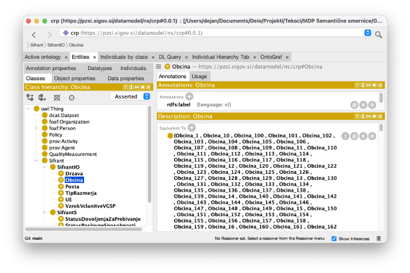{width="90%"}

:::
::::

```turtle
@prefix : <https://pzsi.sigov.si/datamodel/ns/crp#> .
@prefix cnbs: <http://onto.mju.gov.si/centralni-besednjak-sifranti#> .

cnbs:Sifrant rdf:type owl:Class .
:SifrantIO rdf:type owl:Class ;
           rdfs:subClassOf cnbs:Sifrant .
:Obcina rdf:type owl:Class ;
        rdfs:subClassOf :SifrantIO .
```

::: notes :::
V ontologiji CRP so pojmi organizirani v hierarhijo razredov, kar pomeni, da razredi niso nepovezani, ampak so med seboj povezani z relacijo `rdfs:subClassOf`.

V Protégé to vidimo v zavihku Entities → Classes, kjer je prikazana razredna hierarhija.

V našem primeru vidimo, da je `Obcina` podrazred razreda `SifrantIO`, ta pa je podrazred razreda `cnbs:Sifrant`.

S tem formalno povemo, da je vsaka občina tudi šifrant IO in vsak šifrant IO tudi šifrant iz Centralnega besednjaka.

Pri tem smo načrtno uporabili pojem `cnbs:Sifrant` iz Centralnega besednjaka, ki je del Platforme za semantično interoperabilnost.

To je pomembno zato, ker uporabljamo skupne pojme, ki jih razume tudi širši ekosistem.

Takšna hierarhija predstavlja temelj za sklepanje. Če na primer poizvedujemo po vseh `cnbs:Sifrant`, bomo samodejno dobili tudi vse občine, če uporabljamo mehanizme, ki upoštevajo razredno hierarhijo.

S tem naši podatki niso več izolirani, ampak postanejo del širšega, povezanega semantičnega prostora.
:::

## 🧑‍💻 Hierarhija lastnosti (`rdfs:subPropertyOf`)

:::: columns

::: column

- Podobno kot pri razredih, tudi lastnosti tvorijo hierarhijo,
- splošna lastnost → bolj specifične podlastnosti,
- omogoča splošnejše poizvedbe in sklepanje.
- `foaf:givenName`
  - `:ime`
    - `:mat_ime_1`

[🐢 CRP.ttl ↗](./assets/data/processed/CRP.ttl){target="\_blank"}

:::

::: column

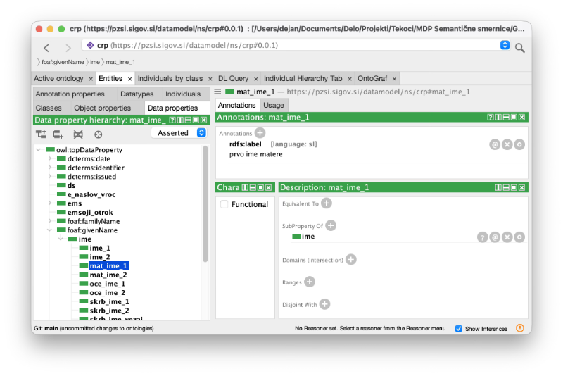{width="90%"}

:::
::::

```turtle
@prefix : <https://pzsi.sigov.si/datamodel/ns/crp#> .
@prefix cnb: <http://onto.mju.gov.si/centralni-besednjak-core#> .
@prefix foaf: <http://xmlns.com/foaf/0.1/> .

:ime rdf:type owl:DatatypeProperty ;
     rdfs:subPropertyOf foaf:givenName ;
     rdfs:domain cnb:FizicnaOseba .
:mat_ime_1 rdf:type owl:DatatypeProperty ;
           rdfs:subPropertyOf :ime ;
           rdfs:label "prvo ime matere"@sl .
```

::: notes :::
Podoben koncept kot pri razredih velja tudi za lastnosti.

V CRP-ju pogosto naletimo na situacijo, kjer imamo najprej splošno lastnost, nato pa bolj specifične lastnosti, ki so podlastnosti te splošne lastnosti.

Primer: imamo splošno lastnost za ime, in potem še bolj specifične lastnosti, kot je na primer "prvo ime matere".

V Protégé to vidimo v zavihku Entities → Data properties, kjer je prikazana hierarhija lastnosti, povezana z relacijo `rdfs:subPropertyOf`.

Tukaj vidimo verigo: `foaf:givenName` → `:ime` → `:mat_ime_1`.

Ključno sporočilo: ko enkrat vzpostavimo hierarhijo lastnosti, lahko poizvedujemo ali sklepamo na bolj splošni ravni, ne da bi morali poznati vse specifične lastnosti.

---

V RDF/TTL to hierarhijo opišemo s trditvami `rdfs:subPropertyOf`.

Najprej povemo, da je `:ime` podlastnost `foaf:givenName`, torej se naš domenski pojem “ime” naveže na splošno lastnost iz FOAF, kar je hkrati primer uporabe zunanjega standarda.

Nato povemo, da je `:mat_ime_1` podlastnost `:ime`, kar pomeni, da je “prvo ime matere” posebna oblika lastnosti “ime”.

Kaj s tem dobimo?

Če ima neka oseba trditev: `:mat_ime_1 "Marija"`, lahko ob sklepanju zaključimo tudi: `:ime "Marija"` in `foaf:givenName "Marija"`.

To je koristno za poizvedbe: če poizvedujemo po vseh `foaf:givenName`, bomo (ob vključenem sklepanju) dobili tudi vrednosti iz specifičnih podlastnosti.

Pomembno je tudi dedovanje omejitev. Na `:ime` je opredeljena omejitev dolžine (max 35 znakov), in ta omejitev velja tudi za `:mat_ime_1`, ker je podlastnost `:ime`.

To je zelo praktičen mehanizem, ker pravila definiramo enkrat na splošni lastnosti, specifične lastnosti pa jih avtomatsko podedujejo.
:::

## 🧑‍💻 Povezovanje istih primerkov (`owl:sameAs`)

:::: columns

::: column

- Včasih vemo, da dva URI-ja opisujeta **isto entiteto**,
- entiteta je ista, razlikuje se le **vir podatkov**,
- `owl:sameAs` pove: _to je popolnoma isto_.

**Primer:**

- CRP: `:Obcina_1` ([🐢 CRP.ttl ↗](./assets/data/processed/CRP.ttl){target="\_blank"}),
- Wikidata: [🌐 `wd:Q331701` ↗](https://www.wikidata.org/wiki/Q331701){target="\_blank"} (Ajdovščina).

:::
::: column

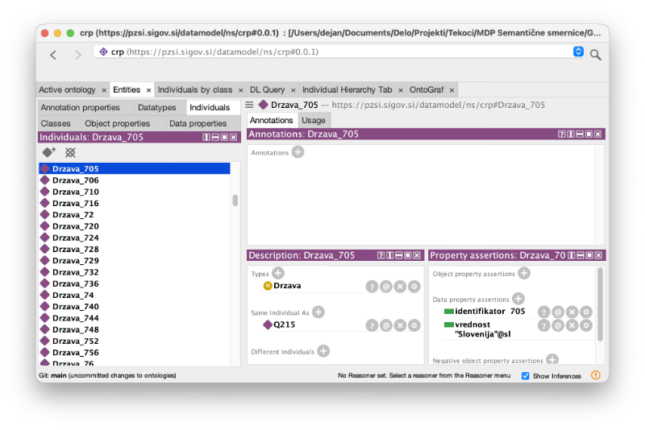{width="90%"}

:::
::::

```turtle
@prefix : <https://pzsi.sigov.si/datamodel/ns/crp#> .
@prefix wd: <https://www.wikidata.org/entity/> .

:Obcina_1 rdf:type owl:NamedIndividual ,
                   :Obcina ;
          :identifikator 1 ;
          :vrednost "Ajdovščina"@sl ;
          owl:sameAs wd:Q331701 .
```

::: notes :::
V nekaterih primerih vemo, da dva URI-ja predstavljata popolnoma isto entiteto, le da sta pridobljena iz različnih podatkovnih virov.

V našem primeru imamo občino Ajdovščina v viru CRP, kjer je predstavljena kot primerek `:Obcina_1`.

Isto občino najdemo tudi v Wikidata, kjer je predstavljena kot entiteta `wd:Q331701`.

V Protégé to povezavo vidimo kot `owl:sameAs` povezavo med primerkoma.

Ključna ideja je, da podatkov ni treba fizično združevati v eno bazo. Povezavo naredimo z enolično povezavo med URI-jema.

To je tipičen mehanizem ravni 5 ★: podatki ostanejo pri izvoru, mi pa zagotovimo povezavo, prek katere lahko po potrebi dostopamo do dodatnih informacij.

---

V Turtle zapisu dodamo trditev: `owl:sameAs wd:Q331701`

Semantični pomen tega zapisa je zelo močan.

Pomeni: vse, kar velja za `wd:Q331701`, velja tudi za `:Obcina_1` in obratno.

Če ima Wikidata dodatne informacije, na primer koordinato, državo, nadmorsko višino, ali pripadnost administrativnim enotam, lahko te informacije “priključimo” naši entiteti, ne da bi jih kopirali v CRP.

To nam omogoča združevanje informacij iz različnih virov prek povezav, ne pa prek fizičnega združevanja podatkov.

Pomembno: `owl:sameAs` uporabimo takrat, ko smo res prepričani, da gre za popolnoma isto entiteto, ker z njim izenačimo identiteto in vse lastnosti.
:::

## 🧑‍💻 Povezovanje pojmov (`owl:equivalentClass`)

:::: columns

::: column

- Povezujemo **pojme / razrede**, ne primerkov,
- različni slovarji → isti pomen,
- `owl:equivalentClass` pomeni: _pojma sta semantično enakovredna_.

**Primer:**

- `:Obcina` ([🐢 CRP.ttl ↗](./assets/data/processed/CRP.ttl){target="\_blank"}),
- `Municipality` v drugem slovarju / ontologiji,
- opredelitev vseh vrednosti.

:::
::: column

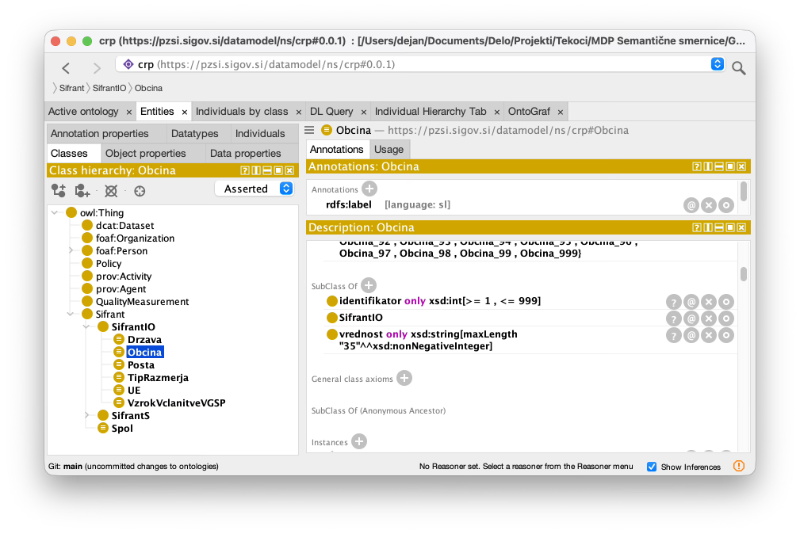{width="90%"}

:::
::::

```turtle
:Obcina rdf:type owl:Class ;
  owl:equivalentClass [ rdf:type owl:Class ;
                        owl:oneOf ( :Obcina_1
                                    :Obcina_10
                                    :Obcina_100
                                    ... ) ] ;
  rdfs:subClassOf :SifrantIO ,
    [ rdf:type owl:Restriction ; ... ] ,
    [ rdf:type owl:Restriction ; ... ] .
```

::: notes :::
Do sedaj smo povezovali primerke z `owl:sameAs` in gradili hierarhije razredov ter lastnosti.

Pogosto pa želimo povezati tudi pojme oziroma razrede, ki imajo enak pomen, a so definirani v različnih slovarjih ali ontologijah.

V našem primeru pojem _občina_ pomeni isto kot pojem _municipality_ v kakšni drugi ontologiji.

Za to uporabimo `owl:equivalentClass`, ki pove, da sta dva razreda semantično enakovredna.

V CRP-ju je razred `:Obcina` opredeljen zelo natančno in ne zgolj kot ime, ampak z naborom pravil in omejitev, kar lepo vidimo v Protégé.

---

V tem zapisu vidimo dva pomembna vidika.

Prvič, razred `:Obcina` je definiran kot **ekvivalenten razredu, ki je zaprt nabor primerkov** z uporabo `owl:oneOf`.

To pomeni, da razred občin ni odprt, ampak je natančno določen seznam primerkov. To je zelo tipično za šifrante.

Drugič, razred ima dodatne omejitve, ki so podane z `rdfs:subClassOf` in `owl:Restriction`.

Na primer:

- identifikator mora biti med 1 in 999,
- vrednost (ime) je niz z največ 35 znaki.

Takšen razred ni zgolj oznaka, ampak formalen opis pojma, ki ga lahko računalnik preverja, uporablja pri sklepanju in primerja z drugimi ontologijami.

Zato je `owl:equivalentClass` ključen mehanizem pri povezovanju pojmov med različnimi sistemi, še posebej v kontekstu šifrantov in referenčnih seznamov.
:::

## Kako povezati CRP in SURS?

- 2 neodvisna vira:
  - **CRP** – uradni šifranti, stabilni identifikatorji ([🐢 CRP.ttl ↗](./assets/data/processed/CRP.ttl){target="\_blank"}),
  - **SURS** – statistični kazalniki (npr. prebivalstvo) ([🐢 SURS_obcine_dp_op.ttl ↗](./assets/data/processed/SURS_obcine_dp_op.ttl){target="\_blank"}),
- opisujeta **iste občine**,
- cilj:
  - ne združujemo podatkov v eno datoteko,
  - omogočimo **skupno uporabo** v poizvedbah in sklepanju,
- integracija v ločeni datoteki [🐢 Integracija_CRP_SURS.ttl ↗](./assets/data/processed/Integracija_CRP_SURS.ttl){target="\_blank"}.

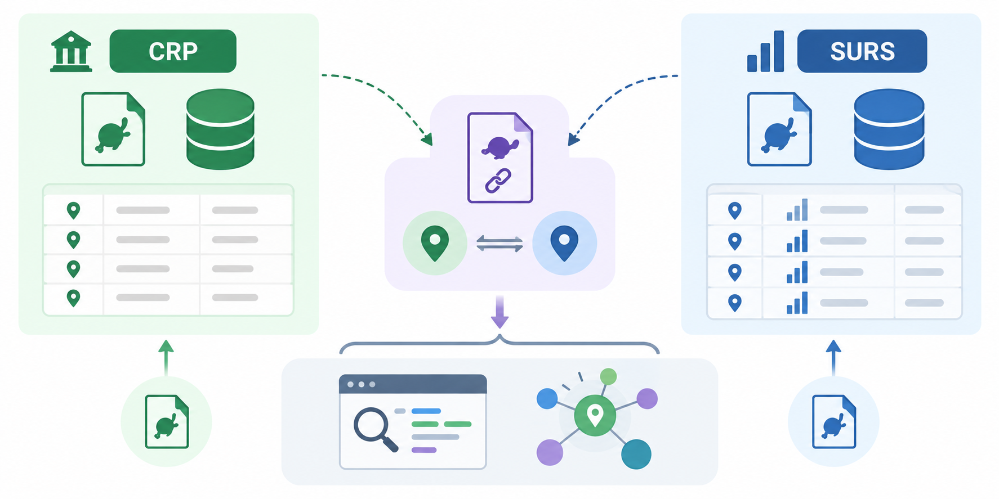{width="50%"}

::: notes :::
Najprej jasno povemo namen povezovanja.

CRP in SURS sta dva ločena, neodvisna vira, vsak s svojim namenom.
CRP vsebuje uradne šifrante in stabilne identifikatorje, SURS pa statistične kazalnike, kot je število prebivalcev.

Cilj semantičnega povezovanja ni, da bi podatke fizično združili v eno samo datoteko ali bazo.
Cilj je, da oba vira **opisujeta iste realne entitete** in da jih lahko **skupaj uporabljamo** v poizvedbah in sklepanju.

Zato integracijo opredelimo v ločeni datoteki `Integracija_CRP_SURS.ttl`, ki vsebuje samo povezave med obema viroma.
:::

## 🧑‍💻 Povezovanje primerkov (CRP ↔ SURS)

- Najbolj neposreden pristop: **`owl:sameAs`**,
- primer: CRP: `crp:Obcina_1` (CRP) in `sursABox:ajdovscina` (SURS),
- pomensko gre za **isto občino**.

::: columns

:::: column

[🐢 CRP.ttl ↗](./assets/data/processed/CRP.ttl){target="\_blank"}

```turtle
@base
  <https://pzsi.sigov.si/datamodel/ns/crp#> .

:Obcina_1 rdf:type :Obcina ;
  :identifikator 1 ;
  :vrednost "Ajdovščina"@sl ;
  owl:sameAs wd:Q331701 .
```

::::

:::: column

[🐢 SURS_obcine_dp_op.ttl ↗](./assets/data/processed/SURS_obcine_dp_op.ttl){target="\_blank"}

```turtle
@prefix obcina:
  <https://onto.mdp.gov.si/obcina/> .

obcina:ajdovscina a shema:Obcina ;
  shema:idObcinaSurs "001" ;
  shema:naziv "Ajdovščina" ;
  shema:imaMeritevPrebivalcev .
```

::::

:::

<div style="text-align: center;">↓</div>

[🐢 Integracija_CRP_SURS.ttl ↗](./assets/data/processed/Integracija_CRP_SURS.ttl){target="\_blank"}

```turtle
@prefix crp:      <https://pzsi.sigov.si/datamodel/ns/crp#> .
@prefix sursABox: <https://onto.mdp.gov.si/obcina/> .

crp:Obcina_1 owl:sameAs sursABox:ajdovscina .
```

::: notes :::
Najpreprostejši in najmočnejši način povezovanja je na ravni primerkov.

V CRP je občina Ajdovščina predstavljena kot crp:Obcina_1,
v SURS pa kot sursABox:ajdovscina.

Ker vemo, da oba primerka predstavljata isto realno občino, uporabimo lastnost owl:sameAs.

Semantični pomen tega zapisa je zelo močan: vse, kar velja za en primerek, velja tudi za drugega.

To pomeni, da lahko:

– iz CRP dobimo stabilen identifikator,
– iz SURS pa statistične podatke,

ne da bi karkoli podvajali.

Poizvedbe lahko zato "prehajajo" med viroma.
:::

## 🧑‍💻 Povezovanje pojmov in širši ekosistem

::: columns

:::: column

- Povezovanje **pojmov (TBox)**:
  - previdno: `rdfs:subClassOf`,
  - strogo: `owl:equivalentClass`,
- primer (previdnejša varianta) &rarr;

::::

:::: column

[🐢 Integracija_CRP_SURS.ttl ↗](./assets/data/processed/Integracija_CRP_SURS.ttl){target="\_blank"}

```turtle
@prefix crp:
  <https://pzsi.sigov.si/datamodel/ns/crp#> .
@prefix sursTBox:
  <https://onto.mdp.gov.si/shema/> .

sursTBox:Obcina rdfs:subClassOf crp:Obcina .
```

::::

:::

<div class="exercise-promo exercise-promo-inline">
  <p class="exercise-promo-label"><strong>INTERAKTIVNA VAJA</strong></p>
  <a href="./vaje/model-in-povezave/ontologije/povezi-vira/" target="_blank" rel="noopener">
    
  </a>
  <p class="exercise-promo-title">
    <a href="./vaje/model-in-povezave/ontologije/povezi-vira/" target="_blank" rel="noopener">Poveži podatkovna vira ↗</a>
  </p>
</div>

::: notes :::
Poleg primerkov lahko povezujemo tudi pojme oziroma razrede.

Če ocenimo, da pojma Obcina v CRP in v SURS pomenita isto, lahko uporabimo `owl:equivalentClass`. Če pa želimo biti bolj previdni – na primer, ker SURS vključuje tudi zgodovinske ali agregirane enote – uporabimo šibkejšo povezavo rdfs:subClassOf.

V tem primeru povemo, da je pojem občine v SURS-u podrazred pojma občine v CRP-ju. To omogoča skupno interpretacijo, hkrati pa ohranja semantično varnost.

Zelo pomemben korak je tudi povezava z Wikidata. Ker ima CRP že povezavo owl:sameAs na Wikidata, se s tem samodejno povežejo: CRP, SURS in Wikidata.

To lepo pokaže bistvo ravni 5 ★: podatki niso več izolirani, ampak postanejo del širšega, povezanega ekosistema, kjer se informacije združujejo prek povezav – ne prek kopiranja podatkov.

**INTERAKTIVNA VAJA 6:** »Poveži podatkovna vira«. Udeleženci uporabijo prikazano previdnejšo povezavo `sursTBox:Obcina rdfs:subClassOf crp:Obcina` in z `owl:sameAs` povežejo štiri pare občin. Pari so navedeni v navodilu vaje.
:::

## 🧑‍💻 Razširitev povezovanja – več občin, en ekosistem

- Ajdovščina je že povezana z **Wikidata**,
- dodamo še druge občine: **Celje**, Ljubljana, Maribor,
- CRP ↔ SURS ↔ Wikidata,
- podatkov **ne podvajamo**, ampak jih **logično povežemo**.

[🐢 Integracija_CRP_SURS.ttl ↗](./assets/data/processed/Integracija_CRP_SURS.ttl){target="\_blank"}

```turtle
sursTBox:Obcina rdfs:subClassOf crp:Obcina .

crp:Obcina_11 owl:sameAs sursABox:celje .
crp:Obcina_11 owl:sameAs wd:Q3441823 .
```

::: notes :::
V tem koraku pokažemo, da povezovanje ni omejeno samo na en primer.

Za občino Ajdovščina že imamo povezavo na Wikidata prek owl:sameAs wd:Q331701.
To pomeni, da je Ajdovščina del širšega globalnega podatkovnega ekosistema.

Sedaj dodamo še povezave za nekaj drugih občin: Celje, Ljubljano in Maribor.

Vsaka občina ima:

– svoj primerek v CRP,
– svoj primerek v SURS,
– in svoj primerek na Wikidata.

Z uporabo owl:sameAs povemo, da vsi ti URI-ji predstavljajo isto realno entiteto.

Pomembno je poudariti, da podatkov ne kopiramo iz Wikidata ali SURS v CRP ali obratno.
Vsak vir ostane samostojen in avtoritativen za svoje podatke.

Mi zgolj dodamo semantične povezave, ki omogočajo:

– združevanje lastnosti iz različnih virov,
– poizvedbe, ki prehajajo med CRP, SURS in Wikidata,
– in sklepanje na podlagi skupnega pomena.

To je bistvo ravni 5 ★: podatki postanejo del povezanega ekosistema, kjer nova vrednost nastaja iz povezav, ne iz podvajanja podatkov.
:::

# 6. Uporaba semantično opisanih podatkov s SPARQL

## SPARQL je poizvedovalni sloj semantičnega spleta

:::: columns
::: column

- Podatkovna izmenjava: **RDF**
- Taksonomije: **RDFS**
- Ontologije: **OWL**
- Pravila: **RIF/SWRL**
- Poizvedovanje: **SPARQL**

**Različice standarda**

- SPARQL 1.0 (2008)
- SPARQL 1.1 (2013)

:::
::: column

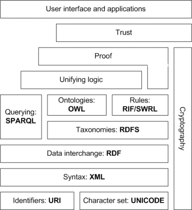

:::
::::

## SPARQL poveže odjemalca s podatkovnim grafom

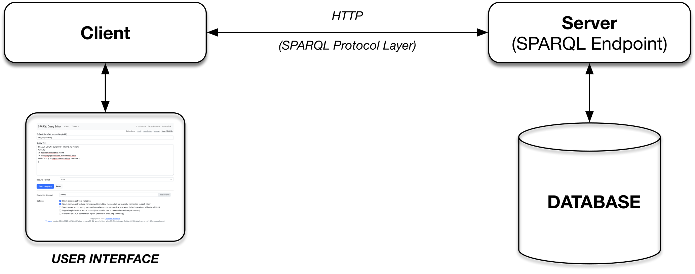

::: notes :::
SPARQL je rekurzivna kratica za SPARQL Protocol and RDF Query Language. Poleg poizvedovalnega jezika definira tudi protokol s pravili za povezovanje odjemalskega programa na SPARQL vmesnik in izmenjavo podatkov preko HTTP.

SPARQL 1.0 je bil kot uraden standard W3C objavljen v letu 2008, zadnja verzija 1.1 pa v letu 2013. Posodobljena verzija vsebuje tudi dodatne funkcionalnosti, kot je uporaba podpoizvedb, negacije, posodobitve grafa in iskanje preko poti lastnosti v grafih.
::: 

## Predstavitev CRP kot graf

```turtle
### https://pzsi.sigov.si/datamodel/ns/crp#obc
:obc rdf:type owl:ObjectProperty ;
     rdfs:domain cnb:FizicnaOseba ;
     rdfs:range :Obcina .
```

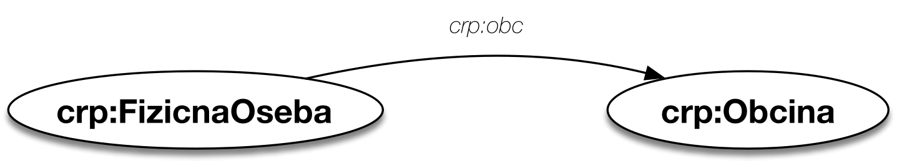

::: notes :::
SPARQL bomo lažje razumeli, če si bomo podatke predstavljali v obliki grafa. Trojčki, ki smo jih do sedaj zapisovali v datotekak TTL namreč tvorijo strukturo grafa. Naslednji zapis
:::

## Širša predstavitev CRP v okolici specifičnega objekta

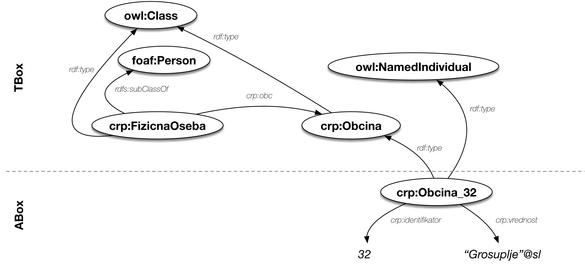

::: notes :::
Če si predstavljamo še okolico teh konceptov, lahko ugotovimo, da bi graf izgledal nekako takole.
:::

## Poizvedovanje s SPARQL nad CRP

:::: columns
::: column

> Okolje Protégé ponuja tudi možnost poizvedovanja s SPARQL (Window -> Tabs -> SPARQL Query). 

> V Protégé odprimo datoteko [🐢 CRP.ttl ↗](./assets/data/processed/CRP.ttl){target="\_blank"} in izvedimo spodnjo poizvedbo:

```SPARQL
SELECT ?osebek ?povedek ?predmet

WHERE {
    ?osebek ?povedek ?predmet .
}
```

:::
::: column

> 🧑🏻‍🎓 Kaj predstavlja rezultat poizvedbe? 

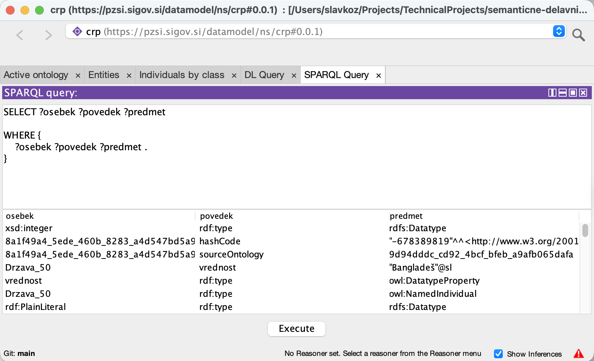

:::
::::

::: notes :::
Rezultat poizvedbe so vsi trojčki, ki se nahajajo v naši ontologiji.
:::

## 🧑‍💻 Osnovno iskanje vsebine v CRP

:::: columns
::: column

- Izrazi s `?` so **spremenljivke**,
- SPARQL poišče **vse podgrafe**, ki se ujemajo z vzorcem,
- poiščimo vse povezave, ki izhajajo iz `crp:Obcina_32`:

```SPARQL
SELECT ?povedek ?predmet

WHERE {
    <https://pzsi.sigov.si/datamodel/ns/crp#Obcina_32>
        ?povedek ?predmet .
}
```

:::
::: column

- Pri daljših poizvedbah si tudi tu pomagamo s **predponami**:

```SPARQL
PREFIX crp: <https://pzsi.sigov.si/datamodel/ns/crp#>

SELECT ?povedek ?predmet

WHERE {
    crp:Obcina_32 ?povedek ?predmet .
}
```

> 🧑🏻‍🎓 Zakaj sta obe poizvedbi enakovredni?

:::
::::

::: notes :::
Tu naredimo prvi korak od "izpiši vse" k ciljanemu iskanju.

Poudarek: vse, kar se začne z vprašajem, je spremenljivka. SPARQL poskuša vzorec iz stavka WHERE preslikati na graf in vrne vsako ujemanje posebej.

V prvi poizvedbi smo osebek fiksirali na konkretno občino, spremenljivki pa ostaneta povedek in predmet. Rezultat so torej vse povezave, ki izhajajo iz tega primerka.

Druga poizvedba je popolnoma enakovredna prvi – predpona crp: je le okrajšava za isti imenski prostor, enako kot pri zapisu TTL. Pri daljših poizvedbah je berljivost bistveno boljša.

Vprašanje za udeležence: zakaj sta poizvedbi enakovredni? Odgovor: ker se predpona pred izvajanjem razvije v polni URI – poizvedbi sta po razvoju identični.

Namig za demonstracijo: obe poizvedbi poženemo v Protégé eno za drugo in pokažemo, da je rezultat isti.
:::

## 🧑‍💻 Rezultat iskanja po občini `crp:Obcina_32`

:::: columns
::: column

```SPARQL
SELECT ?povedek ?predmet

WHERE {
    <https://pzsi.sigov.si/datamodel/ns/crp#Obcina_32>
        ?povedek ?predmet .
}
```

:::
::: column

```SPARQL
PREFIX crp: <https://pzsi.sigov.si/datamodel/ns/crp#>

SELECT ?povedek ?predmet

WHERE {
    crp:Obcina_32 ?povedek ?predmet .
}
```
:::
::::

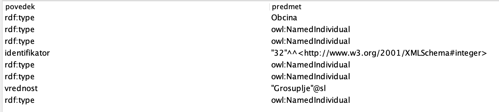

::: notes :::
Rezultat so vsi povedki in predmeti, ki so vezani na občino z identifikatorjem 32 – to je Grosuplje.

Na izpisu opozorimo na tri vrste vrstic:

– rdf:type, ki pove, da gre za primerek razreda crp:Obcina in hkrati za owl:NamedIndividual,
– crp:identifikator z vrednostjo 32,
– crp:vrednost z imenom "Grosuplje" in jezikovno oznako @sl.

To je pravzaprav isti opis, ki smo ga prej gledali v Protégéjevem pogledu Individuals, le da smo ga tokrat dobili s poizvedbo.

Občino Grosuplje si zapomnimo – uporabljali jo bomo kot rdečo nit vse do poglavja o sklepanju, kjer ji bomo dodali še podatke SURS in župana iz DBpedie.
:::

## Od Wikipedije do DBpedie

:::: columns
::: column

- **Wikipedija** – prosta enciklopedija:
  - vsebina je namenjena **ljudem**,
  - strukturirani so predvsem podatki v okencih _(angl. infobox)_.
- **DBpedia** – javna **semantična baza**:
  - vsebino črpa iz teh okenc,
  - vsaka stran dobi svoj **URI**,
  - podatke lahko izpišemo tudi v obliki **Turtle**.

Ista vsebina, dva pogleda:

- 🌐 [Wikipedija: Audi ↗](https://en.wikipedia.org/wiki/Audi){target="\_blank"}
- 🌐 [DBpedia: Audi ↗](https://dbpedia.org/page/Audi){target="\_blank"}

:::
::: column

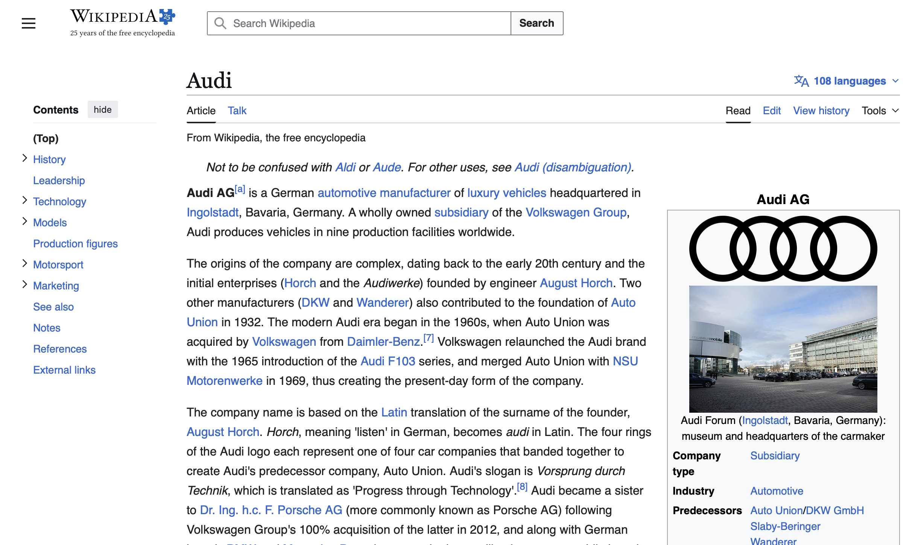

:::
::::

::: notes :::
Za prikaz osnovnih konceptov SPARQL si izposodimo javen primer iz DBpedie.

Najprej pojasnimo razmerje med obema viroma. Wikipedija je prosta enciklopedija, njena vsebina pa je pisana za človeka – strojno je uporabno predvsem tisto, kar je v okencih tipa infobox, torej v tabeli na desni strani članka.

DBpedia to strukturo zajame in jo objavi kot semantično bazo. Vsaka stran na Wikipediji dobi v DBpedii svoj vir s stabilnim URI-jem, njene lastnosti pa postanejo trojčki.

Če odpremo obe povezavi vzporedno, je primerjava zelo nazorna: na levi je članek za človeka, na desni isti podatki kot semantični opis vira – in izpišemo jih lahko tudi v obliki Turtle, torej natanko v zapisu, ki smo ga uporabljali za CRP in SURS.

Na sliki je desno okence infobox z vrsticami Company type, Industry in Predecessors. Prav takšne vrstice postanejo lastnosti, ki jih bomo čez nekaj prosojnic uporabili v poizvedbah – na primer dbo:industry z vrednostjo dbr:Automotive_industry.

Poanta za udeležence: DBpedia ni ločen projekt od Wikipedije, ampak njen strojno berljiv odsev. In prav to je isti prehod, ki smo ga cel dan delali z lastnimi podatki – od zapisa za človeka do zapisa za stroj.
:::

## Primer iz javnega grafa DBpedia

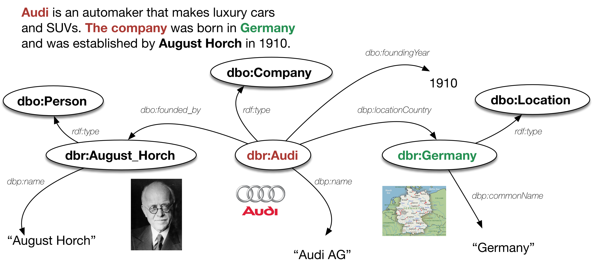

::: notes :::
Iz DBpedie zdaj izluščimo manjši del grafa znanja: August Horch je leta 1910 ustanovil podjetje Audi, ki se nahaja v Nemčiji.

Vidimo tri primerke – August Horch, Audi in Nemčija – vsak je semantično opisan z lastnostmi, ki bodisi nosijo vrednost bodisi kažejo na drug primerek. Audi je tipa dbo:Company, August Horch pa dbo:Person.

Poudarek: to je natanko ista struktura trojčkov, kot smo jo gradili za CRP in SURS – le da je javno dostopna in veliko večja.
:::


## Javni endpoint omogoča poizvedovanje po DBpedii

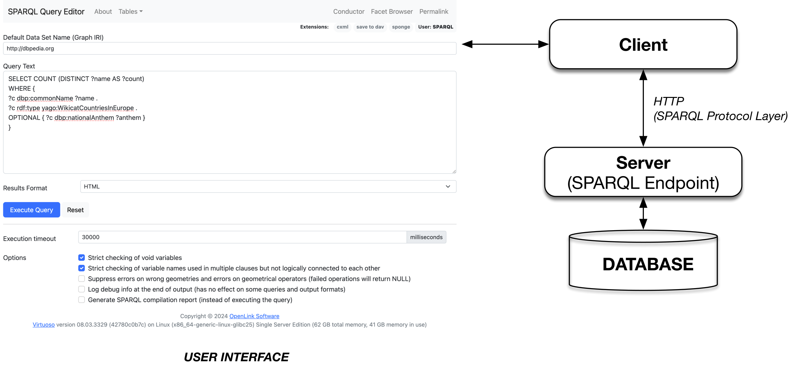

[**Odpri DBpedia SPARQL endpoint →**](https://dbpedia.org/sparql)

::: notes :::
DBpedia ponuja javno storitev za izvajanje poizvedb (angl. SPARQL endpoint) na naslovu https://dbpedia.org/sparql.

Vmesnik je preprost: v polje vpišemo poizvedbo, izberemo obliko rezultata in poženemo. Ničesar ni treba namestiti.

Če delamo v živo, priporočam, da udeleženci odprejo to stran vzporedno in poizvedbe izvajajo z nami – naslednjih nekaj prosojnic je zgrajenih tako, da vsaka doda en element k isti poizvedbi.
:::


## SPARQL poizveduje z ujemanjem vzorcev

- Vzorec trojčka zapišemo podobno kot trojček v obliki Turtle.
- Neznane dele označimo s spremenljivkami.

```sparql
?subject dbp:name ?object .
```

| `?subject`         | `?object`        |
| ------------------ | ---------------- |
| `dbr:August_Horch` | `"August Horch"` |
| `dbr:Audi`         | `"Audi AG"`      |

::: notes :::
Osnovni gradnik poizvedbe je vzorec trojčka. Zapišemo ga enako kot trojček v obliki Turtle, le da neznane dele nadomestimo s spremenljivkami.

V primeru iščemo vse pare osebek–vrednost, povezane z lastnostjo dbp:name. Rezultat je tabela: vsaka vrstica je ena veljavna vezava spremenljivk.

Pomembno je razumeti to miselno preobrazbo: poizvedba ni zaporedje korakov, ampak opis vzorca, ki ga baza poišče v grafu.
:::


## Vzorec se ujema neposredno z deli grafa

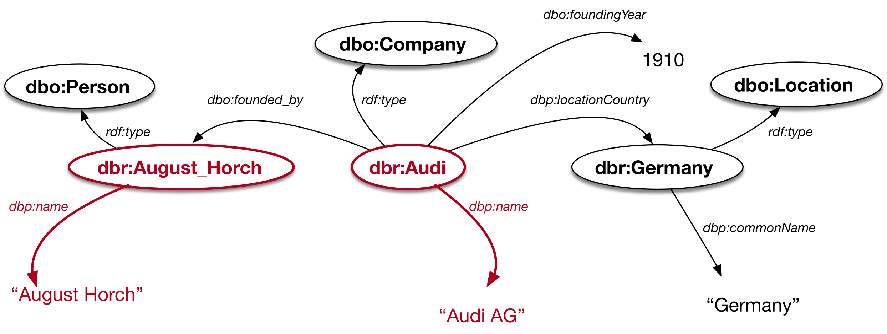

::: notes :::
Slika pokaže, kje v grafu se vzorec ujame.

Vzorec z lastnostjo dbp:name se ujame na dveh mestih – pri primerku August Horch in pri primerku Audi. Zato ima rezultat dve vrstici.

Analogija za udeležence: vzorec je kot šablona, ki jo polagamo čez graf; vsaka lega, kjer se šablona prilega, je ena vrstica rezultata.
:::


## Konjunkcija poveže več vzorcev v en rezultat

:::: columns
::: column

```sparql
?subject dbp:name ?name .
?subject rdf:type dbo:Company .
?subject dbo:foundingYear ?foundingYear .
```

| `?subject` | `?name`     | `?foundingYear` |
| ---------- | ----------- | --------------: |
| `dbr:Audi` | `"Audi AG"` |          `1910` |

:::
::: column

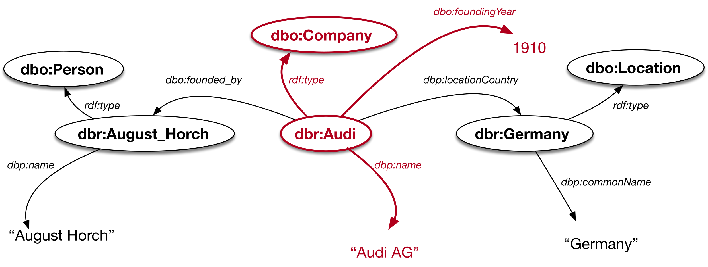

:::
::::

::: notes :::
Več vzorcev zapišemo enega za drugim in jih ločimo s piko. Med njimi velja logični IN – veljati morajo vsi hkrati.

Ključno je, da se ista spremenljivka v vseh treh vzorcih nanaša na isti vir. Spremenljivka ?subject torej mora biti hkrati nekaj, kar ima ime, kar je tipa dbo:Company in kar ima leto ustanovitve.

Ker je vzorec s tremi pogoji precej bolj omejujoč, se v našem malem grafu ujame le podjetje Audi.
:::


## Poizvedba SPARQL ima štiri osnovne dele

:::: columns
::: column

```sparql
PREFIX rdf: <http://www.w3.org/1999/02/22-rdf-syntax-ns#>
PREFIX dbp: <http://dbpedia.org/property/>
PREFIX dbo: <http://dbpedia.org/ontology/>
SELECT ?name ?foundingYear

FROM <http://dbpedia.org/>

WHERE {
  ?subject dbp:name ?name .
  ?subject rdf:type dbo:Company .
  ?subject dbo:foundingYear ?foundingYear .
}
```

> Izvedite zgornjo poizvedbo na DBPedii. Kakšne rezultate dobite? So pričakovani?

:::
::: column

- `PREFIX` določi kratice imenskih prostorov.
- `SELECT` določi rezultatne spremenljivke.
- `FROM` izbere graf.
- `WHERE` opiše iskane vzorce.

:::
::::

::: notes :::
Zdaj sestavimo prvo celotno poizvedbo. Ima štiri dele.

PREFIX določi okrajšave imenskih prostorov – popolnoma enako kot v datotekah TTL. Polni URI zapišemo med lomljena oklepaja.

SELECT določi, katere spremenljivke želimo v rezultatu.

FROM določi graf, nad katerim poizvedujemo. Pri DBpedii ga lahko tudi izpustimo, saj poizvedujemo nad privzetim grafom.

WHERE vsebuje grafne vzorce in pogoje, ki morajo veljati za vsak rezultat.

Namig: če primerjamo s SQL, sta SELECT in WHERE znana, FROM pa ne izbira tabele, ampak graf.
:::


## DBpedia ponuja javno storitev SPARQL

:::: columns
::: column

- Endpoint: https://dbpedia.org/sparql
- Približno **900 milijonov dejstev**
- Približno **400.000 organizacij**

```sparql
PREFIX rdf: <http://www.w3.org/1999/02/22-rdf-syntax-ns#>
PREFIX dbp: <http://dbpedia.org/property/>
PREFIX dbo: <http://dbpedia.org/ontology/>
SELECT ?name ?foundingYear

FROM <http://dbpedia.org/>

WHERE {
  ?subject dbp:name ?name .
  ?subject rdf:type dbo:Company .
  ?subject dbo:foundingYear ?foundingYear .
}
```

:::
::: column

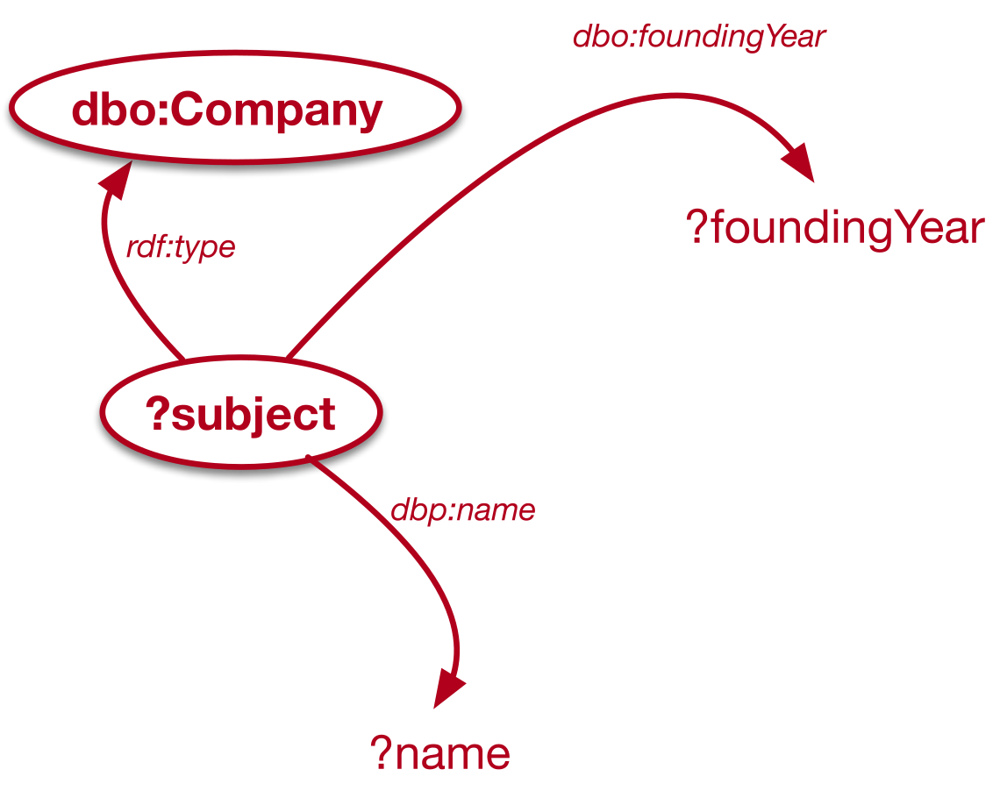

:::
::::

::: notes :::
Zdaj poizvedbo dejansko poženimo na https://dbpedia.org/sparql.

Vprašanje udeležencem: so rezultati taki, kot ste pričakovali?

Rezultatov je zelo veliko. Naš vzorec namreč opisuje poljubno podjetje z imenom in letom ustanovitve, takih pa je v DBpedii med približno 400.000 organizacijami ogromno. Celotna baza obsega okoli 900 milijonov dejstev.

To je dober trenutek za poanto: pri velikem grafu vzorec sam po sebi ne zadošča – potrebujemo urejanje, omejevanje in filtriranje. Prav to bomo dodajali na naslednjih prosojnicah.
:::


## `ORDER BY` in `LIMIT` urejata rezultate

```sparql
PREFIX rdf: <http://www.w3.org/1999/02/22-rdf-syntax-ns#>
PREFIX dbp: <http://dbpedia.org/property/>
PREFIX dbo: <http://dbpedia.org/ontology/>

SELECT ?name ?foundingYear

FROM <http://dbpedia.org/>

WHERE {
  ?subject dbp:name ?name .
  ?subject rdf:type dbo:Company .
  ?subject dbo:foundingYear ?foundingYear .
}

ORDER BY ASC(?name)
LIMIT 100
```

::: notes :::
Prvi poskus, da pridemo do zapisa za Audi, je urejanje in omejevanje.

ORDER BY uredi rezultate – tu naraščajoče po imenu podjetja. LIMIT omeji izpis na prvih 100 vrstic.

Ko pogledamo rezultate, vidimo težavo: nekatera podjetja imajo prazna imena, druga pa se leksikografsko uvrščajo precej pred Audi. Tako do iskanega zapisa še ne pridemo.
:::


## `OFFSET` preskoči začetni del rezultatov

```sparql
PREFIX rdf: <http://www.w3.org/1999/02/22-rdf-syntax-ns#>
PREFIX dbp: <http://dbpedia.org/property/>
PREFIX dbo: <http://dbpedia.org/ontology/>

SELECT ?name ?foundingYear

FROM <http://dbpedia.org/>

WHERE {
  ?subject dbp:name ?name .
  ?subject rdf:type dbo:Company .
  ?subject dbo:foundingYear ?foundingYear .
}

ORDER BY ASC(?name)
LIMIT 100
OFFSET 14800
```

::: notes :::
Z OFFSET preskočimo začetni del urejenih rezultatov. Če preskočimo približno 14.800 zadetkov, se Audi AG pojavi med naslednjimi stotimi.

Opozorilo, ki ga velja povedati na glas: DBpedia je živa baza, zato ta številka ni zanesljiva. Stanje velja za 11. februar 2026 in se bo ob vaši izvedbi verjetno razlikovalo.

Ob rezultatih opazimo še nekaj zanimivega: za Audi AG je zapisanih več različnih let ustanovitve, prvo je 1909. To je lepa iztočnica za pogovor o kakovosti javnih podatkov.

Poanta prosojnice: ORDER BY, LIMIT in OFFSET so uporabni za listanje, ne pa za iskanje.
:::


## `FILTER` omeji rezultate na izbrane vire

```sparql
PREFIX rdf: <http://www.w3.org/1999/02/22-rdf-syntax-ns#>
PREFIX dbp: <http://dbpedia.org/property/>
PREFIX dbo: <http://dbpedia.org/ontology/>

SELECT ?name ?foundingYear

FROM <http://dbpedia.org/>

WHERE {
  ?subject dbp:name ?name .
  ?subject rdf:type dbo:Company .
  ?subject dbo:foundingYear ?foundingYear .

  FILTER (?subject IN (dbr:Audi))

}

LIMIT 100
```

::: notes :::
Boljša pot je filtriranje.

Ker točno vemo, kateri primerek iščemo – dbr:Audi –, z omejitvijo FILTER zahtevamo, da je osebek prav ta vir. Ostale omejitve lahko odstranimo.

Enakovredna možnost je, da namesto spremenljivke ?subject kar neposredno zapišemo dbr:Audi v vzorce. Rezultat je isti; izbira je stvar berljivosti.
:::


## `FILTER REGEX` filtrira besedilo

```sparql
PREFIX rdf: <http://www.w3.org/1999/02/22-rdf-syntax-ns#>
PREFIX dbp: <http://dbpedia.org/property/>
PREFIX dbo: <http://dbpedia.org/ontology/>

SELECT ?name ?foundingYear

FROM <http://dbpedia.org/>

WHERE {
  ?subject dbp:name ?name .
  ?subject rdf:type dbo:Company .
  ?subject dbo:foundingYear ?foundingYear .

  FILTER REGEX(?name, "^audi", "i")

}

LIMIT 100
```

::: notes :::
V praksi točnih URI-jev pogosto ne poznamo – ti so namenjeni predvsem organizaciji podatkov in si jih je težko zapomniti.

Zato filtriramo po besedilu z regularnim izrazom. Izraz »^audi« vrne vsa imena, ki se začnejo z audi, zastavica »i« pa pomeni, da velikost črk ni pomembna.

Uporabimo lahko poljubno standardno sintakso regularnih izrazov.

Opomba za izvedbo: REGEX je počasnejši od natančnega ujemanja, ker mora preveriti vsako vrednost posebej.
:::


## Obvezni vzorec izloči rezultate brez trgovalnega imena

[**Opis razreda `dbo:Company` →**](https://dbpedia.org/ontology/Company)

```sparql
SELECT ?name ?foundingYear ?tradingName

FROM <http://dbpedia.org/>

WHERE {
  ?subject dbp:name ?name .
  ?subject rdf:type dbo:Company .
  ?subject dbo:foundingYear ?foundingYear .
  
  ?subject dbo:tradingName ?tradingName .
  FILTER REGEX(?name, "^audi", "i")

}

LIMIT 100
```

::: notes :::
V opisu razreda dbo:Company na DBpedii najdemo lastnost dbo:tradingName. Dodajmo jo v poizvedbo kot običajen vzorec.

Rezultat je prazen. Zakaj?

Ker primerek dbr:Audi te lastnosti nima. Vzorec je obvezen, zato se celotna poizvedba ne more ujeti in ne vrne ničesar.

To je pogosta in zelo poučna past: v grafu odsotnost podatka ni prazna vrednost, ampak odsotnost trojčka.
:::


## `OPTIONAL` ohrani rezultate brez trgovalnega imena

[**Opis razreda `dbo:Company` →**](https://dbpedia.org/ontology/Company)

```sparql
SELECT ?name ?foundingYear ?tradingName

FROM <http://dbpedia.org/>

WHERE {
  ?subject dbp:name ?name .
  ?subject rdf:type dbo:Company .

  ?subject dbo:foundingYear ?foundingYear .
  OPTIONAL { ?subject dbo:tradingName ?tradingName . }

  FILTER REGEX(?name, "^audi", "i")
}

LIMIT 100
```

::: notes :::
Rešitev je ključna beseda OPTIONAL.

Obvezni del vzorca se mora ujeti, neobvezni pa se doda le, če obstaja. Če ga ni, ostane spremenljivka nevezana, vrstica pa se kljub temu vrne.

To je torej ustreznik levega zunanjega stika (LEFT OUTER JOIN) iz sveta relacijskih baz.

Praktični nasvet: pri odprtih podatkih, kjer so zapisi neenakomerno izpolnjeni, je OPTIONAL pogosto edini način, da poizvedba sploh vrne uporaben rezultat.
:::


## Vzorce lahko sestavljamo

[**Primer: Audi v DBpedii →**](https://dbpedia.org/page/Audi)

```sparql
SELECT ?carCompanyName

FROM <http://dbpedia.org/>

WHERE {
  ?carCompany rdfs:label ?carCompanyName .
  ?carCompany dbo:industry dbr:Automotive_industry .
  ?carCompany dbp:locationCountry dbr:Germany .

  FILTER (LANG(?carCompanyName) = "en")
}
```

::: notes :::
Zdaj naredimo korak od tehnike k vsebinskemu vprašanju: koliko avtomobilskih proizvajalcev je v Nemčiji?

Na strani za Audi najdemo lastnost dbo:industry z vrednostjo dbr:Automotive_industry in lastnost dbp:locationCountry za državo. Iz tega sestavimo vzorec.

Brez omejitve dobimo isto podjetje večkrat – enkrat za vsak jezik oznake. Zato z FILTER omejimo oznake na angleščino in dobimo 9 podjetij.

Dva praktična poudarka: del FROM lahko izpustimo, ker poizvedujemo po privzetem grafu DBpedie, funkcija LANG pa vrne jezikovno oznako literala – enako oznako smo pri CRP uporabljali za @sl.
:::


## `UNION` združi alternativne vzorce

```sparql
SELECT ?carCompanyName

FROM <http://dbpedia.org/>

WHERE {
  ?carCompany rdfs:label ?carCompanyName .
  ?carCompany dbo:industry dbr:Automotive_industry .

  { ?carCompany dbp:locationCountry dbr:Germany . }
  UNION
  { ?carCompany dbp:locationCountry dbr:Slovenia . }

  FILTER (LANG(?carCompanyName) = "en")
}
```

::: notes :::
SPARQL podpira tudi logično disjunkcijo, torej ALI, s ključno besedo UNION.

Skupni del vzorca zapišemo enkrat, nato pa v zavitih oklepajih navedemo alternativi, povezani z UNION.

Poizvedba zdaj pomeni: podjetje iz avtomobilske industrije, ki se nahaja bodisi v Nemčiji bodisi v Sloveniji.

Ko jo poženemo, ugotovimo, da se seznamu pridruži le eno dodatno podjetje z angleškim imenom iz Slovenije.
:::


## Avtomobilska podjetja po državah

```sparql
SELECT ?carCompanyName ?countryName

WHERE {
  ?carCompany rdfs:label ?carCompanyName .
  ?carCompany dbo:industry dbr:Automotive_industry .
  ?carCompany dbp:locationCountry ?country .
  ?country rdfs:label ?countryName .

  FILTER (
    LANG(?carCompanyName) = "en" &&
    LANG(?countryName) = "en"
  )
}
```

::: notes :::
Zdaj poizvedbo posplošimo: namesto fiksne države uvedemo spremenljivko ?country in izpišemo še njeno oznako.

Pogoj FILTER razširimo, da sta obe oznaki – ime podjetja in ime države – v angleščini. Dva pogoja povežemo z operatorjem &&.

Rezultat zdaj zajema podjetja iz precejšnjega števila držav. S tem imamo osnovo, nad katero bomo v nadaljevanju računali agregate.
:::


## `COUNT` izračuna agregat nad rezultati

```sparql
SELECT (COUNT(DISTINCT ?carCompanyName) AS ?carCompanyNameCount)

WHERE {
  ?carCompany rdfs:label ?carCompanyName .
  ?carCompany dbo:industry dbr:Automotive_industry .
  ?carCompany dbp:locationCountry ?country .
  ?country rdfs:label ?countryName .

  FILTER (
    LANG(?carCompanyName) = "en" &&
    LANG(?countryName) = "en"
  )

}
```

::: notes :::
Vprašajmo se, koliko avtomobilskih podjetij je v prejšnjem rezultatu.

Agregatne funkcije zapišemo v del SELECT, izračunani stolpec pa poimenujemo z AS.

COUNT brez DISTINCT vrne 318, ker so nekatera podjetja povezana z več državami in jih zato preštejemo večkrat. Z DISTINCT jih preštejemo 310.

Na voljo so tudi SUM, AVG, MIN, MAX in SAMPLE.

Poudarek: razlika med 318 in 310 ni napaka baze, ampak posledica tega, da je isto podjetje lahko vezano na več držav.
:::


## `GROUP BY` izračuna rezultat za vsako državo

```sparql
SELECT ?countryName
       (COUNT(DISTINCT ?carCompanyName) AS ?carCompanyNameCount)

WHERE {
  ?carCompany rdfs:label ?carCompanyName .
  ?carCompany dbo:industry dbr:Automotive_industry .
  ?carCompany dbp:locationCountry ?country .
  ?country rdfs:label ?countryName .

  FILTER (LANG(?carCompanyName) = "en" && LANG(?countryName) = "en")
}

GROUP BY ?countryName
ORDER BY DESC(?carCompanyNameCount)
```

::: notes :::
Skupno število nam še ne pove ničesar o porazdelitvi po državah. Zato rezultate razdelimo v skupine z GROUP BY in agregat izračunamo znotraj vsake skupine.

V delu GROUP BY navedemo spremenljivke, po katerih grupiramo – tu je to ime države. Rezultate uredimo padajoče po številu podjetij.

Ob izvedbi ugotovimo, da je največ avtomobilskih podjetij registriranih v Združenih državah Amerike, sledi Kitajska.

Pravilo, ki ga velja poudariti: vse spremenljivke v SELECT morajo biti bodisi v GROUP BY bodisi zavite v agregatno funkcijo.
:::


## `GROUP_CONCAT` združi imena znotraj skupine

```sparql
SELECT ?countryName
       (COUNT(DISTINCT ?carCompanyName) AS ?carCompanyNameCount)
       (GROUP_CONCAT(?carCompanyName) AS ?carCompanyNames)

WHERE {
  ?carCompany rdfs:label ?carCompanyName .
  ?carCompany dbo:industry dbr:Automotive_industry .
  ?carCompany dbp:locationCountry ?country .
  ?country rdfs:label ?countryName .

  FILTER (LANG(?carCompanyName) = "en" && LANG(?countryName) = "en")
}

GROUP BY ?countryName
ORDER BY DESC(?carCompanyNameCount)
```

::: notes :::
Zdaj nas zanima, katera podjetja sploh so v posamezni skupini.

GROUP_CONCAT vzame vse vrednosti znotraj skupine in jih zlepi v en sam niz. V našem primeru tako poleg števila dobimo še seznam imen podjetij po državah.

Ločilo lahko določimo sami z argumentom SEPARATOR; privzeto je presledek.
:::


## `HAVING` filtrira izračunane skupine

```sparql
SELECT ?countryName
       (COUNT(DISTINCT ?carCompanyName) AS ?carCompanyNameCount)
       (GROUP_CONCAT(?carCompanyName) AS ?carCompanyNames)

WHERE {
  ?carCompany rdfs:label ?carCompanyName .
  ?carCompany dbo:industry dbr:Automotive_industry .
  ?carCompany dbp:locationCountry ?country .
  ?country rdfs:label ?countryName .

  FILTER (LANG(?carCompanyName) = "en" && LANG(?countryName) = "en")
}

GROUP BY ?countryName
HAVING (COUNT(?carCompanyName) > 5)
ORDER BY DESC(?carCompanyNameCount)
```

::: notes :::
Zadnji gradnik: kaj, če želimo filtrirati po izračunani vrednosti?

Pogojev nad agregati ne moremo pisati v FILTER znotraj WHERE, ker takrat agregat še ni izračunan. Zanje je namenjen del HAVING, ki pride za GROUP BY.

Tu izpišemo le države z več kot petimi avtomobilskimi podjetji. Rezultat vsebuje 13 držav, med njimi vse dobro znane avtomobilske proizvajalke.

To je naša končna poizvedba – od preprostega vzorca smo prišli do agregirane analize nad javnim grafom znanja.
:::


## SPARQL 1.1 podpira tudi druge vrste operacij

- Oblike poizvedb:
  - `SELECT`
  - `CONSTRUCT`
  - `ASK`
  - `DESCRIBE`
- Posodabljanje podatkov: `INSERT DATA`
- Zahtevnejši vzorci
  - gnezdene poizvedbe
  - `BIND` za izračun novih vrednosti
  - poti lastnosti (angl. property paths) za sprehode po grafu
  - `SERVICE` za federirane poizvedbe
- Preverjanje podatkov s **SHACL**

::: notes :::
Na kratko povzemimo, česa nismo obravnavali, da udeleženci vedo, kam gledati naprej.

Poleg SELECT obstajajo še: CONSTRUCT, ki iz rezultatov zgradi nov graf RDF po predlogi; ASK, ki samo preveri, ali vzorec sploh obstaja, in vrne da ali ne; ter DESCRIBE, ki vrne opis izbranega vira – podobno, kot smo videli na strani za Audi.

Podatke lahko tudi spreminjamo, na primer z INSERT DATA.

Med zahtevnejšimi vzorci so vgnezdene poizvedbe, BIND za izračun novih vrednosti, poti lastnosti (angl. property paths) za sprehode po grafu in SERVICE za federirane poizvedbe – tega bomo uporabili čez nekaj prosojnic.

Omenimo še SHACL, standard W3C za validacijo vsebine grafa RDF: z njim opišemo omejitve, ki jih morajo podatki izpolnjevati, in nato preverimo skladnost.
:::


## SPARQL lahko uporabljamo tudi iz Pythona

- Poizvedbe izvajamo nad oddaljenimi storitvami SPARQL.
- Rezultate lahko obdelamo v običajnem podatkovnem postopku Python.

[**Odpri zvezek `SPARQL_in_Python.ipynb` →**](./gradivo/SPARQL_in_Python.ipynb)

> Če nimate nameščenega Pythona, lahko zvezek poženete v storitvi [**Google Colab →**](http://colab.google.com/).

::: notes :::
SPARQL ni omejen na spletne vmesnike – uporabljamo ga lahko tudi programsko, podobno kot SQL pri relacijskih bazah.

Priložen je delovni zvezek Jupyter, ki ga lahko poženete lokalno ali v storitvi Google Colab. Prikazuje programsko uporabo javnih storitev SPARQL.

Poanta za javno upravo: rezultat poizvedbe je običajna podatkovna struktura, ki jo lahko takoj vključimo v obstoječi podatkovni postopek – od priprave poročila do polnjenja aplikacije.
:::


## Semantične podatke hranimo v namenskih bazah

:::: columns
::: column

- Primeri baz RDF s podporo SPARQL:
  - **GraphDB** _(uporabimo na delavnici)_,
  - Apache Jena Fuseki,
  - Amazon Neptune,
  - Oracle Graph Database.

:::
::: column

- Kaj pridobimo v primerjavi s Protégé?
  - **trajno hrambo** večjih grafov,
  - **storitev SPARQL** za odjemalce,
  - **sklepanje** ob uvozu podatkov,
  - **federirane poizvedbe** preko več virov.

:::
::::

::: notes :::
Do zdaj smo poizvedovali v Protégé, ki je urejevalnik ontologij in ne podatkovna baza. Za resno rabo potrebujemo namensko bazo RDF, ki jim pogosto rečemo tudi trojčkovne baze.

Naštete so štiri: GraphDB, ki ga bomo uporabili, odprtokodni Apache Jena Fuseki ter oblačni rešitvi Amazon Neptune in Oracle Graph Database.

Vse naštete znajo hraniti trojčke in izpostaviti storitev SPARQL, razlikujejo pa se po zmogljivosti sklepanja in po licenčnem modelu.

Desni stolpec je bistven: baza nam prinese trajno hrambo, dostop za druge aplikacije, sklepanje ob uvozu in možnost povezovanja z zunanjimi grafi. Prav ta dva zadnja elementa bosta osrednja tema nadaljevanja delavnice.
:::

## 🧑‍💻 Zagon baze GraphDB v okolju Docker

:::: columns
::: column

```bash
docker run -p 127.0.0.1:7200:7200 \
  --name graphdb-instance-name-11 \
  -t ontotext/graphdb:11.3.1
```

- Vmesnik: 🌐 [http://localhost:7200](http://localhost:7200){target="\_blank"}
- Ponovni zagon istega vsebnika:

```bash
docker start graphdb-instance-name-11
```

:::
::: column

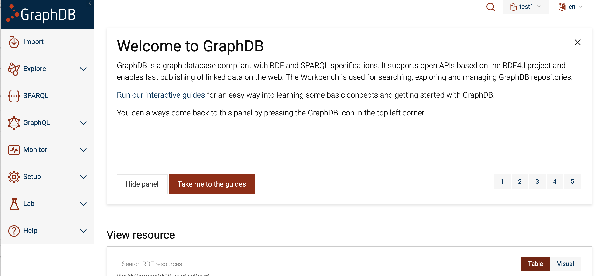

> Za uporabo brezplačne verzije potrebujete licenco, ki jo lahko pridobite na spletni strani [https://www.ontotext.com/products/graphdb](https://www.ontotext.com/products/graphdb){target="\_blank"}.

:::
::::

::: notes :::
Bazo poženemo v Dockerju, da nam ni treba ničesar nameščati.

Ukaz preslika vrata 7200 iz vsebnika na lokalni računalnik, vsebniku da ime in uporabi različico 11.2.1. Zapis 127.0.0.1 pomeni, da je baza dostopna samo z našega računalnika.

Ko se baza vzpostavi, jo odpremo v brskalniku na naslovu localhost, vrata 7200.

Za brezplačno različico potrebujete licenco, ki jo dobite na spletni strani Ontotexta – to povejte vnaprej, da udeleženci niso presenečeni.

Praktičen namig: ukaz docker run vsebnik ustvari, zato ga poženemo samo prvič. Ko bazo ustavimo in jo želimo znova zagnati, uporabimo docker start z istim imenom – sicer dobimo napako, da vsebnik s tem imenom že obstaja.
:::

## 🧑‍💻 Nov repozitorij in nastavitve sklepanja

:::: columns
::: column

- Ustvarimo nov **GraphDB Repository**,
- v razdelku _Inference and Validation_:
  - **odznačimo** _Disable owl:sameAs_,
  - ohranimo _RDFS-Plus (Optimized)_.

> 🧑🏻‍🎓 Zakaj je prav ta nastavitev pomembna za nadaljevanje?

:::
::: column

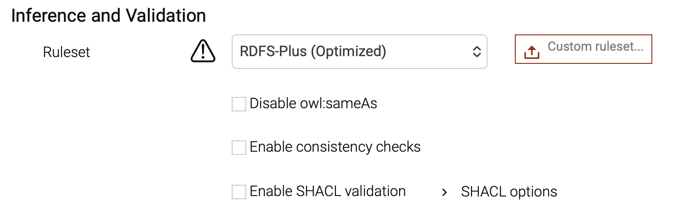

:::
::::

::: notes :::
Ta prosojnica je majhna po obsegu, a ključna za vse, kar sledi.

Nastavitev Disable owl:sameAs moramo odznačiti, torej sklepanja o enakosti ne smemo izklopiti. Če ostane vklopljena, bo baza lastnost owl:sameAs sicer shranila, ne bo pa je upoštevala – in povezovanje CRP ter SURS, ki smo ga gradili v petem poglavju, v poizvedbah preprosto ne bo delovalo.

Način sklepanja pustimo na RDFS-Plus (Optimized). Ta podpira rdfs:subClassOf, rdfs:subPropertyOf, owl:sameAs in owl:equivalentClass – torej natanko tisto, kar smo uporabili pri povezovanju virov.

Odgovor na vprašanje: ker sicer v poglavju o sklepanju ne bomo videli nobenih novih, izpeljanih trojčkov.

Opozorilo: nastavitve sklepanja se določijo ob ustvarjanju repozitorija in jih pozneje ni mogoče preprosto spremeniti – v tem primeru je treba repozitorij ustvariti na novo.
:::

## 🧑‍💻 Uvoz podatkov CRP in SURS

:::: columns
::: column

- V meniju _Import_ izberemo repozitorij in naložimo:
  - [🐢 CRP.ttl ↗](./assets/data/processed/CRP.ttl){target="\_blank"},
  - [🐢 SURS_obcine_dp_op.ttl ↗](./assets/data/processed/SURS_obcine_dp_op.ttl){target="\_blank"}.
- Uvoženih **10.575 trojčkov** _(Explicit)_,
- dodatno izpeljanih **7.507 trojčkov** _(Inferred)_.

:::
::: column

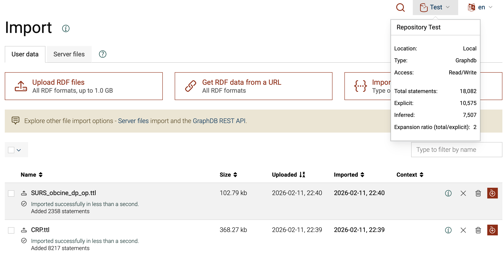

:::
::::

::: notes :::
Uvozimo obe datoteki, ki smo ju pripravili v prejšnjih poglavjih: register CRP in statistične podatke SURS.

Najpomembnejša je številka v desnem stolpcu. Eksplicitno smo uvozili 10.575 trojčkov – to je natanko to, kar piše v datotekah. Poleg tega pa je baza sama dodala še 7.507 trojčkov, ki jih ni zapisal nihče.

Od kod ti trojčki? Iz pravil sklepanja. Če na primer zapišemo, da je nek razred podrazred drugega, baza samodejno izpelje, da so vsi njegovi primerki tudi primerki nadrazreda.

Temu pravimo materializacija: izpeljana dejstva se dejansko shranijo, zato so pri poizvedovanju takoj na voljo in jih ni treba računati sproti.

Podrobneje si bomo to ogledali v naslednjem poglavju – zdaj si zapomnimo le številko 7.507, saj se bo kmalu spremenila.
:::

## 🧑‍💻 Ista poizvedba, druga baza

:::: columns
::: column

```SPARQL
PREFIX crp: <https://pzsi.sigov.si/datamodel/ns/crp#>

SELECT ?povedek ?predmet

WHERE {
    crp:Obcina_32 ?povedek ?predmet .
}
```

:::
::: column

- Poizvedba je **nespremenjena**,
- spremenilo se je le **okolje izvajanja**,
- podatki so zdaj v **bazi**, ne v urejevalniku.

> 🧑🏻‍🎓 Kaj to pomeni za ponovno uporabo poizvedb?

:::
::::

::: notes :::
V zavihku SPARQL poženemo natanko tisto poizvedbo, ki smo jo na začetku poglavja izvedli v Protégé – tisto za občino z identifikatorjem 32.

Rezultat je enak, kar je pravzaprav bistvo te prosojnice.

Poanta: SPARQL je standard W3C, zato poizvedba ni vezana na konkretno orodje ali ponudnika. Isto poizvedbo lahko poženemo v Protégé, v GraphDB, prek javnega vmesnika ali iz programa v Pythonu.

To je velika razlika glede na svet relacijskih baz, kjer se narečja SQL med ponudniki razlikujejo.

Odgovor na vprašanje: poizvedbe lahko delimo, objavimo v dokumentaciji ali vključimo v aplikacijo, ne da bi jih bilo treba prilagajati okolju.
:::

## Federirane poizvedbe povežejo več grafov

:::: columns
::: column

- Ukaz **`SERVICE`** izvede del poizvedbe nad **oddaljeno storitvijo** SPARQL,
- podatkov **ni treba prenesti** v lastno bazo,
- rezultati se **združijo v en odgovor**.

:::
::: column

```SPARQL
PREFIX rdf: <http://www.w3.org/1999/02/22-rdf-syntax-ns#>
PREFIX dbo: <http://dbpedia.org/ontology/>
PREFIX dbr: <http://dbpedia.org/resource/>
PREFIX dbp: <http://dbpedia.org/property/>

SELECT ?subject ?name ?foundingYear

WHERE {
  SERVICE <https://dbpedia.org/sparql> {
    ?subject dbp:name ?name .
    ?subject rdf:type dbo:Company .
    ?subject dbo:foundingYear ?foundingYear .
    FILTER (?subject IN (dbr:Audi))
  }
}
```

:::
::::

::: notes :::
Doslej smo poizvedovali bodisi nad javno DBpedio bodisi nad lastno bazo. Zdaj oboje združimo.

Ukaz SERVICE pove, da se blok v zavitih oklepajih ne izvede lokalno, ampak na navedeni oddaljeni storitvi SPARQL. Rezultat se vrne in vključi v našo poizvedbo.

Ta primer poženemo v naši bazi GraphDB, čeprav v njej ni prav nobenega podatka o Audiju – vse pride iz DBpedie.

Zakaj je to pomembno za javni sektor? Zunanjih podatkov nam ni treba kopirati in vzdrževati. Poizvedujemo po viru, ki ga vzdržuje nekdo drug, in vedno dobimo njegovo trenutno stanje.

Omejitve povejmo pošteno: federirana poizvedba je odvisna od razpoložljivosti in hitrosti oddaljene storitve, zato je smiselno oddaljeni del čim bolj omejiti – tukaj smo ga z ukazom FILTER omejili na en sam vir.
:::

## 🧑‍💻 Kdo je župan občine Grosuplje?

:::: columns
::: column

```SPARQL
PREFIX rdf: <http://www.w3.org/1999/02/22-rdf-syntax-ns#>
PREFIX crp: <https://pzsi.sigov.si/datamodel/ns/crp#>
PREFIX dbp: <http://dbpedia.org/property/>

SELECT ?idObcine ?zupan

WHERE {
    SERVICE <https://dbpedia.org/sparql> {
      ?subject dbp:officialName "Grosuplje"@en .
      ?subject dbp:leaderName ?zupan .
    }
    ?obcina rdf:type crp:Obcina .
    ?obcina crp:identifikator ?idObcine .
    ?obcina crp:vrednost "Grosuplje"@sl .
}
```

:::
::: column

- V CRP imamo **identifikator in ime** občine,
- podatka o županu **nimamo**,
- DBpedia ga ima: 🌐 [Grosuplje ↗](https://dbpedia.org/page/Grosuplje){target="\_blank"}.

| `?idObcine` | `?zupan`        |
| ----------: | --------------- |
|        `32` | `"Peter Verlič"` |

:::
::::

::: notes :::
To je prosojnica, ki pokaže dodano vrednost celotnega dneva na enem primeru.

V registru CRP imamo o občini Grosuplje shranjena le identifikator in ime. Podatka o županu ni – in tudi ne sodi v ta register.

DBpedia pa ta podatek ima, saj ima Grosuplje svoj zapis, ki izhaja iz Wikipedije.

Poizvedba ima zato dva dela: blok SERVICE poišče župana na DBpedii, spodnji del pa poišče identifikator v naši lokalni bazi. Rezultat je združen: identifikator 32 in ime župana Peter Verlič.

Opozorilo na jezikovne oznake, ki je pomembno za razumevanje: na DBpedii iščemo z oznako @en, v CRP pa z oznako @sl. Ista občina, dva vira, dve jezikovni oznaki.

Poudarek za razpravo: podatkov o županih nismo prepisali k sebi. Ostali so tam, kjer se vzdržujejo, mi pa smo jih povezali v trenutku poizvedbe.

Vprašanje za udeležence: kje bi lahko tak pristop uporabili v svoji organizaciji?
:::

# 7. Sklepanje: prehod od podatkov k znanju

Uporaba več podatkovnih virov in materializacija – SURS in CRP

::: notes :::
V zadnjem vsebinskem poglavju naredimo korak od podatkov k znanju.

Do zdaj smo podatke opisali, povezali in nad njimi poizvedovali. Zdaj bomo pokazali, kako baza iz zapisanih dejstev sama izpelje nova dejstva – in zakaj to spremeni tisto, kar lahko vprašamo.

Rdeča nit ostaja občina Grosuplje, delali pa bomo v bazi GraphDB, ki smo jo pripravili v prejšnjem poglavju.
:::

## Sklepanje poveže podatke SURS in CRP

Vira CRP in SURS nista povezana in primer podatkov izgleda sledeče:

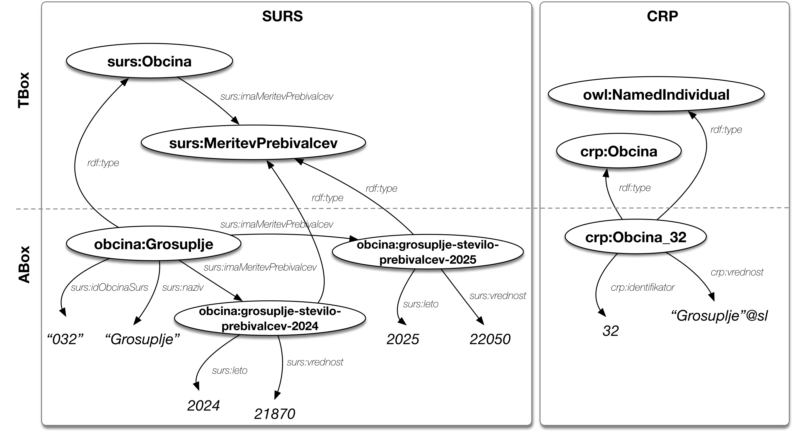

::: notes :::
Poglejmo, kaj je trenutno v naši bazi. Uvozili smo datoteki CRP in SURS, vendar vira med seboj nista povezana – na sliki sta to dve ločeni komponenti grafa.

Na levi strani je SURS: razreda surs:Obcina in surs:MeritevPrebivalcev v delu TBox ter primerek obcina:Grosuplje z identifikatorjem 032, nazivom in meritvama za leti 2024 in 2025.

Na desni je CRP: razred crp:Obcina in primerek crp:Obcina_32 z identifikatorjem 32 in imenom "Grosuplje" z jezikovno oznako @sl.

Človek takoj vidi, da gre za isto občino. Baza tega ne ve – ničesar takega ji nismo povedali.

Opozorimo še na razliko v identifikatorjih: SURS uporablja niz "032", CRP pa število 32. Prav to je tipična ovira pri povezovanju virov v praksi.
:::

## 🧑‍💻 Vsak vir zase odgovori na svoj del vprašanja

:::: columns
::: column

[🐢 CRP.ttl ↗](./assets/data/processed/CRP.ttl){target="\_blank"}

```SPARQL
PREFIX rdf: <http://www.w3.org/1999/02/22-rdf-syntax-ns#>
PREFIX crp: <https://pzsi.sigov.si/datamodel/ns/crp#>

SELECT ?imeObcineCRP ?idCRP
WHERE {
  ?obcinaCRP crp:vrednost ?imeObcineCRP .
  ?obcinaCRP crp:identifikator ?idCRP .
  ?obcinaCRP rdf:type crp:Obcina .
  FILTER (?imeObcineCRP = "Grosuplje"@sl)
}
```

:::
::: column

[🐢 SURS_obcine_dp_op.ttl ↗](./assets/data/processed/SURS_obcine_dp_op.ttl){target="\_blank"}

```SPARQL
PREFIX rdf: <http://www.w3.org/1999/02/22-rdf-syntax-ns#>
PREFIX surs: <https://onto.mdp.gov.si/shema/>

SELECT ?imeObcineSURS ?idSURS
       ?letoMeritve ?steviloPrebivalcev
WHERE {
  ?obcinaSURS surs:naziv ?imeObcineSURS .
  ?obcinaSURS surs:idObcinaSurs ?idSURS .
  ?obcinaSURS rdf:type surs:Obcina .
  ?obcinaSURS surs:imaMeritevPrebivalcev ?meritev .
  ?meritev surs:leto ?letoMeritve .
  ?meritev surs:vrednost ?steviloPrebivalcev .
  FILTER (?imeObcineSURS = "Grosuplje")
}
```

:::
::::

::: notes :::
Najprej pokažimo, da vsak vir zase brez težav odgovori na svoj del vprašanja.

Leva poizvedba nad CRP vrne ime in identifikator občine Grosuplje. Desna nad SURS vrne naziv, identifikator SURS ter leto in število prebivalcev za vsako meritev.

Bodimo pozorni na filtra, ki sta videti skoraj enaka, pa nista. Pri CRP moramo pisati "Grosuplje" z oznako @sl, pri SURS pa "Grosuplje" brez oznake. Literal z jezikovno oznako in literal brez nje v RDF nista ista vrednost.

To je pogost vzrok za prazne rezultate. Če poizvedba ne vrne ničesar, najprej preverimo jezikovne oznake.

Obe poizvedbi poženemo v GraphDB, da udeleženci vidita rezultata pred naslednjim korakom.
:::

## 🧑‍💻 Skupna poizvedba – rezultat je videti pravilen

:::: columns
::: column

```SPARQL
PREFIX rdf: <http://www.w3.org/1999/02/22-rdf-syntax-ns#>
PREFIX crp: <https://pzsi.sigov.si/datamodel/ns/crp#>
PREFIX surs: <https://onto.mdp.gov.si/shema/>

SELECT ?imeObcineCRP ?idCRP ?imeObcineSURS
       ?idSURS ?letoMeritve ?steviloPrebivalcev
WHERE {
  ?obcinaCRP crp:vrednost ?imeObcineCRP .
  ?obcinaCRP crp:identifikator ?idCRP .
  ?obcinaCRP rdf:type crp:Obcina .
  FILTER (?imeObcineCRP = "Grosuplje"@sl)

  ?obcinaSURS surs:naziv ?imeObcineSURS .
  ?obcinaSURS surs:idObcinaSurs ?idSURS .
  ?obcinaSURS rdf:type surs:Obcina .
  ?obcinaSURS surs:imaMeritevPrebivalcev ?meritev .
  ?meritev surs:leto ?letoMeritve .
  ?meritev surs:vrednost ?steviloPrebivalcev .
  FILTER (?imeObcineSURS = "Grosuplje")
}
```

:::
::: column

- Poizvedba združi **oba vzorca** v enem stavku `WHERE`,
- rezultat vsebuje **identifikator CRP** in **število prebivalcev**.

> 🧑🏻‍🎓 Je poizvedba res pravilna?

:::
::::

::: notes :::
Zdaj oba vzorca preprosto zapišemo v isti stavek WHERE.

Rezultat je videti popolnoma v redu: dobimo identifikator iz CRP in število prebivalcev iz SURS, vse v eni vrstici.

Vprašanje udeležencem naj visi v zraku nekaj sekund – naj sami poskusijo najti težavo. Odgovor razkrijemo na naslednji prosojnici.

Namig, ki ga lahko ponudimo, če ni odziva: kaj povezuje spremenljivko ?obcinaCRP in spremenljivko ?obcinaSURS?
:::

## POZOR: to je kartezični produkt

:::: columns
::: column

- Vzorca se ujemata nad **dvema nepovezanima** komponentama grafa,
- med njima **ni nobene skupne spremenljivke**,
- rezultat je **kartezični produkt** CRP × SURS.

:::
::: column

- Tu deluje **po naključju**:
  - filter v CRP pusti **eno samo** rešitev.
- Brez filtra bi dobili **vse pare** občin CRP in SURS.

:::
::::

::: notes :::
Tu je odgovor in hkrati najpomembnejše opozorilo tega poglavja.

Poizvedba ni povezala dveh virov. Zgolj poiskala je ujemanja dveh ločenih vzorcev nad dvema nepovezanima deloma grafa. Ker med vzorcema ni nobene skupne spremenljivke, se rezultat izračuna kot kartezični produkt.

V našem primeru je rezultat videti pravilen samo zato, ker filter na strani CRP pusti eno samo rešitev. Ena vrstica krat dve meritvi je dve vrstici – in vse so videti smiselne.

Če filtra odstranimo, se past takoj pokaže: več kot dvesto občin iz CRP krat več kot dvesto občin iz SURS pomeni več deset tisoč vrstic, od katerih je pravilnih le kakšnih dvesto.

To je zelo pogosta napaka pri delu z več viri v enem grafu, in nevarna je prav zato, ker na majhnem primeru deluje.

Nauk: povezava med viri mora biti zapisana v podatkih, ne v poizvedbi.
:::

## 🧑‍💻 Enakost zapišemo eksplicitno

:::: columns
::: column

[🐢 Integracija_CRP_SURS_SPARQL.ttl ↗](./assets/data/processed/Integracija_CRP_SURS_SPARQL.ttl){target="\_blank"}

```turtle
@prefix owl:  <http://www.w3.org/2002/07/owl#> .
@prefix surs: <https://onto.mdp.gov.si/shema/> .
@prefix crp:  <https://pzsi.sigov.si/datamodel/ns/crp#> .

surs:Obcina owl:equivalentClass crp:Obcina .
surs:naziv  owl:sameAs          crp:vrednost .
```

:::
::: column

- **Dva trojčka**, ki povesta, da gre za isti pojem:
  - `owl:equivalentClass` – **razreda** sta enakovredna,
  - `owl:sameAs` – **lastnosti** imata isti pomen.
- Datoteko **uvozimo** v GraphDB.

:::
::::

::: notes :::
Rešitev je presenetljivo kratka: dva trojčka.

Prvi pove, da sta razreda surs:Obcina in crp:Obcina enakovredna. Tu smo namenoma strožji kot v petem poglavju, kjer smo uporabili previdnejši rdfs:subClassOf – zdaj želimo, da povezava deluje v obe smeri.

Drugi trojček pove, da lastnosti surs:naziv in crp:vrednost pomenita isto.

Bodimo natančni pri poimenovanju: gre za enakost na ravni modela, torej TBox, ne na ravni posameznih občin. Nismo našteli 212 parov primerkov – povedali smo le, kako se ujemata modela.

To datoteko zdaj uvozimo v GraphDB in poglejmo, kaj se zgodi s številom trojčkov.
:::

## 🧑‍💻 Materializacija: baza zapiše izpeljana dejstva

:::: columns
::: column

- Uvožena **2 trojčka** _(Explicit)_,
- izpeljanih **1.713 novih trojčkov**:
  - iz **7.507** na **9.220** _(Inferred)_.
- Izpeljana dejstva so **shranjena**, ne izračunana sproti.

:::
::: column

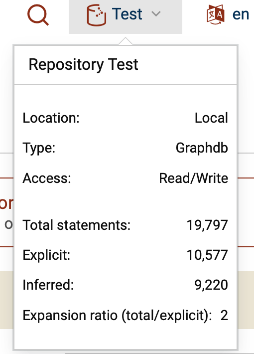

:::
::::

::: notes :::
To je najbolj nazoren trenutek celotne delavnice.

Uvozili smo dva trojčka. Baza je iz njiju izpeljala 1.713 novih – število izpeljanih trojčkov je zraslo s 7.507 na 9.220.

Zakaj toliko? Ker se pravilo uporabi na vsakem primerku posebej. Ker sta razreda enakovredna, je vsaka občina SURS zdaj tudi občina CRP in obratno. Ker sta lastnosti enaki, ima vsak naziv SURS zdaj tudi lastnost crp:vrednost.

Temu pravimo materializacija: mehanizem sklepanja izpeljana dejstva dejansko zapiše v bazo, zato so pri poizvedovanju takoj na voljo.

Prednost je hitrost poizvedb, cena pa prostor in čas ob uvozu. Alternativni pristop je sklepanje ob poizvedbi, ki ga nekatere baze prav tako podpirajo.

Poanta, ki jo velja izreči na glas: znanja nismo prepisali – zapisali smo pravilo in baza je iz njega izpeljala posledice.
:::

## 🧑‍💻 Posledica: viri se v poizvedbi obnašajo kot eden

:::: columns
::: column

```SPARQL
PREFIX rdf: <http://www.w3.org/1999/02/22-rdf-syntax-ns#>
PREFIX crp: <https://pzsi.sigov.si/datamodel/ns/crp#>
PREFIX surs: <https://onto.mdp.gov.si/shema/>

SELECT * WHERE {
  ?obcina rdf:type surs:Obcina .
  ?obcina surs:naziv ?nazivSURS .
  ?obcina crp:vrednost ?nazivCRP .
  ?obcina surs:imaMeritevPrebivalcev ?meritev .
  ?meritev surs:leto ?letoMeritve .
  ?meritev surs:vrednost ?vrednost .
}
```

:::
::: column

- **Ena sama** spremenljivka `?obcina` za oba vira,
- lastnost `crp:vrednost` deluje tudi nad **primerki SURS**,
- **ni** kartezičnega produkta.

> 🧑🏻‍🎓 Kje v poizvedbi je zdaj povezava med viroma?

:::
::::

::: notes :::
Primerjajmo to poizvedbo s tisto izpred nekaj prosojnic.

Takrat smo potrebovali dve ločeni spremenljivki, ?obcinaCRP in ?obcinaSURS, med njima pa ni bilo povezave. Zdaj imamo eno samo spremenljivko ?obcina, ki hkrati nosi lastnosti iz obeh virov.

Nad primerkom, ki je tipa surs:Obcina, lahko uporabimo lastnost crp:vrednost – čeprav tega trojčka ni zapisal nihče. Izpeljala ga je baza.

Odgovor na vprašanje: povezave v poizvedbi ni več. Preselila se je v podatke, kamor tudi sodi. Poizvedba je zato krajša, berljivejša in ne more pasti v past kartezičnega produkta.

To je natanko tisto, kar smo obljubili na začetku: ko so podatki semantično opisani in povezani, postanejo vprašanja preprostejša, ne bolj zapletena.
:::

## Kaj smo pridobili s sklepanjem?

:::: columns
::: column

**Brez sklepanja**

- Povezavo med viri nosi **poizvedba**,
- vsak nov vir pomeni **daljšo poizvedbo**,
- tveganje **kartezičnega produkta**.

:::
::: column

**S sklepanjem**

- Povezavo nosijo **podatki**,
- pravilo zapišemo **enkrat**, velja za **vse primerke**,
- nova dejstva so **preverljiva** in **izsledljiva**.

:::
::::

::: notes :::
Povzemimo poglavje.

Brez sklepanja mora vsako povezavo med viri poznati tisti, ki piše poizvedbo. Z vsakim novim virom poizvedba raste, z njo pa tveganje napake.

S sklepanjem pravilo zapišemo enkrat, na ravni modela, in velja za vse primerke – tudi za tiste, ki jih dodamo pozneje.

Dodajmo pomembno opozorilo za javni sektor: sklepanje je močno orodje, zato mora biti zapis enakosti premišljen. Če napačno zapišemo, da sta dva pojma enaka, bo baza to napako razmnožila po vseh primerkih.

Zato smo v petem poglavju pri povezovanju z zunanjimi viri uporabili previdnejši rdfs:subClassOf, tukaj, kjer sta pojma res ista, pa owl:equivalentClass.

In prav to je tisti prehod od podatkov k znanju, ki ga obljublja naslov poglavja – ter hkrati osnova, na kateri lahko inteligentni agent iz uvodne infografike pripravi preverljiv odgovor.
:::

# 8. Za konec: kdaj se semantika izplača

::: notes :::
Zadnji del delavnice je namenjen prenosu v prakso.

Doslej smo delali z javnimi podatki in orodji. Zdaj pa odgovorimo na vprašanje, ki ga v dvorani verjetno ima vsak: kdaj se to splača pri nas doma?

Najprej si ogledamo en zaključen primer iz javne uprave, nato pa preidemo na merljive rezultate iz gospodarstva – predvsem tam, kjer se semantika srečuje z velikimi jezikovnimi modeli.

Vsi primeri v nadaljevanju imajo navedene vire, da jih lahko preverite sami.
:::

## Kdaj se podjetju semantika izplača?

:::: columns
::: column

**Izplača se, ko …**

- isti pojem živi v **več sistemih** (ERP, CRM, PLM, spletna trgovina),
- podatke **izmenjujete navzven** – z dobavitelji, kupci, regulatorjem,
- se model **pogosto spreminja** (nove kategorije, trgi, jeziki),
- nad podatki poganjate **LLM** in potrebujete **preverljive** odgovore.

:::
::: column

**Ne izplača se, ko …**

- gre za **en sam sistem** s stabilno shemo,
- podatkov **ne izmenjujete** navzven,
- so poizvedbe preproste in jih **SQL dobro pokrije**,
- so podatki **enkratni** in se ne uporabijo ponovno.

:::
::::

::: notes :::
Bodimo pošteni: semantične tehnologije niso odgovor na vsako vprašanje in nihče vam ne bo hvaležen za ontologijo, ki rešuje neobstoječ problem.

Leva stran so signali, da se naložba splača. Ključni je prvi: isti pojem v več sistemih. Če ima izdelek eno oznako v ERP, drugo v spletni trgovini in tretjo pri dobavitelju, potem to razliko nekdo že danes vsak dan ročno premošča – običajno v Excelu.

Drugi signal je izmenjava navzven, saj se tam ne moremo dogovoriti samo sami s sabo.

Tretji je pogosto spreminjanje modela: v relacijski bazi je nova kategorija sprememba sheme, v grafu je nov trojček.

Četrti signal je najnovejši in za marsikoga najbolj zanimiv – uporaba jezikovnih modelov. O tem govorijo naslednje tri prosojnice.

Desna stran je enako pomembna. Če imate en sistem s stabilno shemo in poizvedbe, ki jih SQL dobro pokrije, ostanite pri tem. Semantika je odgovor na raznolikost in izmenjavo, ne na velikost podatkov.
:::

## Utemeljitev 1: ontologija potroji točnost LLM nad bazo

:::: columns
::: column

- Vprašanja v naravnem jeziku nad **poslovno bazo SQL**,
  - domena zavarovalništva, vprašanja različnih težavnosti.
- **GPT-4 neposredno nad shemo SQL**: ~**16 %** pravilnih,
- ista vprašanja prek **grafa znanja**
  _(ontologija + preslikave)_: ~**54 %**,
- **isti model**, drugačen opis podatkov,
- z **ontološkim preverjanjem** poizvedbe in
  samodejnim popravkom: do ~**73 %** _(nadaljevanje študije)_.

:::
::: column

> Razlika ni v modelu, ampak v **kontekstu**, ki ga model dobi.

- 🔗 [arXiv:2311.07509 ↗](https://arxiv.org/abs/2311.07509){target="\_blank"} _(osnovni benchmark)_
- 🔗 [arXiv:2405.11706 ↗](https://arxiv.org/abs/2405.11706){target="\_blank"} _(preverjanje in popravki)_

:::
::::

::: notes :::
To je najbolj citirana meritev na to temo in prihaja iz podjetja data.world.

Postavili so preizkus: poslovna baza SQL iz zavarovalništva ter nabor vprašanj, kakršna resnično postavlja poslovni uporabnik, od preprostih do zahtevnih.

Najprej so GPT-4 dali samo shemo SQL in vprašanje. Točnost je bila približno 16 odstotkov – v poslovnem okolju neuporabno.

Nato so iste podatke opisali z ontologijo in preslikavami, torej natanko tako, kot smo delali danes, in ista vprašanja zastavili nad grafom znanja. Točnost je zrasla na približno 54 odstotkov.

Ključni poudarek, ki ga velja izreči počasi: model je ostal isti. Spremenil se je samo opis podatkov.

Zakaj je razlika tolikšna? Ker shema SQL pomena ne nosi. Stolpec z imenom POL_TYP_CD modelu ne pove ničesar, medtem ko ontologija pove, da gre za vrsto zavarovalne police in kako je ta povezana s stranko.

Pošteno priznajmo tudi drugo plat: 54 odstotkov ni 95. To ni rešen problem, je pa trikratna izboljšava brez menjave modela.
:::

## Utemeljitev 2: semantični sloj prinese več kot menjava modela

:::: columns
::: column

- 100 poslovnih vprašanj nad trgovsko shemo _(Contoso)_, 5 težavnostnih stopenj,
- primerjava: **gola shema DDL** proti **shemi + 4 KB opisa** metrik in poslovnih pravil,
- preizkušeni **trije jezikovni modeli**.

:::
::: column

| Kontekst | Točnost |
| ------------------------ | ------: |
| Samo shema baze | ~46–51 % |
| Shema + **semantični opis** | ~**68 %** |

- **+17 do +23** odstotnih točk, `p < 0,002`,
- **z opisom** so vsi trije modeli **statistično neločljivi**.

- 🔗 [arXiv:2604.25149 ↗](https://arxiv.org/abs/2604.25149){target="\_blank"} · [koda ↗](https://github.com/cubedevinc/semantic-layer-benchmark){target="\_blank"}

:::
::::

::: notes :::
To je najnovejša in za vodstveno publiko morda najbolj prepričljiva meritev.

Postavitev je preprosta: 100 vprašanj poslovnega analitika nad trgovsko shemo, od preprostih do ekspertnih. Model dobi bodisi samo shemo baze bodisi shemo plus približno štiri kilobajte opisa – torej kaj pomenijo metrike, katere so privzete tabele dejstev in kakšna so poslovna pravila.

Brez opisa se vsi trije modeli gibljejo med 46 in 51 odstotki. Z opisom se vsi trije dvignejo na približno 68 odstotkov.

Zdaj pa poanta, ki jo je vredno posebej poudariti: z dodanim opisom med modeli ni več statistično značilne razlike. Prisotnost semantičnega opisa pojasni skoraj vso razliko v uspešnosti, izbira modela pa ne.

Za prosojnico to pomeni eno samo sporočilo: štirje kilobajti dobro zapisanega pomena so prinesli več kot menjava jezikovnega modela. In štirje kilobajti so približno ena stran besedila.

Pošteno povejmo tudi ozadje: raziskavo je objavilo podjetje, ki prodaja semantični sloj. Zato je pomembno, da so objavili članek, kodo in statistični test, tako da je meritev ponovljiva – kar pri marketinških številkah ni običajno.
:::

## Utemeljitev 3: LinkedIn – podpora strankam z grafom znanja

:::: columns
::: column

- Iz **zgodovinskih zahtevkov** zgradili graf znanja,
  - ohranili **strukturo** zahtevka in **povezave** med njimi,
- ob vprašanju poiščejo **podgraf**, ne le podobnega besedila.

:::
::: column

**Rezultati proti klasičnemu RAG**

- **+77,6 %** pri **MRR** _(kakovost priklica)_,
- v produkciji ~**6 mesecev**:
  - **−28,6 %** mediana časa do rešitve zahtevka.

- 🔗 [SIGIR 2024, arXiv:2404.17723 ↗](https://arxiv.org/abs/2404.17723){target="\_blank"}

:::
::::

::: notes :::
Drugi primer je iz produkcije, ne iz laboratorija.

LinkedIn je imel klasičen problem podpore strankam: arhiv preteklih zahtevkov obstaja, iskanje po njem pa temelji na podobnosti besedila. Zahtevek pa ni prosto besedilo – ima strukturo, torej opis, korake, rešitev, in povezave na sorodne zahtevke.

Klasičen RAG to strukturo razbije na odseke besedila in jo s tem izgubi. Zato so iz zahtevkov zgradili graf znanja, ki strukturo in povezave ohrani, ob vprašanju pa iz njega poberejo ustrezen podgraf.

Rezultat pri priklicu je bil za 77,6 odstotka boljši po meri MRR. Ampak najpomembnejša je druga številka: v pol leta uporabe v produkciji se je mediana časa do rešitve zahtevka znižala za 28,6 odstotka.

To je poslovni kazalnik, ne akademski. Prav ta prevod – iz mere priklica v prihranjen čas – je tisto, kar prepriča vodstvo.

Uporabna vzporednica za dvorano: enako strukturo imajo servisni nalogi, reklamacije, revizijske sledi in zahtevki za ponudbo.
:::

## Utemeljitev 4: finančni dokumenti – graf in vektorji skupaj

:::: columns
::: column

- Transkripti **objav poslovnih rezultatov** (NVIDIA in BlackRock),
- **vektorski RAG**: dober nad prostim besedilom, šibek pri **razmerjih med entitetami**,
- **graf znanja**: močan pri strukturi, šibkejši pri **nestrukturiranem besedilu**,
- **kombinacija prekaša oba** pristopa posamično.

:::
::: column

> Graf znanja ni **zamenjava** za vektorsko iskanje, ampak njegova **dopolnitev**.

- 🔗 [arXiv:2408.04948 ↗](https://arxiv.org/abs/2408.04948){target="\_blank"}
- Sorodno – Microsoft **GraphRAG** (odprta koda):
  - 🔗 [arXiv:2404.16130 ↗](https://arxiv.org/abs/2404.16130){target="\_blank"}

:::
::::

::: notes :::
Tretji primer je pomemben zato, ker popravi pogosto napačno predstavo.

Raziskovalci iz NVIDIE in BlackRocka so delali s transkripti objav poslovnih rezultatov – dolgimi, nestrukturiranimi dokumenti, polnimi strokovnih izrazov.

Primerjali so tri pristope. Vektorski RAG je dober pri prostem besedilu, a slab, kadar odgovor zahteva razumevanje razmerij med podjetji, osebami in številkami. Graf znanja je pri razmerjih močan, a sam po sebi slabše pokriva nestrukturirano besedilo. Kombinacija obojega je bila boljša od vsakega posebej, tako pri iskanju konteksta kot pri tvorjenju odgovora.

Sporočilo je torej zelo praktično: ne gre za izbiro med vektorsko bazo in grafom znanja. Vektorji odgovorijo na vprašanje, kje o tem piše, graf pa na vprašanje, kako je to povezano in ali odgovor drži.

Omenimo še Microsoftov GraphRAG, ki je odprtokoden in se je uveljavil za vprašanja nad celotno zbirko dokumentov, na primer katere so glavne teme. To so vprašanja, pri katerih klasičen RAG odpove, saj odgovor ni v nobenem posameznem odseku besedila.
:::

## Utemeljitev 5: najcenejši vstop – schema.org

:::: columns
::: column

- **Lahka semantika** na spletnih straneh:
  - izdelki, recepti, dogodki, delovna mesta,
- brez ontologij in brez baze RDF,
- Googlove **objavljene študije primerov**:
  - Rotten Tomatoes: **+25 %** CTR na 100.000 straneh,
  - Nestlé: **+82 %** CTR za strani z bogatimi rezultati,
  - Food Network: **+35 %** obiskov.

:::
::: column

> Isti strukturirani zapis danes berejo tudi **jezikovni modeli in agenti**.

- 🔗 [developers.google.com/search/case-studies ↗](https://developers.google.com/search/case-studies){target="\_blank"}
- 🔗 [schema.org ↗](https://schema.org/){target="\_blank"}

:::
::::

::: notes :::
Četrti primer je namenoma najbolj preprost, ker je za marsikatero podjetje v dvorani najhitreje uporabljiv.

Schema.org je lahka semantika: v spletno stran dodamo strukturiran opis izdelka, dogodka ali delovnega mesta. Ni ontologije, ni baze RDF, ni novega sistema – le nekaj vrstic v obstoječi strani.

Google objavlja študije primerov z merljivimi učinki. Rotten Tomatoes je označil 100.000 strani in izmeril 25 odstotkov višji delež klikov. Nestlé poroča o 82 odstotkov višjem deležu klikov za strani, ki se prikažejo kot bogat rezultat. Food Network poroča o 35 odstotkih več obiskov.

To so seveda njihovi podatki in vključujejo tudi učinek boljšega prikaza v rezultatih iskanja – ampak mehanizem je isti, ki ga učimo ves dan: podatku dodamo eksplicitni pomen in stroj ga zna uporabiti.

Za danes pa je pomembnejše nadaljevanje te zgodbe. Iste oznake, ki jih je nekdo dodal zaradi iskalnika, danes berejo tudi jezikovni modeli in agenti, ko iščejo ceno, zalogo ali datum dogodka. Naložba iz leta 2015 se je torej obrestovala drugič.
:::

## Kje to že deluje: trije zreli primeri

:::: columns
::: column

**Farmacija** – najbolj zrel trg

- AstraZeneca: graf povezanih biomedicinskih virov za hitrejše preverjanje hipotez,
- lasten _Biomedical Insights KG_ iz besedil in strukturiranih virov.
- 🔗 [Ontotext: študija primera ↗](https://www.ontotext.com/knowledgehub/case-studies/astrazeneca-early-hypotheses-testing-linked-data/){target="\_blank"}

:::
::: column

**Proizvodnja** – najbližje slovenski publiki

- Bosch: graf znanja za **nadzor varjenja** v avtomobilski proizvodnji (ISWC 2022),
- danes: **LLM pomaga pisati preslikave** podatkov v graf (TGDK 2025).
- 🔗 [Bosch: varjenje ↗](https://link.springer.com/chapter/10.1007/978-3-031-19433-7_45){target="\_blank"} · [LLM preslikave ↗](https://drops.dagstuhl.de/entities/document/10.4230/TGDK.3.3.5){target="\_blank"}

:::
::::

::: notes :::
Tri panoge, kjer to ni več raziskovalno vprašanje.

Farmacija je najbolj zrel trg, ker je bila tam bolečina največja: podatki o genih, tarčah, boleznih in učinkovinah so razpršeni po desetinah javnih baz, vsaka s svojimi identifikatorji. AstraZeneca uporablja povezane biomedicinske vire za hitrejše preverjanje zgodnjih hipotez, hkrati pa gradi lasten graf iz znanstvenih besedil in strukturiranih virov.

Proizvodnja je za to dvorano najbližja. Bosch je objavil serijo industrijskih primerov okoli nadzora varjenja – to je proces, kjer nastane ogromno heterogenih podatkov z različnih strojev, analiza kakovosti pa mora te podatke združiti.

Posebej opozorite na časovni lok med obema Boschevima objavama. Leta 2022 so ontologijo in preslikave gradili ročno, leta 2025 pa objavijo delo, kjer preslikave iz proizvodnih podatkov v graf pomaga pisati jezikovni model. Torej prav tisto ročno delo, ki smo ga danes počeli v Protégé, postaja cenejše.

Tretji tip so podpora strankam in interna vprašanja zaposlenih, ki smo ju videli pri LinkedInu.
:::

## Kaj je danes mogoče kupiti?

| Kategorija | Primeri |
| ------------------------------------ | ----------------------------------------------- |
| Semantični sloj z agentom | [Stardog Voicebox ↗](https://www.stardog.com/voicebox/){target="\_blank"} |
| Platforme RDF | [Graphwise ↗](https://graphwise.ai/){target="\_blank"} _(GraphDB + PoolParty)_, metaphacts, eccenca |
| GraphRAG nad grafi lastnosti | [Neo4j ↗](https://neo4j.com/generativeai/){target="\_blank"}, FalkorDB |
| Ontologija kot jedro platforme | [Palantir Foundry / AIP ↗](https://www.palantir.com/platforms/foundry/){target="\_blank"} |
| Semantični sloj za poslovno analitiko | [Cube ↗](https://cube.dev/){target="\_blank"}, dbt Semantic Layer, AtScale |

::: notes :::
Ta prosojnica je namenjena vprašanju, ki v dvorani vedno pride: ali moramo to zgraditi sami?

Ne. Trg je v zadnjih dveh letih dozorel, ponudba pa se je razdelila na šest kategorij.

Omenimo nekaj poudarkov. Graphwise je nastal z združitvijo Ontotexta, ki dela GraphDB, in podjetja Semantic Web Company s produktom PoolParty – torej prav baze, ki smo jo danes zagnali, in orodja za upravljanje slovarjev.

Palantir je za to publiko hvaležen primer. Njihova prodajna zgodba je dobesedno, da je ontologija kontekstni sloj, brez katerega agenti ne morejo varno ukrepati. To je teza semantičnega spleta, povedana brez ene same omembe RDF-ja – in prav zato jo vodstva kupujejo.

Semantični sloj za poslovno analitiko je zanimiv tistim, ki nimajo grafa in ga tudi nočejo. Gre za opis metrik nad obstoječim skladiščem podatkov, ki ga jezikovni model kliče namesto pisanja SQL – to je meritev s prejšnje prosojnice.

Za prvi poskus pa ni treba kupiti ničesar: Microsoftov GraphRAG, Apache Jena in brezplačna različica GraphDB zadoščajo za dokaz koncepta.
:::

## „Ali ni modeliranje predrago?"

:::: columns
::: column

**Ugovor je bil dolga leta upravičen**

- Ontologije so gradili **redki strokovnjaki**,
- ročno pisanje **preslikav** je bilo drago,
- vzdrževanje je zaostajalo za spremembami.

:::
::: column

**Kar se je spremenilo**

- LLM-ji **predlagajo** razrede, lastnosti in hierarhije,
  - izziv [LLMs4OL ↗](https://sites.google.com/view/llms4ol2025){target="\_blank"} pri konferenci ISWC,
- LLM-ji **pišejo preslikave** iz virov v graf _(Bosch, 2025)_,
- človek **preverja**, ne tipka.

:::
::::

::: notes :::
To je najpogostejši ugovor in dolga leta je bil povsem upravičen.

Gradnja ontologije je zahtevala redke strokovnjake, ročno pisanje preslikav iz virov v graf je bilo drago, vzdrževanje pa je zaostajalo za spremembami v sistemih. Prav zato je marsikateri projekt semantičnega spleta obtičal pri dokumentu, ki ga nihče ni posodabljal.

Zanimivo pa je, da so isti jezikovni modeli, ki potrebujejo semantiko, hkrati tudi orodje, ki njeno izdelavo poceni.

Danes modeli predlagajo razrede, lastnosti in hierarhije – obstaja celo redni izziv LLMs4OL pri konferenci ISWC, ki prav to sistematično meri. Pišejo preslikave iz obstoječih virov v graf, kar smo videli pri Boschu. In predlagajo poravnave med dvema modeloma, kadar povezujemo vire.

Vloga človeka se je s tem premaknila: iz tipkanja v presojo. Model predlaga, strokovnjak potrdi ali zavrne.

Povejmo pa tudi omejitev: prav zato, ker model predlaga hitro, je preverjanje nujno. Napačno zapisana enakost se, kot smo videli pri sklepanju, razmnoži po vseh primerkih.
:::

## Primer 1: Podatkovni zemljevid (UL FRI in MDP)

:::: columns
::: column

- Prototip za **Ministrstvo za digitalno preobrazbo**,
- nad slovenskim **portalom odprtih podatkov** (CKAN),
- v **enem pogledu** prikaže:
  - **shemo** (ontologijo) in
  - **podatke** (primerke).
- Temelji na **DCAT** in sorodnih slovarjih,
- podatke bere iz vmesnika **SPARQL**.

- 🌐 [Demo Podatkovnega zemljevida ↗](https://fri-mdp.github.io/Podatkovni-zemljevid-2023/pz-viewer/){target="\_blank"}
- 📦 [github.com/FRI-MDP/ckan-datamap ↗](https://github.com/FRI-MDP/ckan-datamap){target="\_blank"}

:::
::: column

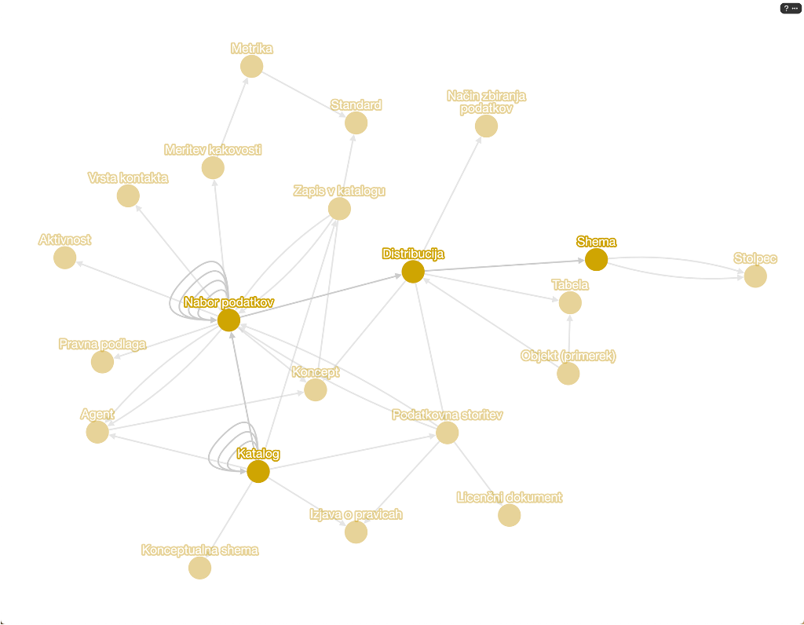

:::
::::

::: notes :::
Podatkovni zemljevid je prototip, ki je nastal v sodelovanju z Ministrstvom za digitalno preobrazbo.

Rešuje konkreten problem portala odprtih podatkov: portal pove, kateri nabori podatkov obstajajo, ne pove pa, kaj je v njih in kako so med seboj povezani. Uporabnik mora vsako datoteko odpreti in ugibati.

Zemljevid namesto tega prikaže shemo – torej pojme in povezave med njimi – ter omogoči vpogled v dejanske podatke za izbrani pojem. Na sliki so osrednji koncepti: katalog, nabor podatkov, distribucija in shema.

Tehnično gre za odjemalca v brskalniku, ki se poveže na vmesnik SPARQL in nariše, kar tam najde. Prav to pa pomeni, da ni vezan na naš portal – enako deluje nad poljubnim grafom.

Komponenta je odprtokodna, povezava do repozitorija je na prosojnici. Če koga zanima uporaba nad lastnimi podatki, je to najlažja vstopna točka.
:::

## Primer 2: Jezikoslovni podatki (UL FRI, projekt LLM4DH)

:::: columns
::: column

- znanje o slovenskem jezikoslovju
- 🌐 [Relacijska baza ↗](https://wiki.cjvt.si/books/digital-dictionary-database-of-slovene){target="\_blank"}
- cilj - odgovarjati na *Kako bi razložili pojem »skupnost«?*, *Kaj so deležniške oblike glagola »skuhati«?*, *Navedi tožilnik množine za samostalnik »obraz«.*


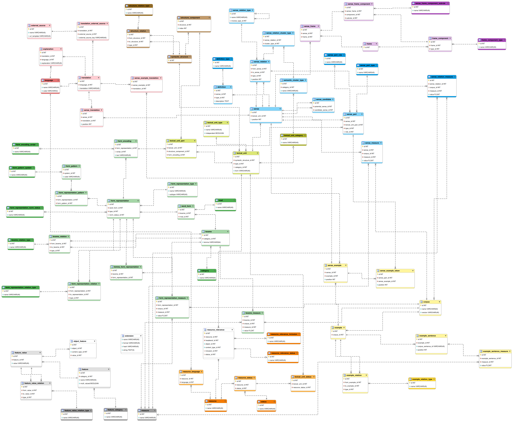

:::
::: column


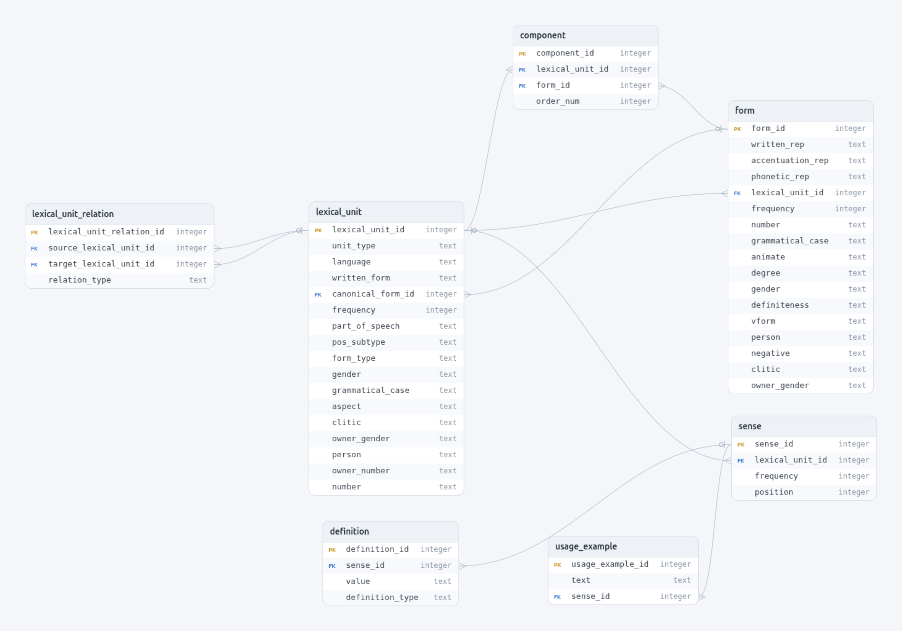

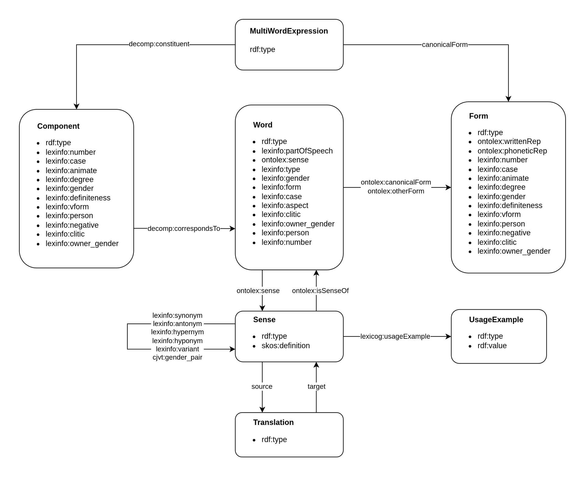

:::
::::

## Zakaj je semantika pomembna za javno upravo?

:::: columns
::: column

**Medsektorsko**

- Isti pojem živi v **več registrih**:
  - občina v CRP, SURS, prostorskih podatkih,
- vsak register ima **svoj identifikator** in svoje ime,
- brez skupnega pomena je vsaka izmenjava **nov projekt**.

:::
::: column

**Meddržavno**

- EU zahteva **pomensko interoperabilnost**:
  - _Interoperable Europe Act_ – [Uredba (EU) 2024/903 ↗](https://eur-lex.europa.eu/eli/reg/2024/903/oj){target="\_blank"},
  - načelo **samo enkrat** _(angl. once-only)_,
- skupni slovarji: **DCAT-AP**, _Core Vocabularies_,
- 🌐 [data.europa.eu ↗](https://data.europa.eu/){target="\_blank"}

:::
::::

::: notes :::
Zakaj je to za javno upravo pomembnejše kot za marsikatero podjetje?

Medsektorsko: isti pojem hkrati živi v več registrih, ki jih vodijo različni organi. Občino smo danes videli v CRP in v SURS – z različnima identifikatorjema in različnim zapisom imena. Ko povezavo enkrat zapišemo v podatke, velja za vse; če je ne, jo mora znova odkriti vsak projekt posebej.

Meddržavno: povezovanje ni več stvar dobre volje, ampak predpisov. Akt o interoperabilni Evropi od javnih organov zahteva pomensko interoperabilnost čezmejnih storitev, načelo samo enkrat pa pomeni, da državljanu istega podatka ne smemo zahtevati dvakrat – kar je izvedljivo le, če se registri razumejo med seboj.

Zato imamo skupne slovarje: DCAT-AP za kataloge odprtih podatkov, ki je tudi osnova našega Podatkovnega zemljevida, in Core Vocabularies za osnovne pojme, kot so oseba, podjetje in naslov.

Praktična poanta za udeležence iz gospodarstva: če v javnem razpisu piše interoperabilnost, danes to praviloma pomeni prav te standarde.
:::

## Ontologija ni le za odgovore, ampak za agente

:::: columns
::: column

- Ko agent le **odgovarja**, je napaka neprijetna,
- ko agent **ukrepa** – naroči, rezervira, spremeni zapis – je napaka **draga**.
- Zato potrebuje:
  - **tipiziran** objektni model,
  - **dovoljene akcije** nad objekti,
  - **revizijsko sled**, od kod podatek izvira.

:::
::: column

> To je natanko tisto, kar smo risali na prvi prosojnici – le da je zdaj to prodajni argument, ne raziskovalna ideja.

{width="88%"}

:::
::::

::: notes :::
S tem sklenemo krog, ki smo ga odprli s prvo prosojnico.

Dokler jezikovni model samo odgovarja, je napaka neprijetna – uporabnik jo opazi in popravi. Ko pa agent začne ukrepati, torej naročati, rezervirati ali spreminjati zapise, postane napaka draga in pogosto nevidna.

Agent, ki mu to dovolimo, potrebuje tri stvari. Prvič, tipiziran objektni model, da ve, kaj je naročilo in kaj stranka. Drugič, opredeljene dovoljene akcije nad temi objekti. In tretjič, revizijsko sled, iz katere je razvidno, na podlagi katerih dejstev je ukrepal.

To je hkrati klasična teza semantičnega spleta in današnja prodajna zgodba platform, kot je Palantir.

Zato je zaključek delavnice isti kot njen začetek: semantični graf ni cilj sam po sebi. Je podlaga, na kateri je agentu sploh mogoče zaupati dejanje, ne le odgovora.
:::

## Podatkovni prostori: semantika kot pogoj za vstop

:::: columns
::: column

- **Catena-X** _(avtomobilska industrija)_ in **Manufacturing-X**:
  - podatkovni modeli so **standardizirani** (SAMM),
  - odprta koda: **Eclipse Tractus-X**.
- **Digitalni potni list izdelka** _(DPP)_:
  - [Uredba o baterijah (EU) 2023/1542 ↗](https://eur-lex.europa.eu/eli/reg/2023/1542/oj){target="\_blank"},
  - od **18. 2. 2027**: QR in potni list za baterije na trgu EU.

:::
::: column

> Za dobavitelja to ni več tehnološka izbira, ampak **pogoj za posel**.

- 🌐 [catena-x.net ↗](https://catena-x.net/){target="\_blank"}
- 🌐 [eclipse-tractusx ↗](https://github.com/eclipse-tractusx){target="\_blank"}

:::
::::

::: notes :::
Zadnji vsebinski argument je najmočnejši za slovensko gospodarstvo, še posebej za avtomobilske dobavitelje.

Podatkovni prostori so dogovorjena okolja za izmenjavo podatkov med podjetji, kjer vsak ostane lastnik svojih podatkov. Catena-X je tak prostor za avtomobilsko industrijo, Manufacturing-X pa isto idejo širi na predelovalno industrijo.

Ključno za nas je tole: v Catena-X podatkovni modeli niso stvar dogovora med dvema partnerjema, ampak so standardizirani in objavljeni v obliki semantičnih modelov. Uporabljajo Semantic Aspect Meta Model, imenovan SAMM, referenčne implementacije pa so odprtokodne v projektu Eclipse Tractus-X.

Zraven pa pride še regulativa. Uredba o baterijah zahteva, da ima od 18. februarja 2027 vsaka zadevna baterija na trgu EU kodo QR, ki vodi do digitalnega potnega lista izdelka. Podoben okvir se pripravlja za druge skupine izdelkov.

Poanta za dvorano je preprosta: če ste dobavitelj v takšni verigi, se o obliki podatkov ne boste pogajali. Dobili boste model in rok. Podjetja, ki svoje podatke že razumejo in imajo urejene identifikatorje, bodo takrat samo pripravila preslikavo. Ostala bodo urejala podatke pod pritiskom roka.

Vprašanje za razpravo: ali kdo od vas že dobiva takšne zahteve od kupcev?
:::

## Napotki: kako in kdaj začeti

:::: columns
::: column

**Kdaj**

1. Začnite pri **enem vprašanju**, ki danes zahteva ročno združevanje virov.
2. Semantiko dodajte **nad obstoječe sisteme**, ne namesto njih.
3. Najprej **dogovor o pojmih**, šele nato tehnologija.
4. Če podatkov ne izmenjujete in je shema statična – **počakajte**.

:::
::: column

**Kako**

5. **Uporabite obstoječe slovarje** – schema.org, DCAT, SAMM, domenske ontologije.
6. **Stabilni identifikatorji** so pomembnejši od izbire formata.
7. Pri LLM: **graf za dejstva in sledljivost**, vektorji za besedilo.
8. Spremljajte **podatkovne prostore svoje panoge** – modeli so tam že dogovorjeni.

:::
::::

::: notes :::
Za konec osem napotkov, ki jih udeleženci lahko odnesejo domov.

Prvi in najpomembnejši: začnite pri enem vprašanju, ki danes zahteva ročno delo. Ne pri ontologiji podjetja. Če nekdo vsak mesec ročno združuje tri izvoze, je to vaš prvi primer uporabe.

Drugi: semantika ne nadomešča sistemov. ERP ostane, kjer je – nad njim zgradimo pomenski sloj. Obstajajo tudi pristopi z virtualnim grafom, kjer podatki ostanejo v relacijski bazi, poizvedbe pa se prevedejo sproti.

Tretji: najtežji del ni tehnologija, ampak dogovor, kaj pomeni stranka, izdelek, dobava. Ta pogovor se splača, tudi če na koncu ne uporabite RDF.

Četrti: če nimate niti izmenjave niti sprememb modela, mirno počakajte. Bolje je, kot delati ontologijo brez uporabnika.

Peti: ne izumljajte svojih slovarjev. Za splet obstaja schema.org, za kataloge DCAT, za proizvodnjo modeli Catena-X, skoraj vsaka panoga pa ima svoje.

Šesti: če od danes odnesete eno samo stvar, naj bo to identifikator. Stabilen in enolični identifikator je temelj; format lahko vedno spremenite, zgodovino identifikatorjev pa težko popravite.

Sedmi: pri jezikovnih modelih uporabite oboje. Graf naj nosi dejstva in sledljivost, torej od kod odgovor izvira, vektorji pa naj pokrivajo prosto besedilo.

Osmi: preverite, kaj se dogaja v podatkovnem prostoru vaše panoge. Tam so modeli pogosto že dogovorjeni – in prej ali slej jih boste morali uporabiti.

Hvala za sodelovanje. Vse gradivo, podatki in vaje ostanejo dostopni na naslovu s prve prosojnice.
:::

# 9. Diskusija: Ali lahko identificirate kak primer, kjer bi uporaba semantike bila za vaše podjetje ali organizacijo koristna?
