## Od virov do pametnejših agentov {.motivation-infographic}

{.motivation-art}

::: notes :::
To je zgodba današnje delavnice v eni sliki.

Na levi imamo podatke, ki obstajajo, vendar so razpršeni po tabelah, bazah, dokumentih in zemljevidih. Vsak vir je zase uporaben, skupaj pa še ne govorijo istega jezika.

Ko vire enolično poimenujemo, jim dodamo formalen pomen in jih povežemo, dobimo semantični graf oziroma podatke v obliki 5 ★.

Tak graf ni cilj sam po sebi. Je zanesljiva osnova, na kateri lahko inteligentni agent poveže dejstva iz več virov, razume njihove odnose ter pripravi boljši in preverljiv odgovor ali dejanje.

Danes bomo ta prehod naredili korak za korakom: od tabele prek RDF-ja in ontologije do povezanega grafa in poizvedovanja.
:::

## Agenda

1. Uvod: Zakaj semantično opisovanje podatkov?
2. Od izvornih podatkov (1 ★) do odprtih podatkov (3 ★)
3. Raven 4 ★: semantični opis podatkov z RDF
4. Formalizacija podatkovnega modela z ontologijami
5. Raven 5 ★: povezani podatki in zunanji viri
6. Uporaba semantično opisanih podatkov s SPARQL
7. Sklepanje: prehod od podatkov k znanju
8. 🚧 TO-DO Vizualizacija (verjetno gre ven)

::: notes :::
Najprej si bomo pogledali, zakaj sploh govorimo o semantičnem opisovanju podatkov in kakšen problem v praksi rešujemo.

Potem bomo postopno šli čez model 5 ★ odprtih podatkov:

– od osnovnih izvornih podatkov,  
– prek odprtih formatov,  
– do semantičnega opisa z RDF in ontologijami.

V zadnjem delu pa bomo pokazali, kaj pridobimo s povezovanjem podatkov in kako iz podatkov pridemo do znanja z uporabo sklepanja.

Posamezna poglavja bomo obravnavali z realnimi primeri in demonstracijami v urejevalniku besedil Visual Studio Code in urejevalniku ontologij Protégé.

Začnimo torej pri vprašanju, zakaj klasični podatkovni pristopi danes pogosto ne zadoščajo.
:::

# 1. Uvod: Zakaj semantično opisovanje podatkov?

::: notes :::
Najprej postavimo kontekst:

– zakaj klasični podatkovni pristopi niso več dovolj,  
– zakaj imamo danes veliko podatkov, a malo uporabnih, da poiščemo odgovore,  
– in zakaj je semantična interoperabilnost ključna za povezovanje sistemov.
:::

## 🚧 TO-DO Slavko uvod

## Namen delavnice

### Problem &gt; tehnologija

- Zakaj objava podatkov ni dovolj?
- Kaj dejansko rešuje semantika?
- Pomen interoperabilnosti in ponovne uporabe podatkov.

::: notes :::
V okviru delavnice želimo praktično pojasniti štiri ključne stvari.

1. Zakaj klasično objavljanje podatkov – tudi če so odprti in v CSV obliki – v praksi pogosto ne zadostuje za odgovarjanje na kompleksna vprašanja.
2. Kako postopno dosežemo višje ravni odprtosti podatkov in kaj vsaka od teh ravni dejansko pomeni v praksi.
3. Kakšen problem semantično opisovanje podatkov sploh rešuje: ne gre za tehnologijo samo, temveč za povezovanje razdrobljenih podatkov.
4. Zakaj je to še posebej pomembno pri interoperabilnosti in ponovni uporabi, kjer se podatki pogosto zbirajo večkrat, niso povezljivi in niso pripravljeni za ponovno uporabo.

Pomembni poudarki:

- poudarek delavnice ni na tehnologiji, ampak **na problemu**,
- in **dodani vrednosti**, ki jo **semantično opisovanje** prinaša.

:::

## Motivacija

### Podatki obstajajo – odgovori na vprašanje pa ne

- Razpršeni podatki,
- različni viri,
- različni pomeni.

::: notes :::
Poglejmo realen problem, s katerim se pogosto srečamo v praksi.

Vprašanje je: "Katere občine imajo največ prebivalcev, katere šole imajo tam sedež in kakšna je nadmorska višina teh območij?"

Na prvi pogled se zdi, da so vsi ti podatki že na voljo. V resnici pa so razpršeni po različnih institucijah: CRP, SURS, MIZŠ, OSM, Wikidata.

Poleg tega uporabljajo različne identifikatorje, različna poimenovanja in različne strukture podatkov.

Z eno Excel ali CSV datoteko tega vprašanja preprosto ne moremo rešiti.

Zato potrebujemo način, kjer podatki govorijo isti jezik, so medsebojno povezljivi in računalniku razumljivi. Tu nastopi semantično opisovanje podatkov.
:::

## Od podatkov do znanja

### Struktura ≠ pomen

- **Podatek** (npr. `298.000`),
- **Informacija** (Število prebivalcev Ljubljane.),
- **Metapodatek** (Kaj ta številka pomeni, za katero leto, vir, metodologija.),
- **Znanje** (Sklepanje, povezovanje, odgovori na kompleksna vprašanja, npr. Ljubljana je največje mesto v Sloveniji z 298.000 prebivalci (podatki iz leta 2023, SURS).).

::: notes :::
Zelo pogosta napačna predstava je, da so strukturirani podatki že semantično bogati podatki. To ne drži.

Primer: Številka `298.000` je sama po sebi samo podatek.

Ko rečemo, da gre za število prebivalcev Ljubljane, smo že na ravni informacije.

Ko dodamo še leto, vir in metodologijo, govorimo o metapodatkih.

Znanje pa nastane šele takrat, ko lahko iz teh podatkov sklepamo in odgovarjamo na vprašanja, na primer da je Ljubljana največje mesto v Sloveniji na podlagi podatkov SURS za določeno leto.

Ključno sporočilo: lepo strukturirana CSV datoteka ne pove, kaj stolpci dejansko pomenijo. Struktura ne predstavlja semantike.
:::

## Zakaj je to pomembno?

### Interoperabilnost in ponovna uporaba

- veliko podatkov,
- veliko podvajanja,
- malo povezovanja.

::: notes :::
V današnjem času upravljamo z zelo velikimi količinami podatkov.

Ti podatki se pogosto zbirajo večkrat, niso enotno opisani in niso pripravljeni za povezovanje ali ponovno uporabo.

Semantična interoperabilnost omogoča:

– zmanjševanje podvajanja,  
– ponovno uporabo podatkov,  
– boljše, podatkovno podprto odločanje.

Ta pristop je neposredno povezan s cilji digitalne preobrazbe javne uprave in z načeli **FAIR**: Findable, Accessible, Interoperable, Reusable.

Semantično opisovanje ni nekaj dodatnega, ampak temelj za smiselno upravljanje podatkov v javnem sektorju.
:::

## Kaj ni semantično opisovanje?

### Pogoste zmote

- ❌ _"Samo za raziskovalce."_
- ❌ _"Najprej moramo razviti ontologijo."_
- ❌ _"Preveč kompleksno za praktično uporabo."_

::: notes :::
Pogosto obstajajo napačne predstave o semantičnem opisovanju podatkov.

Na primer:

- da je to namenjeno samo raziskovalcem,
- da je treba najprej zgraditi ontologijo,
- ali da je to preveč kompleksno za prakso.

Ključno vodilo delavnice je ravno obratno: ne gradimo ontologije zaradi ontologije.

Rešujemo konkreten problem povezovanja podatkov z namenom odgovarjanja na kompleksna vprašanja. Tehnologija je samo sredstvo.
:::

## Ključni pojmi - poenostavljeno

### Enostavne analogije

- URI
- RDF
- Ontologija
- SPARQL
- Linked Data

::: notes :::
Pri delavnici bomo uporabljali zelo preproste razlage pojmov.

**URI** je enoličen, nespremenljiv naslov, ne samo ID v tabeli.

**RDF** je način, kako računalniku povemo, kdo je kdo in kako so stvari povezane.

**Ontologija** je formalen opis pojmov in odnosov, nekakšna nadgradnja sheme.

**SPARQL** je poizvedovalni jezik, primerljiv z Googlom za splet ali SQL-om za relacijske baze, le da deluje nad grafi.

**Povezani podatki** pa pomenijo, da podatke povezujemo z uporabo URI-jev in jih lahko integriramo iz različnih virov.
:::

## 🧑‍💻 Primer iz prakse

### Semantika dandanes

- Spletni članki,
- iskanje,
- povezovanje vsebin.

<div class="exercise-promo-compact">
  <p class="exercise-promo-label"><strong>INTERAKTIVNA VAJA (7–8 MIN)</strong></p>
  <p class="exercise-promo-title">
    <a href="./vaje/semantika-na-spletu/json-ld/kaj-pove-json-ld/" target="_blank" rel="noopener">Kaj pove JSON-LD? ↗</a>
  </p>
</div>

::: columns

:::: column


::::

:::: column

```{text}
{
  "@context": "https://schema.org",
  "@type": "NewsArticle",
  "mainEntityOfPage": {
    "@type": "WebPage",
    ...
  },
  "headline": ...,
  "image": ...,
  "datePublished": "2026-09-16 06:53:59",
  "author": { ... },
  "publisher": {
    "@type": "Organization",
    "name": "RTV Slovenija",
    "logo": { ... }
  }
}
```

::::

:::

::: notes :::
Če pogledamo poljuben članek na RTV Slovenija, lahko opazimo, da je delno semantično opisan.

V izvorni kodi strani je prisoten JSON-LD zapis, ki uporablja standard schema.org.

S tem so formalno opisani pojmi, kot so novica, naslov, avtor, datum objave in izdajatelj.

To omogoča boljše iskanje, indeksiranje in povezovanje vsebin.

Pomembno je sporočilo: semantično opisovanje ni teorija prihodnosti, ampak nekaj, kar se že danes uporablja v praksi.

Schema.org ni edini tak primer. Poznamo še številne druge formalne opredelitve
v obliki besednjakov in ontologij, kot so:

– **FOAF (Friend Of A Friend)** za opis oseb in njihovih povezav,  
– **Dublin Core (DC)** za splošne metapodatke,  
– **SKOS (Simple Knowledge Organization System)** za šifrante in taksonomije,  
– in **DCAT (Data Catalog Vocabulary)**,
ki se uporablja predvsem za opis podatkovnih naborov v katalogih odprtih podatkov.

**INTERAKTIVNA VAJA 1 (7–8 min):** »Kaj pove JSON-LD?«. Udeleženci v lokalnem posnetku prepoznajo `@context` in `@type`, nato na schema.org preverijo hierarhijo `NewsArticle` ter pričakovane tipe lastnosti `datePublished` in `publisher`.

Po skupnem pregledu odprem [novico Predstavništva Evropske komisije v Sloveniji](https://slovenia.representation.ec.europa.eu/novice-dogodki/novice/govor-o-stanju-v-uniji-2026-2026-09-16_sl), v izvorni kodi poiščem `application/ld+json` in pokažem ločena zapisa `BreadcrumbList` ter `NewsArticle`. Živi primer je dodaten korak; uspešno dokončanje vaje ni odvisno od zunanje strani.
:::

# 2. Od izvornih podatkov (1 ★) do odprtih podatkov (3 ★)

::: notes :::
Sedaj bomo prikazali razvoj razvoj od:

– objavljenih podatkov (PDF),  
– strukturiranih podatkov (Excel),  
– do odprtih formatov (CSV).

Ključno sporočilo je, da struktura podatkov še ne pomeni razumevanja njihovega pomena.

Čeprav so CSV-ji odprti in strojno berljivi, še vedno ne povedo, kaj podatki dejansko pomenijo – in tu nastopi naslednji korak.
:::

## Model 5 ★ odprtosti podatkov

| Stopnja | Zvezdice | Raven                      | Značilnosti podatkov          |
| :-----: | :------- | -------------------------- | ----------------------------- |
|    1    | ★        | Objavljeni podatki         | PDF, HTML, poročila           |
|    2    | ★★       | Strukturirani podatki      | Excel, lastni formati         |
|    3    | ★★★      | Odprti podatki             | CSV, strojno berljivi formati |
|    4    | ★★★★     | Semantično opisani podatki | RDF, URI-ji, ontologije       |
|    5    | ★★★★★    | Povezani podatki           | Zunanji viri, Linked Data     |

::: notes :::
V okviru delavnice želimo praktično pojasniti, zakaj klasično objavljanje podatkov ni dovolj in kako postopno dosežemo višje ravni odprtosti podatkov.

Model petih stopenj odprtosti prikazuje, da objava podatkov sama po sebi še ne pomeni, da so podatki uporabni ali ponovno uporabni.

Na prvi ravni so podatki zgolj objavljeni, pogosto v obliki PDF dokumentov ali spletnih strani.

Na drugi ravni so podatki že strukturirani, na primer v Excel datotekah, vendar so še vedno vezani na konkretna orodja in niso primerni za enostavno avtomatsko obdelavo.

Na tretji ravni govorimo o odprtih podatkih, kjer so podatki objavljeni v odprtih, strojno berljivih formatih, kot je CSV.

Pomembno pa je poudariti, da tudi lepo strukturirana datoteka CSV še ne pove, kaj stolpci dejansko pomenijo. Struktura podatkov ne predstavlja pomena.

Ravni 4 ★ in 5 ★ presegajo zgolj strukturo: na teh ravneh podatkom dodamo pomen in jih povežemo z drugimi viri, kar omogoča odgovarjanje na kompleksna vprašanja, česar z eno datoteko Excel ali CSV ne moremo doseči.

V nadaljevanju se bomo zato osredotočili predvsem na prve tri ravni odprtosti, ki predstavljajo izhodišče za semantično opisovanje podatkov.
:::

## 🧑‍💻 Izvorni podatki (1 ★ in 2 ★): ko podatki obstajajo, a niso uporabni

- Podatki CRP iz [🌐 NIO ↗](https://nio.gov.si/sl/products/nio%2Bcentralni%2Bregister%2Bprebivalstva%2Bcrp%2Bvpogled%2Bpreko%2Bemso?release=0.1){target="\_blank"},
  - [📊 Nabor podatkov NIO CRP.xls ↗](./assets/data/raw/CRP/Nabor%20podatkov%20NIO%20CRP.xls){target="\_blank"},
  - [📊 Sifranti IO CRP.xls ↗](./assets/data/raw/CRP/Sifranti%20IO%20CRP.xls){target="\_blank"},

- pomanjkljivosti,
  - razpršeni po datotekah in zavihkih,
  - pomeni stolpcev ni jasen,
  - brez konteksta,
  - iste vrednosti &rarr; različen koncept.

::: notes :::
**Odpremo datoteko** v programu Excel.

Po pregledu podatkov opazimo:

- podatki so **razpršeni po več datotekah in zavihkih**,
- pomen stolpcev **ni jasno razložen** (npr. kaj pomeni 4 v stolpcu OBC_ID in v katerem registru je enolična oznaka; ali je ta oznaka nespremenljiva in uporabna tudi izven Excel datoteke?),
- podatki so predstavljeni **brez konteksta**,
- iste vrednosti se lahko nanašajo na **različne koncepte** (npr. Ljubljana kot občina, naselje, upravna enota), ker ni eksplicitne definicije pojma.

Gre za tipičen primer, kjer so podatki objavljeni (1 ★) in strukturirani (2 ★), vendar brez jasnega pomena in konteksta, kar onemogoča njihovo učinkovito uporabo in zato **niso interoperabilni**.

Excel datoteka je primerna za uporabniško branje, ne pa za povezovanje podatkov.
:::

## 🧑‍💻 Prehod v odprti format (3 ★)

- Pretvorba v **CSV** (odprt in strojno berljiv format), kot prvi korak k tehnični interoperabilnosti,
- preprost 2D besedilni zapis (vrstice, stolpci, ločila),
- izboljša **dostopnost**, ne pa še **pomena**.

::: notes :::
Naslednji korak je pretvorba podatkov v **odprt** in **strojno berljiv format**, kot je CSV. To omogoča lažjo obdelavo in izmenjavo podatkov med različnimi sistemi.

Format CSV je preprost besedilni format, kjer so podatki organizirani v vrstice in stolpce, ločene z vejicami ali drugimi ločili (npr. `;`). Vsaka vrstica predstavlja en zapis, prvi vrstici pa običajno vsebujejo imena stolpcev. Je odprt standard, neodvisen od orodij, primeren za avtomatsko obdelavo in podprt praktično v vseh okoljih.

V nadaljevanju bomo podatke iz Excela izvozili v podatke CSV, odstranili nepotrebne zavihke, poenotili kodiranje (UTF-8) in zagotovili konsistentna imena stolpcev.

S tem postopkom zapisa v obliki CSV smo **izboljšali dostopnost**, **ne** pa še **pomena**.

**Struktura ≠ semantika.** Brez opredeljenega pomena računalnik podatkov ne razume in jih ne more povezovati.
:::

## 🧑‍💻 Podatki SURS (3 ★)

- Podatki o prebivalcih po občinah ([🌐 SURS ↗](https://www.stat.si/obcine/sl/Theme/Index/PrebivalstvoStevilo){target="\_blank"}, 2025),
- prenos v **odprtem formatu (CSV/TSV)**,
- vrednosti in kratice stolpcev ([📊 `data.tsv` ↗](./assets/data/raw/SURS/2025/data.tsv){target="\_blank"}),
- pomen stolpec zapisan **ločeno** ([📄 `info.txt` ↗](./assets/data/raw/SURS/2025/info.txt){target="\_blank"}),
- **odprti podatki brez vgrajene semantike**.

<div class="exercise-promo">
  <p class="exercise-promo-label"><strong>INTERAKTIVNA VAJA</strong></p>
  <a href="./vaje/od-tabele-do-grafa/podatki/kaj-nam-tsv-ne-pove/" target="_blank" rel="noopener">
    
  </a>
  <p class="exercise-promo-title">
    <a href="./vaje/od-tabele-do-grafa/podatki/kaj-nam-tsv-ne-pove/" target="_blank" rel="noopener">Kaj nam TSV ne pove? ↗</a>
  </p>
</div>

::: notes :::
Nadaljujemo s podatki SURS, ki so na voljo na portalu odprtih podatkov SURS, v okviru tematskih člankov o prebivalstvu.

<https://www.stat.si/obcine/sl/Theme/Index/PrebivalstvoStevilo>

Če želimo pridobiti podatke o številu prebivalcev po občinah za leto 2025, to naredimo prek interaktivnega zemljevida, kjer nastavimo leto in zahtevamo prenos podatkov v obliki CSV.

Rezultat prenosa je ZIP datoteka, ki vsebuje podatkovno datoteko `data.tsv` ter spremljajoči datoteki `info.html` in `info.txt`.

V datoteki `data.tsv` so zapisane zgolj vrednosti in kratice stolpcev, na primer `ob_id`, `ob_ime` in `tot_p`. Iz same strukture podatkov ni razvidno, kaj posamezen stolpec pomeni.

Pomen stolpcev je zapisan ločeno, v datoteki `info.txt`, kjer so navedeni polni nazivi kazalnikov v slovenskem in angleškem jeziku ter njihova hierarhična umestitev.

Ta primer lepo ponazarja raven 3 ★: podatki so odprti in strojno berljivi, vendar pomen ni del podatkov samih, ampak je zapisan v spremljajoči dokumentaciji.

**Za računalniško obdelavo to pomeni, da je treba ta pomen interpretirati ročno ali z dodatno logiko, saj ni formalne, enolične povezave med stolpci in njihovim pomenom. Zato podatki še niso primerni za avtomatsko povezovanje z drugimi viri.**

**INTERAKTIVNA VAJA 2 (5–7 min):** odpremo portal in rešimo »Kaj nam TSV ne pove?«. Po preverjanju skupaj primerjamo identifikator, podatkovni tip in manjkajoči kontekst meritve.
:::

## Omejitve ravni 3 ★

- Odprti in strojno berljivi podatki (CSV),
- brez skupnih identifikatorjev,
- različna imena in strukture,
- pomen ni formalno opredeljen,
- **struktura ≠ semantika**.

<br><br>

:::: columns
::: column

<div style="text-align: center;">**CRP · izvoz iz ([📊 Excela ↗](./assets/data/raw/CRP/Sifranti%20IO%20CRP.xls){target="\_blank"})**</div>

| `OBC_ID` | `OBC_IME_SLO_MLC` |
| -------: | ----------------- |
|        1 | Ajdovščina        |

:::
::: column

<div style="text-align: center;">**SURS · ([📊 data.tsv ↗](./assets/data/raw/SURS/2025/data.tsv){target="\_blank"})**</div>

| `ob_id` | `ob_ime`   | `tot_p` |
| ------: | ---------- | ------: |
|     001 | Ajdovščina |   19895 |

:::
::::

<div style="text-align: center;">**1 ↔ 001:** ista občina, različna imena stolpcev in različna oblika identifikatorja.</div>

::: notes :::
Na tej točki smo zdaj posamezne podatke, na primer podatke iz CRP in SURS, pretvorili v odprt in strojno berljiv format CSV.

Naravno vprašanje je: kako zdaj ta dva nabora podatkov medsebojno povežemo?

Tu se pojavijo konkretne težave. Najprej nimamo skupnega identifikatorja.
Na primer, `OBC_ID` v CRP ni popolnoma enak `ob_id` v SURS.

Poleg tega se razlikujejo tudi imena stolpcev, recimo `OBC_IME_SLO_MLC` v CRP in `ob_ime` v SURS.

Še pomembneje pa je, da ni jasne formalne definicije pojmov, kot so občina, pošta, upravna enota ali naselje.

Računalnik pri samodejni obdelavi ne razume, da `Ajdovščina` v CRP in `Ajdovščina` v SURS predstavljata isto občino.

Na primer: Ajdovščina ima v CRP `OBC_ID = 1`, v SURS pa `ob_id = 001`. Človeški uporabnik to zlahka ugane, računalnik pa brez dodatnih informacij ne more vedeti, da gre za isti entiteti.

Pri 3 ★ smo s formatom CSV dosegli strojno berljivost in odprt format, vendar podatki še vedno nimajo enoličnih identifikatorjev in formalno opredeljenega pomena.

Zato bomo v nadaljevanju uvedli URI-je in RDF, da omogočimo povezovanje podatkov in semantično interoperabilnost.
:::

# 3. Raven 4 ★: semantični opis podatkov z RDF

::: notes
Na tej 4. ravni prvič vpeljemo semantiko:

– RDF kot osnovni podatkovni model,  
– URI-je kot enolične identifikatorje,  
– ontologije kot formalni opis pomena podatkov.

Poudarek bo na razliki med podatki in njihovim pomenom ter na vlogi terminološke komponente (TBox) in in dejanskih primerov (ABox).

Ko enkrat podatkom dodamo pomen, se pojavi naslednje vprašanje: kako ta pomen formalno opišemo in ga naredimo konsistentnega.
:::

## Zakaj CSV ni več dovolj?

- Odprti in strojno berljivi podatki (3 ★),
- brez pomena za računalnik,
- enaki nizi ≠ ista entiteta,
- manjkajo enolični identifikatorji,
- potrebujemo **URI-je**, **RDF** in **formalni pomen**.

::: notes :::
Na tej točki naredimo ključni preskok od zgolj odprtih in strojno berljivih podatkov na ravni 3 ★ k semantično opisanim podatkom na ravni 4 ★.

Pomembno je poudariti, da z RDF-jem podatkom ne dodajamo nove vsebine. Podatkom dodamo jasen, formalen in strojno razumljiv pomen.

Kot primer lahko ponovno vzamemo Ajdovščino. Za človeškega uporabnika `Ajdovščina` v CRP in `Ajdovščina` v SURS pomenita isto občino.

Za računalnik pa gre zgolj za enak niz znakov, brez kakršnegakoli pomena ali konteksta.

Če želimo ta problem rešiti, moramo vpeljati tri ključne elemente.

1. **Enolične identifikatorje** oziroma URI-je, s katerimi jasno določimo, da gre za isto entiteto ne glede na vir podatkov.
2. **Formalen opis pomena**, ki bo opredelil, kaj občina sploh je, katere lastnosti ima in kako se povezuje z drugimi pojmi. Ta opis kasneje zajamemo z ontologijo.
3. **Podatkovni model**, ki presega tabelarično strukturo CSV in omogoča predstavitev kompleksnih odnosov med pojmi. Za to uporabimo RDF.

To je razlog, zakaj CSV na tej točki ni več dovolj in zakaj v naslednjih korakih preidemo na 4 ★.
:::

## RDF: opis podatkov v obliki trojčkov

- **Osebek** – kaj opisujemo,
- **povedek** – katero lastnost opisujemo,
- **predmet** – vrednost ali povezava,
- eksplicitno izražen pomen,
- podatki kot **graf**, ne tabela.

<br>

:::: columns
::: column

<div style="text-align: center;">**SURS · [📊 data.tsv ↗](./assets/data/raw/SURS/2025/data.tsv){target="\_blank"}**

| `ob_id` | `ob_ime`   | `tot_p` |
| ------: | ---------- | ------: |
|     001 | Ajdovščina |   19895 |

`Ajdovščina` (osebek) &rarr; `tot_p` (povedek) &rarr; `1985` (vrednost).

</div>

:::
::::

::: notes :::
RDF oz. Resource Description Framework je standard za predstavitev podatkov v obliki tako imenovanih trojčkov.

Vsak RDF zapis je sestavljen iz treh delov.

1. Prvi del je **osebek** oziroma **subject**. To je tisto, kar opisujemo, na primer **občina Ajdovščina**.
2. Drugi del je **povedek** oziroma **predicate**. To je lastnost ali odnos, ki ga opisujemo, na primer da **ima občina določeno število prebivalcev**.
3. Tretji del je **predmet** oziroma **object**. To je bodisi **vrednost**, na primer število **19895**, ali pa povezava na drug pojem.

Takšna struktura omogoča, da pomen podatkov izrazimo eksplicitno in na način, ki je razumljiv računalniku.

Podatki v RDF niso več organizirani v tabele, ampak v graf, kjer so pojmi med seboj povezani.

Pomembna lastnost RDF-ja je tudi razširljivost. Nove lastnosti in povezave lahko dodajamo brez spremembe obstoječih zapisov, kar pri tabelaričnih strukturah ni enostavno.

To je temelj, na katerem bomo v nadaljevanju gradili semantično interoperabilnost podatkov.
:::

## URI: enolična identifikacija pojmov

### Od ID-ja v tabeli do globalnega pomena

- Enolični in stabilni identifikatorji,
- globalno naslovljivi (splet),
- osnova povezovanja podatkov.

<br>

<div style="text-align: center;">

[🌐 https://sl.wikipedia.org/wiki/Ajdovščina ↗](https://sl.wikipedia.org/wiki/Ajdov%C5%A1%C4%8Dina){target="\_blank"}

[🌐 https://dbpedia.org/page/Ajdovščina ↗](https://sl.wikipedia.org/wiki/Ajdov%C5%A1%C4%8Dina){target="\_blank"}

</div>

::: notes :::
Osnova jezika RDF je uporaba **URI-jev**, ki predstavljajo stabilne, globalno enolične in spletno naslovljive identifikatorje.

Do sedaj smo v CSV-jih uporabljali lokalne identifikatorje, kot je na primer `OBC_ID = 1`. Tak identifikator ima pomen samo znotraj ene konkretne tabele ali enega sistema.

V semantičnem svetu namesto tega uporabimo URI, na primer `https://sl.wikipedia.org/wiki/Ajdov%C5%A1%C4%8Dina`.

Ta URI jasno in nedvoumno identificira občino Ajdovščina, ne glede na to, iz katerega vira podatkov prihaja ali v kakšnem formatu je zapisana.

S tem ločimo pojem, torej občino kot entiteto, od njenega zapisa v posamezni tabeli ali datoteki.

URI-ji nam omogočijo:

- odpravo dvoumnosti,
- povezovanje podatkov iz različnih virov,
- in integracijo podatkov v skupni podatkovni graf.

Ključno sporočilo tega koraka je, da **URI ni le identifikator**, ampak **nosilec pomena**, ki omogoča semantično interoperabilnost podatkov.

To je temelj, na katerem lahko v naslednjih korakih gradimo RDF zapise, ontologije in povezane podatke.
:::

## Zapis RDF v obliki Turtle (TTL)

- RDF ima več zapisov (serializacij),
- **Turtle (TTL)** je najbolj berljiv,
- pogosto uporabljen v praksi.

```turtle
<https://onto.mdp.gov.si/obcina/ajdovscina> <https://onto.mdp.gov.si/shema/steviloPrebivalcev> 19895 .
```

```turtle
@prefix obcina: <https://onto.mdp.gov.si/obcina/> .
@prefix shema: <https://onto.mdp.gov.si/shema/> .

obcina:ajdovscina shema:steviloPrebivalcev 19895 .
```

```turtle
<?xml version="1.0"?>
<rdf:RDF
    xmlns:rdf="http://www.w3.org/1999/02/22-rdf-syntax-ns#"
    xmlns:shema="https://onto.mdp.gov.si/shema/">
  <rdf:Description rdf:about="https://onto.mdp.gov.si/obcina/ajdovscina">
    <shema:steviloPrebivalcev rdf:datatype="http://www.w3.org/2001/XMLSchema#integer">
      19895
    </shema:steviloPrebivalcev>
  </rdf:Description>
</rdf:RDF>
```

::: notes :::
RDF podatke lahko zapišemo v različnih formatih, temu pravimo serializacije RDF.

Eden izmed najbolj razširjenih in praktičnih zapisov je Turtle oziroma TTL, ker je človeško berljiv in se pogosto uporablja v praksi.

V nadaljevanju se bomo zato osredotočili prav na zapis RDF v obliki Turtle.
:::

## TSV → RDF

### Vsaka vrstica → več trojčkov

::: columns
:::: column

- Vrstica = entiteta,
- stolpci = lastnosti,
- RDF preseže tabelo.

::::
:::: column

<div style="text-align: center;">[📊 data.tsv ↗](./assets/data/raw/SURS/2025/data.tsv){target="\_blank"}</div>

| `ob_id` | `ob_ime`   | `tot_p` |
| ------- | ---------- | ------- |
| 001     | Ajdovščina | 19895   |
| 213     | Ankaran    | 3446    |
| ...     | ...        | ...     |

::::
:::

<div class="exercise-promo">
  <p class="exercise-promo-label"><strong>INTERAKTIVNA VAJA</strong></p>
  <a href="./vaje/od-tabele-do-grafa/podatki/tsv-v-rdf/" target="_blank" rel="noopener">
    
  </a>
  <p class="exercise-promo-title">
    <a href="./vaje/od-tabele-do-grafa/podatki/tsv-v-rdf/" target="_blank" rel="noopener">TSV v RDF-trojčke ↗</a>
  </p>
</div>

::: notes :::
Izhajamo iz podatkov v obliki TSV, ki smo jih pridobili iz SURS-a.

V TSV datoteki so stolpci ločeni s tabulatorji, vsaka vrstica pa predstavlja eno občino z njenimi lastnostmi.

Pri pretvorbi v RDF vsake vrstice ne pretvorimo v eno celico, ampak v več RDF trojčkov.

Eden izmed trojčkov določa tip entitete, ostali trojčki pa opisujejo posamezne lastnosti, kot so naziv ali število prebivalcev.

**INTERAKTIVNA VAJA 3 (7–9 min):** »TSV v RDF-trojčke«. Udeleženci iz vrstice za Ajdovščino sestavijo štiri ločene trojčke s polnimi URI-ji, brez predpon in podpičij. Imena lastnosti so navedena v navodilu vaje; predpone in krajši zapis sledijo pozneje.
:::

## 🧑‍💻 RDF trojčki – polni zapis

<div style="text-align: center;">[📊 data.tsv ↗](./assets/data/raw/SURS/2025/data.tsv){target="\_blank"}</div>

| `ob_id` | `ob_ime`   | `tot_p` |
| ------- | ---------- | ------- |
| 001     | Ajdovščina | 19895   |
| ...     | ...        | ...     |

<div style="text-align: center;">↓</div>

- **Subjekt**
  - **Povedek** **Predmet** .

```turtle
<https://onto.mdp.gov.si/obcina/ajdovscina>
  <http://www.w3.org/1999/02/22-rdf-syntax-ns#type> <https://onto.mdp.gov.si/shema/Obcina> .

<https://onto.mdp.gov.si/obcina/ajdovscina>
  <https://onto.mdp.gov.si/shema/idObcinaSurs> "001" .

<https://onto.mdp.gov.si/obcina/ajdovscina>
  <https://onto.mdp.gov.si/shema/naziv> "Ajdovščina" .

<https://onto.mdp.gov.si/obcina/ajdovscina>
  <https://onto.mdp.gov.si/shema/steviloPrebivalcev> 19895 .
```

::: notes :::
Za razumevanje RDF-ja je koristen tako imenovani polni zapis, kjer so vsi URI-ji zapisani v celoti.

Vsak RDF zapis je sestavljen iz treh delov: subjekta, povedka in predmeta.

Na ta način je zelo jasno vidno, kateri pojem opisujemo, katero lastnost in kakšna je vrednost ali povezava.

V praksi tak zapis hitro postane nepregleden, zato si kmalu pomagamo s predponami.

Omenimo URI-je in literale (navadne vrednosti).

V polnem zapisu Turtle morajo biti URI-ji v kotnih oklepajih. Predpone in združevanje trditev s podpičjem bomo uvedli na naslednjih prosojnicah.
:::

## 🧑‍💻 Predpone _(angl. prefix)_

- Skrajšanje URI-jev (`rdf:type` &rarr; `a`), bolj berljiv zapis, standardna praksa.

```turtle
<https://onto.mdp.gov.si/obcina/ajdovscina>
  <http://www.w3.org/1999/02/22-rdf-syntax-ns#type> <https://onto.mdp.gov.si/shema/Obcina> .

<https://onto.mdp.gov.si/obcina/ajdovscina>
  <https://onto.mdp.gov.si/shema/idObcinaSurs> "001" .

<https://onto.mdp.gov.si/obcina/ajdovscina>
  <https://onto.mdp.gov.si/shema/naziv> "Ajdovščina" .

<https://onto.mdp.gov.si/obcina/ajdovscina>
  <https://onto.mdp.gov.si/shema/steviloPrebivalcev> 19895 .
```

<div style="text-align: center;">↓</div>

```turtle
@prefix obcina: <https://onto.mdp.gov.si/obcina/> .
@prefix  shema: <https://onto.mdp.gov.si/shema/> .

obcina:ajdovscina a shema:Obcina .
obcina:ajdovscina shema:idObcinaSurs "001" .
obcina:ajdovscina shema:naziv "Ajdovščina" .
obcina:ajdovscina shema:steviloPrebivalcev 19895 .
```

::: notes :::
Ko se količina podatkov povečuje, polni zapisi URI-jev postanejo nepregledni.

Zato v RDF skoraj vedno uporabljamo predpone, s katerimi si skrajšamo zapise.

Predpone ne spremenijo pomena podatkov, ampak zgolj izboljšajo berljivost zapisa, kar je zelo pomembno pri delu z večjimi datotekami.
:::

## 🧑‍💻 Krajši zapis (TTL sintaksa)

- Podpičje `;` za isti subjekt,
- bolj jedrnato.

```turtle
@prefix obcina: <https://onto.mdp.gov.si/obcina/> .
@prefix shema:  <https://onto.mdp.gov.si/shema/> .

obcina:ajdovscina a shema:Obcina .
obcina:ajdovscina shema:idObcinaSurs "001" .
obcina:ajdovscina shema:naziv "Ajdovščina" .
obcina:ajdovscina shema:steviloPrebivalcev 19895 .
```

::: columns
:::: column

<div class="exercise-promo exercise-promo-inline">
  <p class="exercise-promo-label"><strong>INTERAKTIVNA VAJA</strong></p>
  <a href="./vaje/od-tabele-do-grafa/podatki/popravi-turtle/" target="_blank" rel="noopener">
    
  </a>
  <p class="exercise-promo-title">
    <a href="./vaje/od-tabele-do-grafa/podatki/popravi-turtle/" target="_blank" rel="noopener">Popravi Turtle ↗</a>
  </p>
</div>

::::
:::: column

<div style="text-align: center;">↓</div>

```turtle
@prefix obcina:
  <https://onto.mdp.gov.si/obcina/> .
@prefix shema:
  <https://onto.mdp.gov.si/shema/> .

obcina:ajdovscina a shema:Obcina ;
    shema:idObcinaSurs "001" ;
    shema:naziv "Ajdovščina" ;
    shema:steviloPrebivalcev 19895 .
```

::::
:::

::: notes :::
Turtle omogoča tudi zelo jedrnat zapis.

Če se subjekt ponavlja, ga lahko izpustimo in nadaljujemo zapis z uporabo podpičja.

Tak zapis je krajši, a ohranja popolnoma enak pomen, zato se v praksi uporablja zelo pogosto.

Omeni še uporabo vejice `,`, če v novi vrstici izpustimo osebek in povedek.

**INTERAKTIVNA VAJA 4 (7–9 min):** »Popravi Turtle«. Udeleženci naj najprej uporabijo povratno informacijo parserja, šele nato namig.
:::

## Od tabele do grafa

- **CSV** = 2D tabela,
- **RDF** = graf,
- priprava na povezovanje.

<br>

{width=50%}

::: notes :::
Če na CSV gledamo kot na dvodimenzionalno tabelo, potem posamezno vrstico pretvorimo v več RDF trojčkov.

S tem podatke iz tabelarične oblike pretvorimo v grafovno obliko.

To je ključni korak, ki omogoča fleksibilno predstavitev podatkov, razširljivost in kasneje povezovanje z drugimi viri.
:::

## Kako določimo URI-je?

- Stabilni in trajni identifikatorji,
- berljivi in enolični,
- brez posebnih znakov,
- niso vezani izključno na interne ID-je.

| ✅ Dober, delujoč URI                                   | ❌ Slab URI                                          | Zakaj?                                                     |
| ------------------------------------------------------- | ---------------------------------------------------- | ---------------------------------------------------------- |
| `https://dbpedia.org/`<br>&nbsp;`resource/Ljubljana`    | `https://primer.si/`<br>&nbsp;`mesto/Ljubljana 2026` | Brez presledkov in časovno spremenljivih dodatkov.         |
| `https://dbpedia.org/`<br>&nbsp;`resource/Slovenia`     | `https://primer.si/`<br>&nbsp;`drzava?id=17`         | URI jasno identificira entiteto, ne le internega ID-ja.    |
| `https://dbpedia.org/`<br>&nbsp;`resource/Berlin`       | `https://primer.si/`<br>&nbsp;`mesto/Berlin!`        | Brez nepotrebnih posebnih znakov.                          |
| `https://dbpedia.org/`<br>&nbsp;`resource/Semantic_Web` | `https://primer.si/`<br>&nbsp;`pojem/Semantic Web`   | Stabilna in konsistentna struktura URI-ja.                 |
| `https://dbpedia.org/`<br>&nbsp;`resource/The_Beatles`  | `https://interni-sistem.local/entity/84723`          | Javni in trajni identifikator, ne vezan na interni sistem. |

::: notes :::
Pri prehodu na raven 4 ★ je ena od ključnih odločitev, kako entitetam dodelimo stabilne in smiselne URI-je.

URI naj se s časom ne spreminja, tudi če se spremeni naziv entitete, saj stabilnost omogoča trajne povezave med podatki.

URI naj bo berljiv in človeku razumljiv, hkrati pa enoličen znotraj problemske domene in v idealnem primeru tudi globalno.

Pri zapisu URI-jev se izogibamo posebnim znakom, uporabljamo male črke, brez presledkov, šumnike pa pretvorimo (č → c, š → s, ž → z).

Pomembno je tudi, da se ne zanašamo izključno na interne identifikatorje, ki so vezani na posamezen sistem. Takšne ID-je raje hranimo kot lastnost entitete, ne pa kot edini del URI-ja.
:::

## Vzorec URI-jev na delavnici

- Entitete: `/obcina/{naziv}`,
- pojmi (shema): `/shema/{pojem}`,
- jasna ločitev pomena.

::: notes :::
V okviru delavnice bomo uporabljali preprost in dosleden vzorec URI-jev.

Za entitete, ki predstavljajo konkretne stvari v realnem svetu, uporabljamo obliko
`https://onto.mdp.gov.si/obcina/{naziv-obcine}`.

Za pojme v shemi oziroma podatkovnem modelu pa obliko `https://onto.mdp.gov.si/shema/{naziv-pojma}`.

S tem jasno ločimo entitete, kot so posamezne občine, od pojmov, ki jih uporabljamo za njihov opis, kot so razredi in lastnosti.

Ta ločitev poenostavi razumevanje RDF zapisa in nadaljnje povezovanje podatkov.
:::

## Kaj dobimo z ravnjo 4 ★?

- **Enolična identifikacija** entitet,
- **povezljivost** med različnimi viri,
- **grafovska struktura** podatkov,
- osnova za **poizvedovanje** in **sklepanje**,
- priprava na **ontologije**.

{width=50%}

::: notes :::
Ko podatke zapišemo v RDF in uporabimo URI-je, ne dosežemo zgolj zapisa v drugem formatu, ampak bistveno več.

Imena entitet niso več dvoumna, saj ima vsaka entiteta enoličen identifikator.

Isti URI se lahko uporablja v različnih podatkovnih virih, na primer v kontekstu CRP in SURS, kar omogoča neposredno povezovanje podatkov.

Podatki niso več omejeni na dvodimenzionalno tabelo, ampak so zapisani v grafovski strukturi, ki omogoča predstavitev kompleksnih odnosov med pojmi.

Tak zapis predstavlja boljšo osnovo za poizvedovanje s SPARQL-om in kasneje tudi za sklepanje.

Raven 4 ★ je tudi predpogoj za naslednji korak, kjer pomen podatkov formaliziramo z ontologijo.

Na tej točki podatki postanejo dejansko semantično interoperabilni: ne le prenosljivi, ampak tudi razumljivi in povezljivi, kar je ključno za odgovarjanje na kompleksna vprašanja, ki zahtevajo integracijo več virov.
:::

# 4. Formalizacija podatkovnega modela z ontologijami

::: notes
Zdaj pa bomo pokazali, kaj se zgodi, ko lastne podatke povežemo z zunanjimi viri, kot so npr.:

– Wikidata,  
– prostorski podatki,  
– drugi javni registri.

Na tem mestu bi rad poudaril koncept povezanih podatkov (Linked Data) in mrežni učinek, ki potem nastane ob povezovanju virov.

Ko imamo podatke formalno opisane, lahko naredimo še zadnji korak in jih povežemo v širši podatkovni ekosistem.
:::

## Zakaj RDF sam po sebi ni dovolj?

- RDF zagotovi zapis in povezljivost,
- pomen pojmov ni formalno opredeljen,
- pravila so implicitna,
- računalnik/agent jih ne razume,
- potrebujemo **ontologijo**.

::: notes :::
V prejšnjem koraku smo podatke zapisali v obliki RDF in jim dodelili URI-je.

S tem smo dosegli enolično identifikacijo entitet, osnovno povezljivost ter strojno berljiv in razširljiv zapis podatkov.

Vendar nam RDF sam po sebi še ne pove, kaj natančno pomeni posamezen pojem, na primer kaj je občina.

Ne vemo, katere lastnosti so za občino smiselne, ali ima lahko občina več nazivov, ali je podatek o številu prebivalcev obvezen.

Brez uporabe ontologije so ta pravila zgolj implicitna. Zapisana so v dokumentaciji ali pa obstajajo kot tacitno znanje razvijalcev.

Takšna pravila so nedostopna računalniški interpretaciji.

Ontologija ta pravila formalizira, eksplicitno opredeli pomen pojmov, njihove lastnosti in medsebojne odnose ter jih naredi strojno razumljive.

Zato RDF predstavlja osnovo, ontologija pa je naslednji nujni korak.
:::

## Kaj je ontologija _(v kontekstu delavnice)_?

- Formalni opis pomena,
- razredi, lastnosti in relacije,
- pravila in omejitve,
- **model pomenskega področja** (ne podatki).

::: notes :::
V kontekstu delavnice ontologijo razumemo kot formalen opis pojmov, njihovih lastnosti in medsebojnih odnosov na določenem področju, na primer pri opisu občin ali šol.

Ontologija opredeljuje, kaj v nekem področju sploh obstaja, to so razredi, kot so `Obcina`, `Naselje` ali `UpravnaEnota`.

Določa tudi, kako so ti pojmi opisani, torej katere lastnosti imajo, na primer `naziv` ali `steviloPrebivalcev`.

Poleg tega ontologija opredeli, kako so pojmi med seboj povezani, na primer z relacijami, kot sta `jeDelObcine` ali `imaNaselje`.

In nenazadnje določa pravila in omejitve, na primer da mora imeti občina vsaj en naziv.

Pomembno je poudariti, da ontologija ni slovar pojmov in ni podatkovna baza.

Ontologija je **model pomena**, ki omogoča, da so podatki strojno razumljivi in dosledno interpretirani.
:::

## Ločevanje modela in podatkov: TBox in ABox

- **TBox** – model, struktura in pravila,
- **ABox** – konkretni podatki in primerki,
- isti model, različni podatki,
- lažje vzdrževanje in nadgradnje.

<br>

{width=50%}

::: notes :::
Pri delu z ontologijami jasno ločimo dve ravni, ki imata različni vlogi:

- Prva je **TBox**, terminološka raven. Ta opisuje strukturo ontologije in pravila domene: katere razrede imamo, kako so razredi povezani, katere lastnosti obstajajo in na katere pojme se nanašajo.
  - Na primer: da je `Obcina` vrsta `AdministrativnaEnota` in da je `steviloPrebivalcev` lastnost, ki se nanaša na `Obcina`.
- Druga raven je **ABox**, raven primerkov. Ta vsebuje konkretne podatke oziroma primerke in njihove lastnosti.
  - Na primer: da je `obcina:ajdovscina` primerek razreda `Obcina` in da ima lastnost `steviloPrebivalcev` z vrednostjo `19895`.

Takšno ločevanje je pomembno, ker omogoča ponovno uporabo istega modela za različne podatkovne nize, jasno loči domensko znanje od podatkov in bistveno olajša vzdrževanje ter nadgradnje ontologije.
:::

## 🧑‍💻 Uvoz podatkov TTL v Protégé

:::: columns

::: column

- Začnemo z **realnimi podatki SURS**<br>([🐢 SURS_obcine.ttl ↗](./assets/data/processed/SURS_obcine.ttl){target="\_blank"})
  - 848 trditev (axioms),
  - 212 primerkov (občin),
  - 3 lastnosti (še brez formalnega pomena),
- RDF/TTL brez formalnega modela,
- fokus na podatkih (ABox).

:::

::: column


:::

::::

> 📥 Orodje **Protégé** je odprtokodno in je na voljo na [https://**protege**.stanford.edu/](https://protege.stanford.edu/){target="\_blank"}.

::: notes :::
V tem koraku se še ne bomo ukvarjali z ontologijo oziroma formalnim modelom.

Začnemo z realnimi podatki Statističnega urada Republike Slovenije, ki smo jih v prejšnjem koraku pretvorili iz CSV v RDF in zapisali v obliki Turtle.

Trenutna datoteka vsebuje:

– posamezne občine kot RDF entitete,  
– osnovne lastnosti, kot so naziv, število prebivalcev in SURS-ov ID,  
– vendar še nima formalno opredeljenega modela oziroma TBox-a.

To pomeni, da imamo podatke, nimamo pa še jasno opredeljenega pomena teh podatkov.

Za delo bomo uporabili orodje Protégé, ki je odprtokodno orodje za urejanje ontologij in RDF podatkov in je standardno uporabljeno v semantičnih projektih.

**Povzetek uvoženih podatkov**

Na začetnem zaslonu Protégé lahko izpostavimo nekaj ključnih informacij.

Število trditev oziroma axioms je 848. Pri čistem RDF zapisu to pogosto sovpada s številom trojčkov. V našem primeru imamo 212 občin in za vsako občino 4 trditve, kar skupaj da 848.

Število primerkov je 212, kar ustreza številu občin v Sloveniji glede na podatke SURS za leto 2025.

Število lastnosti je 3. Gre za lastnosti `idObcinaSurs`, `naziv` in `steviloPrebivalcev`.

Pomembno je poudariti, da Protégé te lastnosti trenutno interpretira kot annotation properties, ker še nimajo formalne opredelitve v modelu.

To je tipično stanje, ko imamo RDF podatke, a še nimamo ontologije.
:::

## 🧑‍💻 Pregled podatkov: Individuals

:::: columns

::: column

- Vsi primerki v zavihku **Individuals**,
- brez formalnega opisa modela.

:::

::: column


:::

::::

::: notes :::
Po uvozu podatkov si lahko ogledamo zavihek Individuals, kjer vidimo seznam vseh občin.

Če izberemo posamezen primerek, na primer `ajdovscina`, vidimo njegove lastnosti in vrednosti, kot so naziv in število prebivalcev.
:::

## 🧑‍💻 Pregled podatkov: Classes

:::: columns

::: column

- En sam razred: `Obcina`,
- brez formalnega opisa modela.

:::

::: column


:::

::::

::: notes :::
V zavihku Classes vidimo, da imamo opredeljen zgolj razred `Obcina`, ki je uporabljen v RDF zapisu, ni pa dodatno opisan.

Vidimo samo seznam primerkov, brez hierarhije, brez omejitev in brez formalnih pravil.

To je zelo tipično začetno stanje: imamo podatke oziroma ABox, nimamo pa še pravega modela oziroma TBox-a.

V naslednjem koraku bomo zato začeli z gradnjo ontologije, ki bo formalizirala pomen teh podatkov in jim dala semantično strukturo.
:::

## Prvi korak formalizacije: opis razreda

- Iz podatkov izluščimo pojme,
- v središču: **Občina**,
- prehod iz implicitnega v formalni model.

::: notes :::
V tem koraku naredimo prvi konkreten prehod iz zgolj podatkov v formalni model.

Iz obstoječih podatkov SURS izluščimo pojme, ki jih v resnici že implicitno uporabljamo.

Ugotovimo, da opisujemo občine, ki imajo SURS-ov identifikator, ime in število prebivalcev za določeno leto.

To nas pripelje do osnovnega pojma oziroma razreda `Obcina`, ki je v podatkih že prisoten, čeprav še ni formalno opredeljen v modelu.
:::

## 🧑‍💻 Razred `Obcina`

:::: columns

::: column

### Implicitna opredelitev ([🐢 SURS_obcine.ttl ↗](./assets/data/processed/SURS_obcine.ttl){target="\_blank"})

```turtle
obcina:ajdovscina a shema:Obcina .
```

<div style="text-align: center;">↓</div>

### Formalna opredelitev

```turtle
shema:Obcina rdf:type owl:Class ;
  rdfs:label "Občina"@sl ;
  rdfs:label "Municipality"@en .
```

:::

::: column


:::

::::

::: notes :::
Če pogledamo RDF zapise, vidimo, da vsi naši primerki že pripadajo razredu `shema:Obcina`.

To pomeni, da razred že obstaja in ga dejansko že uporabljamo, vendar je njegova definicija implicitna.

V Protégé vidimo lokalno ime `Obcina`, v ozadju pa gre za polni URI `shema:Obcina`.

Naslednji korak je, da ta razred formalno opišemo v okviru ontologije.

Sedaj razred `Obcina` formalno definiramo kot razred OWL.

Uporabimo `owl:Class`, s čimer jasno povemo, da gre za koncept v našem modelu.

Dodamo tudi oznake z uporabo `rdfs:label`, in sicer v slovenskem in angleškem jeziku.

S tem razred dobi jasno semantično opredelitev in postane del terminološke ravni ontologije.

Na sliki vidimo, kako je razred `Obcina` prikazan v Protégé.

Vidimo dodane oznake razreda, ki omogočajo boljše razumevanje tako razvijalcem kot uporabnikom.

Protégé prikazuje razred v človeško berljivi obliki, v ozadju pa še vedno uporablja URI-je.
:::

## 🧑‍💻 Dodajanje oznak (večjezičnost)

:::: columns

::: column

- `rdfs:label`,
- jezikovne oznake
  - ročno (`@sl`, `@en`),
  - GUI (`@es`).

```turtle
shema:Obcina rdf:type owl:Class ;
  rdfs:label "Municipality"@en , "Občina"@sl ,
    "Municipio"@es .
```

:::

::: column


:::

::::

::: notes :::
Oznake lahko dodajamo tudi ročno prek uporabniškega vmesnika Protégé.

S klikom na znak plus pri Annotations izberemo lastnost `rdfs:label` in dodamo novo oznako.

V tem primeru dodamo še špansko oznako `Municipio` in jo označimo z jezikovno oznako `@es`.

To je zelo pomembno za večjezične in mednarodne podatkovne prostore.

Ko dodamo oznake v Protégé in ontologijo shranimo, se te spremembe zapišejo v izvorno TTL datoteko.

Vidimo, da ima razred `shema:Obcina` sedaj več oznak, vsako z ustrezno jezikovno oznako.

Uporabljamo lastnost `rdfs:label`, ki je standardni del RDF Schema in namenjena ravno opisovanju poimenovanj pojmov.
:::

## 🧑‍💻 Kaj Protégé doda samodejno (1/2)?

- Lastnosti še niso formalno opredeljene,
- zato se interpretirajo kot **oznake**.

```turtle
shema:idObcinaSurs rdf:type owl:AnnotationProperty .
shema:naziv rdf:type owl:AnnotationProperty .
shema:steviloPrebivalcev rdf:type owl:AnnotationProperty .
```

::: notes :::
Ko ontologijo shranimo, Protégé samodejno doda nekaj trditev.

Ker lastnosti še niso formalno definirane, jih Protégé interpretira kot `owl:AnnotationProperty`.

To pomeni, da jih trenutno obravnava kot oznake, ne pa kot podatkovne lastnosti.

To je pričakovano in povsem pravilno stanje v tej fazi.

V naslednjem koraku bomo te lastnosti formalno definirali kot podatkovne lastnosti z uporabo `owl:DatatypeProperty`.
:::

## 🧑‍💻 Kaj Protégé doda samodejno (2/2)?

### Primerki kot `owl:NamedIndividual`

```turtle
obcina:ajdovscina rdf:type owl:NamedIndividual ,
                           shema:Obcina .
```

### Osnovni imenski prostor in ontologija

```turtle
@base <https://onto.mdp.gov.si/shema/> .
<https://onto.mdp.gov.si/shema/> a owl:Ontology .
```

::: notes :::
Protégé vsakemu primerku doda tudi trditev, da gre za `owl:NamedIndividual`.

To pomeni, da gre za konkretno entiteto, ki je del ontologije.

Primerki so sedaj jasno ločeni od razredov in formalno vključeni v ontologijo, kar omogoča nadaljnjo obdelavo, sklepanje in poizvedovanje.

Protégé dodatno opredeli osnovni prostor imen z uporabo `@base` in določi aktivno ontologijo.

S tem omogoči krajši zapis URI-jev in jasno pove, kateri dokument predstavlja ontologijo.

To je tehnična, a zelo pomembna osnova za nadaljnje delo z ontologijo.
:::

## 🧑‍💻 Podatkovne lastnosti

- Formalizacija obstoječih lastnosti,
- prehod iz opisov v **podatkovne lastnosti**,
- lastnosti pripadajo razredu `Obcina`.

<br><br>

<div style="text-align: center;">**SURS · ([📊 data.tsv ↗](./assets/data/raw/SURS/2025/data.tsv){target="\_blank"})**</div>

| `ob_id` | `ob_ime`   | `tot_p` |
| ------: | ---------- | ------: |
|     001 | Ajdovščina |   19895 |
|     ... | ...        |     ... |

::: notes :::
Naslednji korak formalizacije ontologije je opis lastnosti, ki jih podatki SURS že vsebujejo.

Iz podatkov lahko razberemo, da za občine opisujemo:

– enolični identifikator občine po SURS-u,  
– ime občine,  
– in število prebivalcev.

Te lastnosti se nanašajo na literalne vrednosti, kot so besedilo in števila, zato jih bomo formalno opisali kot **podatkovne lastnosti** oziroma _Data Properties_.
:::

## 🧑‍💻 Dodajanje podatkovnih lastnosti v Protégé

:::: columns

::: column

- `Entities` → `Data properties`,
- lastnosti imajo **domeno** in **obseg** (tip podatka).

```turtle
shema:idObcinaSurs a owl:DatatypeProperty ;
  rdfs:domain shema:Obcina ;
  rdfs:range xsd:string ;
  rdfs:label "SURS ID občine"@sl .

shema:naziv a owl:DatatypeProperty ;
  rdfs:domain shema:Obcina ;
  rdfs:range xsd:string ;
  rdfs:label "naziv"@sl .

shema:steviloPrebivalcev a
    owl:DatatypeProperty ;
  rdfs:domain shema:Obcina ;
  rdfs:range xsd:integer ;
  rdfs:label "število prebivalcev"@sl .
```

:::

::: column


> Končna verzija s podatkovnimi lastnostmi je na voljo v [🐢 SURS_obcine_dp.ttl ↗](./assets/data/processed/SURS_obcine_dp.ttl){target="\_blank"}.

:::

::::

::: notes :::
V grafičnem vmesniku Protégé odpremo zavihek Data properties.

Prek možnosti "Create a new Data property" začnemo dodajati podatkovne lastnosti.

Podatkovne lastnosti uporabljamo, kadar lastnost povezuje entiteto z literalno vrednostjo, na primer z nizom ali številom.

Pri vsaki lastnosti določimo:

– ime lastnosti,  
– domeno, torej na kateri razred se nanaša,  
– in obseg oziroma tip podatka.

Za URI uporabimo predpono <https://onto.mdp.gov.si/shema/>.

Na enak način dodamo še preostali lastnosti.

Lastnost `naziv` opisuje ime občine in je besedilna, zato uporabimo `xsd:string`.

Lastnost `steviloPrebivalcev` predstavlja številski podatek, zato jo opredelimo z obsegom `xsd:integer`.

S tem formalno ločimo besedilne in številske vrednosti, kar je pomembno za nadaljnjo obdelavo in poizvedovanje.
:::

## Zakaj potrebujemo objektne lastnosti?

- Število prebivalcev ni trajna lastnost občine,
- gre za **opazovanje v času**,
- ena občina → več meritev,
- graf omogoča naravno razširitev.

<div style="text-align: center; font-size: 300%">🤔</div>

```turtle
shema:steviloPrebivalcev a owl:DatatypeProperty ;
  rdfs:domain shema:Obcina ;
  rdfs:range xsd:integer ;
  rdfs:label "število prebivalcev"@sl .

obcina:ajdovscina shema:steviloPrebivalcev 19895 .
```

::: notes :::
Pri podatkih, ki jih trenutno imamo, se zelo hitro pojavi vprašanje, kako vključiti zgodovinske podatke ali podatke za prihodnja leta.

Če ima občina lastnost `steviloPrebivalcev` kot enostavno številsko vrednost, lahko shranimo samo eno stanje.

V resnici pa število prebivalcev ni lastnost občine same po sebi, ampak rezultat opazovanja občine v določenem letu.

To je tipičen primer, kjer se izkaže prednost grafovske strukture v primerjavi s tabelarično.

Namesto da vrednost pripnemo neposredno občini, jo modeliramo ločeno, kar nam omogoča več meritev brez spreminjanja strukture razreda `Obcina`.
:::

## 🧑‍💻 Model z objektno lastnostjo

:::: columns

::: column

- Nov razred: `MeritevPrebivalcev`,
- lastnosti: `leto`, `vrednost`,
- objektna lastnost: `imaMeritevPrebivalcev`.

```turtle
shema:MeritevPrebivalcev a owl:Class ;
  rdfs:label "Meritev števila prebivalcev"@sl .

shema:leto a owl:DatatypeProperty ;
  rdfs:domain shema:MeritevPrebivalcev ;
  rdfs:range xsd:gYear ;
  rdfs:label "leto"@sl .

shema:vrednost a owl:DatatypeProperty ;
  rdfs:domain shema:MeritevPrebivalcev ;
  rdfs:range xsd:integer ;
  rdfs:label "vrednost"@sl .

shema:imaMeritevPrebivalcev a owl:ObjectProperty ;
  rdfs:domain shema:Obcina ;
  rdfs:range shema:MeritevPrebivalcev ;
  rdfs:label
    "ima meritev števila prebivalcev"@sl .
```

:::

::: column


:::

::::

::: notes :::
V ta namen uvedemo nov razred `MeritevPrebivalcev`.

Ta razred predstavlja posamezno meritev in ima lastnosti:

– `leto`, tipa `xsd:gYear`,  
– `vrednost`, tipa `xsd:integer`.

Razred `Obcina` nato povežemo z meritvami prek objektne lastnosti `imaMeritevPrebivalcev`.

Gre za **object property**, kar pomeni, da lastnost ne kaže na literal, ampak na drug primerek v ontologiji.

S tem lahko ena občina povezana z več meritvami za različna leta.

Zato lastnosti `steviloPrebivalcev` ne uporabljamo več neposredno pri občini, ampak vrednost hranimo prek meritev.

To je konceptualno pravilnejši model in dobra osnova za nadaljnje analize, poizvedbe in časovne primerjave.
:::

## 🧑‍💻 Preoblikovanje podatkov z novo strukturo

:::: columns

::: column

- Vrednosti → povezave na meritve,
- več let brez spremembe razreda `Obcina`,
- podatki postanejo časovno razširljivi.

> Končna verzija s podatkovnimi lastnostmi je na voljo v [🐢 SURS_obcine_dp_op.ttl ↗](./assets/data/processed/SURS_obcine_dp_op.ttl){target="\_blank"}.

<div class="exercise-promo exercise-promo-inline">
  <p class="exercise-promo-label"><strong>INTERAKTIVNA VAJA</strong></p>
  <a href="./vaje/model-in-povezave/ontologije/formaliziraj-obcino/" target="_blank" rel="noopener">
    
  </a>
  <p class="exercise-promo-title">
    <a href="./vaje/model-in-povezave/ontologije/formaliziraj-obcino/" target="_blank" rel="noopener">Formaliziraj občino ↗</a>
  </p>
</div>

:::

::: column

```turtle
obcina:ajdovscina shema:steviloPrebivalcev
  19895 .
```

<div style="text-align: center;">↓</div>

```turtle
obcina:ajdovscina a shema:Obcina ;
  shema:imaMeritevPrebivalcev
   obcina:ajdovscina-stevilo-prebivalcev-2024,
   obcina:ajdovscina-stevilo-prebivalcev-2025 .

obcina:ajdovscina-stevilo-prebivalcev-2024
  a shema:MeritevPrebivalcev ;
  shema:leto "2024"^^xsd:gYear ;
  shema:vrednost 19891 .

obcina:ajdovscina-stevilo-prebivalcev-2025
  a shema:MeritevPrebivalcev ;
  shema:leto "2025"^^xsd:gYear ;
  shema:vrednost 19895 .
```

:::

::::

::: notes :::
V tem koraku preoblikujemo obstoječe podatke SURS, tako da število prebivalcev ni več shranjeno kot neposredna vrednost pri občini.

Namesto tega občina vsebuje povezavo na primerke razreda `MeritevPrebivalcev`, ki imajo lastnosti `leto` in `vrednost`.

To pomeni, da ima lahko ena občina več povezanih meritev, na primer za leto 2024 in 2025, ne da bi morali kakorkoli spreminjati strukturo razreda `Obcina`.

Za občino Ajdovščina to pomeni, da je povezana z dvema primerkoma meritev, vsak primerek pa predstavlja opazovanje v določenem letu z ustrezno vrednostjo.

Takšen zapis je veliko bolj fleksibilen kot tabelarični pristop in omogoča naravno razširjanje podatkov z novimi leti ali drugimi vrstami meritev.

Celotna datoteka z nadgrajenim modelom in preoblikovanimi podatki je na voljo v datoteki `SURS_obcine_dp_op.ttl`, ki jo lahko uporabimo za nadaljnje poizvedbe in analize.

**INTERAKTIVNA VAJA 5 (10–12 min):** »Formaliziraj občino«. Po uspešnem preverjanju si skupaj ogledamo graf razredov in lastnosti.
:::

# 5. Raven 5 ★: povezani podatki in zunanji viri

::: notes :::
Zaključno poglavje pokaže praktično vrednost:

– kako s SPARQL poizvedbami dostopamo do povezanih podatkov,
– kako lahko sistem sam sklepa novo znanje,
– in zakaj je to razlika med podatki in znanjem.

To poglavje poveže celotno delavnico v smiselno celoto.

S tem se vrnemo na začetno vprašanje delavnice – kako iz razdrobljenih podatkov pridemo do odgovorov, ki jih posamezen vir sam ne more ponuditi.
:::

## Kaj pomeni raven 5 ★ v praksi?

- RDF + URI + ontologija (4 ★),
- podatki so še vedno izolirani,
- manjka povezava z drugimi viri,
- 5 ★ = **povezani podatki**.

<br>

{width=60%}

::: notes :::
Na ravni 4 ★ smo podatke zapisali v RDF, dodali enolične URI-je in formalizirali podatkovni model z ontologijo.

Imamo jasno ločen TBox in ABox, podatki so strojno razumljivi in semantično opisani.

Vendar so ti podatki še vedno izolirani. Ne uporabljajo skupnih pojmov ali standardov in niso povezani z drugimi podatkovnimi viri.

Raven 5 ★ dosežemo šele takrat, ko svoje podatke povežemo z drugimi viri in uporabimo skupne pojme iz obstoječih ontologij.

S tem naši podatki postanejo del širšega, globalnega ekosistema podatkov.

Ključna razlika je zelo jasna: pri 4 ★ so podatki semantično opisani, pri 5 ★ pa so semantično opisani in hkrati povezani z drugimi podatki.

To je tisti korak, ki omogoča resnično integracijo in odgovarjanje na kompleksna vprašanja prek več virov.
:::

## 🧑‍💻 Zunanji viri za povezovanje (5 ★) (1/2)

- **Podatkovni modeli (TBox)**
  - Centralni besednjak – Platforma za semantično interoperabilnost [🌐 NIO ↗](https://nio.gov.si/products/centralni%2Bbesednjak){target="\_blank"},

- **Splošne ontologije (TBox)**
  - Schema.org – [🌐 https://schema.org/](https://schema.org/){target="\_blank"}
  - FOAF – [🌐 http://xmlns.com/foaf/spec/](http://xmlns.com/foaf/spec/){target="\_blank"}
  - Dublin Core – [🌐 http://purl.org/dc/elements/1.1/](http://purl.org/dc/elements/1.1/){target="\_blank"}
  - SKOS – [🌐 http://www.w3.org/2004/02/skos/core#](http://www.w3.org/2004/02/skos/core#){target="\_blank"}
  - DCAT – [🌐 http://www.w3.org/ns/dcat#](http://www.w3.org/ns/dcat#){target="\_blank"}

::: notes :::
Na ravni 5 ★ se podatki ne zaprejo sami vase, ampak se povezujejo z zunanjimi viri in uporabljajo skupne pojme.

Pomembno je poudariti, da povezovanje z zunanjimi viri ne pomeni, da bomo vse podatke fizično uvozili v lastno podatkovno zbirko.

Ključna ideja povezanih podatkov je, da podatki ostanejo pri izvoru, mi pa zagotovimo enolične povezave, prek katerih lahko po potrebi dostopamo do dodatnih informacij.

Prikazujemo primere:

– splošnih terminoloških ontologij (TBox),  
– splošnih podatkovnih virov (ABox),  
– ter domenskih besednjakov.

V nadaljevanju se ne bomo osredotočili na množično povezovanje z zunanjimi viri, ampak bomo najprej pogledali povezovanje znotraj javnega sektorja.

To bomo naredili na primeru datoteke `CRP.ttl`, ki predstavlja referenčni, produkcijsko usmerjen model, in na njej pokazali osnovne semantične mehanizme, ki se kasneje uporabljajo tudi pri povezovanju z zunanjimi viri.
:::

## 🧑‍💻 Zunanji viri za povezovanje (5 ★) (2/2)

- **Splošni podatkovni viri (ABox)**
  - DBpedia – [🌐 https://wiki.dbpedia.org/](https://wiki.dbpedia.org/){target="\_blank"}
  - Wikidata – [🌐 https://www.wikidata.org/](https://www.wikidata.org/){target="\_blank"}
  - LinkedGeoData – [🌐 http://linkedgeodata.org/](http://linkedgeodata.org/){target="\_blank"}

- **Domenski besednjaki**
  - EUROVOC – [🌐 https://eurovoc.europa.eu/](https://eurovoc.europa.eu/){target="\_blank"}
  - GEMET – [🌐 https://www.eionet.europa.eu/gemet/](https://www.eionet.europa.eu/gemet/){target="\_blank"}
  - INSPIRE – [🌐 https://inspire.ec.europa.eu/glossary](https://inspire.ec.europa.eu/glossary){target="\_blank"}
  - GeoNames – [🌐 https://www.geonames.org/](https://www.geonames.org/){target="\_blank"}

## 🧑‍💻 Povezovanje s hierarhijo pojmov (`rdfs:subClassOf`)

:::: columns

::: column

- Razredi so organizirani hierarhično,
- podrazredi dedujejo pomen nadrazredov,
- omogoča splošnejše poizvedbe,
- temelj za sklepanje.
- `cnbs:Sifrant`
  - `:SifrantIO`
    - `:Obcina`

[🐢 CRP.ttl ↗](./assets/data/processed/CRP.ttl){target="\_blank"}

:::
::: column

{width="90%"}

:::
::::

```turtle
@prefix : <https://pzsi.sigov.si/datamodel/ns/crp#> .
@prefix cnbs: <http://onto.mju.gov.si/centralni-besednjak-sifranti#> .

cnbs:Sifrant rdf:type owl:Class .
:SifrantIO rdf:type owl:Class ;
           rdfs:subClassOf cnbs:Sifrant .
:Obcina rdf:type owl:Class ;
        rdfs:subClassOf :SifrantIO .
```

::: notes :::
V ontologiji CRP so pojmi organizirani v hierarhijo razredov, kar pomeni, da razredi niso nepovezani, ampak so med seboj povezani z relacijo `rdfs:subClassOf`.

V Protégé to vidimo v zavihku Entities → Classes, kjer je prikazana razredna hierarhija.

V našem primeru vidimo, da je `Obcina` podrazred razreda `SifrantIO`, ta pa je podrazred razreda `cnbs:Sifrant`.

S tem formalno povemo, da je vsaka občina tudi šifrant IO in vsak šifrant IO tudi šifrant iz Centralnega besednjaka.

Pri tem smo načrtno uporabili pojem `cnbs:Sifrant` iz Centralnega besednjaka, ki je del Platforme za semantično interoperabilnost.

To je pomembno zato, ker uporabljamo skupne pojme, ki jih razume tudi širši ekosistem.

Takšna hierarhija predstavlja temelj za sklepanje. Če na primer poizvedujemo po vseh `cnbs:Sifrant`, bomo samodejno dobili tudi vse občine, če uporabljamo mehanizme, ki upoštevajo razredno hierarhijo.

S tem naši podatki niso več izolirani, ampak postanejo del širšega, povezanega semantičnega prostora.
:::

## 🧑‍💻 Hierarhija lastnosti (`rdfs:subPropertyOf`)

:::: columns

::: column

- Podobno kot pri razredih, tudi lastnosti tvorijo hierarhijo,
- splošna lastnost → bolj specifične podlastnosti,
- omogoča splošnejše poizvedbe in sklepanje.
- `foaf:givenName`
  - `:ime`
    - `:mat_ime_1`

[🐢 CRP.ttl ↗](./assets/data/processed/CRP.ttl){target="\_blank"}

:::

::: column

{width="90%"}

:::
::::

```turtle
@prefix : <https://pzsi.sigov.si/datamodel/ns/crp#> .
@prefix cnb: <http://onto.mju.gov.si/centralni-besednjak-core#> .
@prefix foaf: <http://xmlns.com/foaf/0.1/> .

:ime rdf:type owl:DatatypeProperty ;
     rdfs:subPropertyOf foaf:givenName ;
     rdfs:domain cnb:FizicnaOseba .
:mat_ime_1 rdf:type owl:DatatypeProperty ;
           rdfs:subPropertyOf :ime ;
           rdfs:label "prvo ime matere"@sl .
```

::: notes :::
Podoben koncept kot pri razredih velja tudi za lastnosti.

V CRP-ju pogosto naletimo na situacijo, kjer imamo najprej splošno lastnost, nato pa bolj specifične lastnosti, ki so podlastnosti te splošne lastnosti.

Primer: imamo splošno lastnost za ime, in potem še bolj specifične lastnosti, kot je na primer "prvo ime matere".

V Protégé to vidimo v zavihku Entities → Data properties, kjer je prikazana hierarhija lastnosti, povezana z relacijo `rdfs:subPropertyOf`.

Tukaj vidimo verigo: `foaf:givenName` → `:ime` → `:mat_ime_1`.

Ključno sporočilo: ko enkrat vzpostavimo hierarhijo lastnosti, lahko poizvedujemo ali sklepamo na bolj splošni ravni, ne da bi morali poznati vse specifične lastnosti.

---

V RDF/TTL to hierarhijo opišemo s trditvami `rdfs:subPropertyOf`.

Najprej povemo, da je `:ime` podlastnost `foaf:givenName`, torej se naš domenski pojem “ime” naveže na splošno lastnost iz FOAF, kar je hkrati primer uporabe zunanjega standarda.

Nato povemo, da je `:mat_ime_1` podlastnost `:ime`, kar pomeni, da je “prvo ime matere” posebna oblika lastnosti “ime”.

Kaj s tem dobimo?

Če ima neka oseba trditev: `:mat_ime_1 "Marija"`, lahko ob sklepanju zaključimo tudi: `:ime "Marija"` in `foaf:givenName "Marija"`.

To je koristno za poizvedbe: če poizvedujemo po vseh `foaf:givenName`, bomo (ob vključenem sklepanju) dobili tudi vrednosti iz specifičnih podlastnosti.

Pomembno je tudi dedovanje omejitev. Na `:ime` je opredeljena omejitev dolžine (max 35 znakov), in ta omejitev velja tudi za `:mat_ime_1`, ker je podlastnost `:ime`.

To je zelo praktičen mehanizem, ker pravila definiramo enkrat na splošni lastnosti, specifične lastnosti pa jih avtomatsko podedujejo.
:::

## 🧑‍💻 Povezovanje istih primerkov (`owl:sameAs`)

:::: columns

::: column

- Včasih vemo, da dva URI-ja opisujeta **isto entiteto**,
- entiteta je ista, razlikuje se le **vir podatkov**,
- `owl:sameAs` pove: _to je popolnoma isto_.

**Primer:**

- CRP: `:Obcina_1` ([🐢 CRP.ttl ↗](./assets/data/processed/CRP.ttl){target="\_blank"}),
- Wikidata: [🌐 `wd:Q331701` ↗](https://www.wikidata.org/wiki/Q331701){target="\_blank"} (Ajdovščina).

:::
::: column

{width="90%"}

:::
::::

```turtle
@prefix : <https://pzsi.sigov.si/datamodel/ns/crp#> .
@prefix wd: <https://www.wikidata.org/entity/> .

:Obcina_1 rdf:type owl:NamedIndividual ,
                   :Obcina ;
          :identifikator 1 ;
          :vrednost "Ajdovščina"@sl ;
          owl:sameAs wd:Q331701 .
```

::: notes :::
V nekaterih primerih vemo, da dva URI-ja predstavljata popolnoma isto entiteto, le da sta pridobljena iz različnih podatkovnih virov.

V našem primeru imamo občino Ajdovščina v viru CRP, kjer je predstavljena kot primerek `:Obcina_1`.

Isto občino najdemo tudi v Wikidata, kjer je predstavljena kot entiteta `wd:Q331701`.

V Protégé to povezavo vidimo kot `owl:sameAs` povezavo med primerkoma.

Ključna ideja je, da podatkov ni treba fizično združevati v eno bazo. Povezavo naredimo z enolično povezavo med URI-jema.

To je tipičen mehanizem ravni 5 ★: podatki ostanejo pri izvoru, mi pa zagotovimo povezavo, prek katere lahko po potrebi dostopamo do dodatnih informacij.

---

V Turtle zapisu dodamo trditev: `owl:sameAs wd:Q331701`

Semantični pomen tega zapisa je zelo močan.

Pomeni: vse, kar velja za `wd:Q331701`, velja tudi za `:Obcina_1` in obratno.

Če ima Wikidata dodatne informacije, na primer koordinato, državo, nadmorsko višino, ali pripadnost administrativnim enotam, lahko te informacije “priključimo” naši entiteti, ne da bi jih kopirali v CRP.

To nam omogoča združevanje informacij iz različnih virov prek povezav, ne pa prek fizičnega združevanja podatkov.

Pomembno: `owl:sameAs` uporabimo takrat, ko smo res prepričani, da gre za popolnoma isto entiteto, ker z njim izenačimo identiteto in vse lastnosti.
:::

## 🧑‍💻 Povezovanje pojmov (`owl:equivalentClass`)

:::: columns

::: column

- Povezujemo **pojme / razrede**, ne primerkov,
- različni slovarji → isti pomen,
- `owl:equivalentClass` pomeni: _pojma sta semantično enakovredna_.

**Primer:**

- `:Obcina` ([🐢 CRP.ttl ↗](./assets/data/processed/CRP.ttl){target="\_blank"}),
- `Municipality` v drugem slovarju / ontologiji,
- opredelitev vseh vrednosti.

:::
::: column

{width="90%"}

:::
::::

```turtle
:Obcina rdf:type owl:Class ;
  owl:equivalentClass [ rdf:type owl:Class ;
                        owl:oneOf ( :Obcina_1
                                    :Obcina_10
                                    :Obcina_100
                                    ... ) ] ;
  rdfs:subClassOf :SifrantIO ,
    [ rdf:type owl:Restriction ; ... ] ,
    [ rdf:type owl:Restriction ; ... ] .
```

::: notes :::
Do sedaj smo povezovali primerke z `owl:sameAs` in gradili hierarhije razredov ter lastnosti.

Pogosto pa želimo povezati tudi pojme oziroma razrede, ki imajo enak pomen, a so definirani v različnih slovarjih ali ontologijah.

V našem primeru pojem _občina_ pomeni isto kot pojem _municipality_ v kakšni drugi ontologiji.

Za to uporabimo `owl:equivalentClass`, ki pove, da sta dva razreda semantično enakovredna.

V CRP-ju je razred `:Obcina` opredeljen zelo natančno in ne zgolj kot ime, ampak z naborom pravil in omejitev, kar lepo vidimo v Protégé.

---

V tem zapisu vidimo dva pomembna vidika.

Prvič, razred `:Obcina` je definiran kot **ekvivalenten razredu, ki je zaprt nabor primerkov** z uporabo `owl:oneOf`.

To pomeni, da razred občin ni odprt, ampak je natančno določen seznam primerkov. To je zelo tipično za šifrante.

Drugič, razred ima dodatne omejitve, ki so podane z `rdfs:subClassOf` in `owl:Restriction`.

Na primer:

- identifikator mora biti med 1 in 999,
- vrednost (ime) je niz z največ 35 znaki.

Takšen razred ni zgolj oznaka, ampak formalen opis pojma, ki ga lahko računalnik preverja, uporablja pri sklepanju in primerja z drugimi ontologijami.

Zato je `owl:equivalentClass` ključen mehanizem pri povezovanju pojmov med različnimi sistemi, še posebej v kontekstu šifrantov in referenčnih seznamov.
:::

## Kako povezati CRP in SURS?

- 2 neodvisna vira:
  - **CRP** – uradni šifranti, stabilni identifikatorji ([🐢 CRP.ttl ↗](./assets/data/processed/CRP.ttl){target="\_blank"}),
  - **SURS** – statistični kazalniki (npr. prebivalstvo) ([🐢 SURS_obcine_dp_op.ttl ↗](./assets/data/processed/SURS_obcine_dp_op.ttl){target="\_blank"}),
- opisujeta **iste občine**,
- cilj:
  - ne združujemo podatkov v eno datoteko,
  - omogočimo **skupno uporabo** v poizvedbah in sklepanju,
- integracija v ločeni datoteki [🐢 Integracija_CRP_SURS.ttl ↗](./assets/data/processed/Integracija_CRP_SURS.ttl){target="\_blank"}.

{width="50%"}

::: notes :::
Najprej jasno povemo namen povezovanja.

CRP in SURS sta dva ločena, neodvisna vira, vsak s svojim namenom.
CRP vsebuje uradne šifrante in stabilne identifikatorje, SURS pa statistične kazalnike, kot je število prebivalcev.

Cilj semantičnega povezovanja ni, da bi podatke fizično združili v eno samo datoteko ali bazo.
Cilj je, da oba vira **opisujeta iste realne entitete** in da jih lahko **skupaj uporabljamo** v poizvedbah in sklepanju.

Zato integracijo opredelimo v ločeni datoteki `Integracija_CRP_SURS.ttl`, ki vsebuje samo povezave med obema viroma.
:::

## 🧑‍💻 Povezovanje primerkov (CRP ↔ SURS)

- Najbolj neposreden pristop: **`owl:sameAs`**,
- primer: CRP: `crp:Obcina_1` (CRP) in `sursABox:ajdovscina` (SURS),
- pomensko gre za **isto občino**.

::: columns

:::: column

[🐢 CRP.ttl ↗](./assets/data/processed/CRP.ttl){target="\_blank"}

```turtle
@base
  <https://pzsi.sigov.si/datamodel/ns/crp#> .

:Obcina_1 rdf:type :Obcina ;
  :identifikator 1 ;
  :vrednost "Ajdovščina"@sl ;
  owl:sameAs wd:Q331701 .
```

::::

:::: column

[🐢 SURS_obcine_dp_op.ttl ↗](./assets/data/processed/SURS_obcine_dp_op.ttl){target="\_blank"}

```turtle
@prefix obcina:
  <https://onto.mdp.gov.si/obcina/> .

obcina:ajdovscina a shema:Obcina ;
  shema:idObcinaSurs "001" ;
  shema:naziv "Ajdovščina" ;
  shema:imaMeritevPrebivalcev .
```

::::

:::

<div style="text-align: center;">↓</div>

[🐢 Integracija_CRP_SURS.ttl ↗](./assets/data/processed/Integracija_CRP_SURS.ttl){target="\_blank"}

```turtle
@prefix crp:      <https://pzsi.sigov.si/datamodel/ns/crp#> .
@prefix sursABox: <https://onto.mdp.gov.si/obcina/> .

crp:Obcina_1 owl:sameAs sursABox:ajdovscina .
```

::: notes :::
Najpreprostejši in najmočnejši način povezovanja je na ravni primerkov.

V CRP je občina Ajdovščina predstavljena kot crp:Obcina_1,
v SURS pa kot sursABox:ajdovscina.

Ker vemo, da oba primerka predstavljata isto realno občino, uporabimo lastnost owl:sameAs.

Semantični pomen tega zapisa je zelo močan: vse, kar velja za en primerek, velja tudi za drugega.

To pomeni, da lahko:

– iz CRP dobimo stabilen identifikator,
– iz SURS pa statistične podatke,

ne da bi karkoli podvajali.

Poizvedbe lahko zato "prehajajo" med viroma.
:::

## 🧑‍💻 Povezovanje pojmov in širši ekosistem

::: columns

:::: column

- Povezovanje **pojmov (TBox)**:
  - previdno: `rdfs:subClassOf`,
  - strogo: `owl:equivalentClass`,
- primer (previdnejša varianta) &rarr;

::::

:::: column

[🐢 Integracija_CRP_SURS.ttl ↗](./assets/data/processed/Integracija_CRP_SURS.ttl){target="\_blank"}

```turtle
@prefix crp:
  <https://pzsi.sigov.si/datamodel/ns/crp#> .
@prefix sursTBox:
  <https://onto.mdp.gov.si/shema/> .

sursTBox:Obcina rdfs:subClassOf crp:Obcina .
```

::::

:::

<div class="exercise-promo exercise-promo-inline">
  <p class="exercise-promo-label"><strong>INTERAKTIVNA VAJA</strong></p>
  <a href="./vaje/model-in-povezave/ontologije/povezi-vira/" target="_blank" rel="noopener">
    
  </a>
  <p class="exercise-promo-title">
    <a href="./vaje/model-in-povezave/ontologije/povezi-vira/" target="_blank" rel="noopener">Poveži podatkovna vira ↗</a>
  </p>
</div>

::: notes :::
Poleg primerkov lahko povezujemo tudi pojme oziroma razrede.

Če ocenimo, da pojma Obcina v CRP in v SURS pomenita isto, lahko uporabimo `owl:equivalentClass`. Če pa želimo biti bolj previdni – na primer, ker SURS vključuje tudi zgodovinske ali agregirane enote – uporabimo šibkejšo povezavo rdfs:subClassOf.

V tem primeru povemo, da je pojem občine v SURS-u podrazred pojma občine v CRP-ju. To omogoča skupno interpretacijo, hkrati pa ohranja semantično varnost.

Zelo pomemben korak je tudi povezava z Wikidata. Ker ima CRP že povezavo owl:sameAs na Wikidata, se s tem samodejno povežejo: CRP, SURS in Wikidata.

To lepo pokaže bistvo ravni 5 ★: podatki niso več izolirani, ampak postanejo del širšega, povezanega ekosistema, kjer se informacije združujejo prek povezav – ne prek kopiranja podatkov.

**INTERAKTIVNA VAJA 6 (8–10 min):** »Poveži podatkovna vira«. Udeleženci uporabijo prikazano previdnejšo povezavo `sursTBox:Obcina rdfs:subClassOf crp:Obcina` in z `owl:sameAs` povežejo štiri pare občin. Pari so navedeni v navodilu vaje.
:::

## 🧑‍💻 Razširitev povezovanja – več občin, en ekosistem

- Ajdovščina je že povezana z **Wikidata**,
- dodamo še druge občine: **Celje**, Ljubljana, Maribor,
- CRP ↔ SURS ↔ Wikidata,
- podatkov **ne podvajamo**, ampak jih **logično povežemo**.

[🐢 Integracija_CRP_SURS.ttl ↗](./assets/data/processed/Integracija_CRP_SURS.ttl){target="\_blank"}

```turtle
sursTBox:Obcina rdfs:subClassOf crp:Obcina .

crp:Obcina_11 owl:sameAs sursABox:celje .
crp:Obcina_11 owl:sameAs wd:Q3441823 .
```

::: notes :::
V tem koraku pokažemo, da povezovanje ni omejeno samo na en primer.

Za občino Ajdovščina že imamo povezavo na Wikidata prek owl:sameAs wd:Q331701.
To pomeni, da je Ajdovščina del širšega globalnega podatkovnega ekosistema.

Sedaj dodamo še povezave za nekaj drugih občin: Celje, Ljubljano in Maribor.

Vsaka občina ima:

– svoj primerek v CRP,
– svoj primerek v SURS,
– in svoj primerek na Wikidata.

Z uporabo owl:sameAs povemo, da vsi ti URI-ji predstavljajo isto realno entiteto.

Pomembno je poudariti, da podatkov ne kopiramo iz Wikidata ali SURS v CRP ali obratno.
Vsak vir ostane samostojen in avtoritativen za svoje podatke.

Mi zgolj dodamo semantične povezave, ki omogočajo:

– združevanje lastnosti iz različnih virov,
– poizvedbe, ki prehajajo med CRP, SURS in Wikidata,
– in sklepanje na podlagi skupnega pomena.

To je bistvo ravni 5 ★: podatki postanejo del povezanega ekosistema, kjer nova vrednost nastaja iz povezav, ne iz podvajanja podatkov.
:::

# 6. Uporaba semantično opisanih podatkov s SPARQL

## SPARQL je poizvedovalni sloj semantičnega spleta

:::: columns
::: column

- Podatkovna izmenjava: **RDF**
- Taksonomije: **RDFS**
- Ontologije: **OWL**
- Pravila: **RIF/SWRL**
- Poizvedovanje: **SPARQL**

**Različice standarda**

- SPARQL 1.0 (2008)
- SPARQL 1.1 (2013)

:::
::: column


:::
::::

## SPARQL poveže odjemalca s podatkovnim grafom


## Predstavitev CRP kot graf

```turtle
### https://pzsi.sigov.si/datamodel/ns/crp#obc
:obc rdf:type owl:ObjectProperty ;
     rdfs:domain cnb:FizicnaOseba ;
     rdfs:range :Obcina .
```


## Širša predstavitev CRP v okolici specifičnega objekta


## Primer iz javnega grafa DBpedia


## Javni endpoint omogoča poizvedovanje po DBpedii


[**Odpri DBpedia SPARQL endpoint →**](https://dbpedia.org/sparql)

## SPARQL poizveduje z ujemanjem vzorcev

- Vzorec trojčka zapišemo podobno kot trojček v obliki Turtle.
- Neznane dele označimo s spremenljivkami.

```sparql
?subject dbp:name ?object .
```

| `?subject`         | `?object`        |
| ------------------ | ---------------- |
| `dbr:August_Horch` | `"August Horch"` |
| `dbr:Audi`         | `"Audi AG"`      |

## Vzorec se ujema neposredno z deli grafa


## Konjunkcija poveže več vzorcev v en rezultat

:::: columns
::: column

```sparql
?subject dbp:name ?name .
?subject rdf:type dbo:Company .
?subject dbo:foundingYear ?foundingYear .
```

| `?subject` | `?name`     | `?foundingYear` |
| ---------- | ----------- | --------------: |
| `dbr:Audi` | `"Audi AG"` |          `1910` |

:::
::: column


:::
::::

## Poizvedba SPARQL ima štiri osnovne dele

:::: columns
::: column

```sparql
PREFIX rdf: <http://www.w3.org/1999/02/22-rdf-syntax-ns#>
PREFIX dbp: <http://dbpedia.org/property/>
PREFIX dbo: <http://dbpedia.org/ontology/>
SELECT ?name ?foundingYear
FROM <http://dbpedia.org/>
WHERE {
  ?subject dbp:name ?name .
  ?subject rdf:type dbo:Company .
  ?subject dbo:foundingYear ?foundingYear .
}
```

:::
::: column

- `PREFIX` določi kratice imenskih prostorov.
- `SELECT` določi rezultatne spremenljivke.
- `FROM` izbere graf.
- `WHERE` opiše iskane vzorce.

:::
::::

## DBpedia ponuja javno storitev SPARQL

:::: columns
::: column

- Endpoint: https://dbpedia.org/sparql
- Približno **900 milijonov dejstev**
- Približno **400.000 organizacij**

:::
::: column


:::
::::

## `ORDER BY` in `LIMIT` urejata rezultate

```sparql
PREFIX rdf: <http://www.w3.org/1999/02/22-rdf-syntax-ns#>
PREFIX dbp: <http://dbpedia.org/property/>
PREFIX dbo: <http://dbpedia.org/ontology/>
SELECT ?name ?foundingYear
FROM <http://dbpedia.org/>
WHERE {
  ?subject dbp:name ?name .
  ?subject rdf:type dbo:Company .
  ?subject dbo:foundingYear ?foundingYear .
}
ORDER BY ASC(?name)
LIMIT 100
```

## `OFFSET` preskoči začetni del rezultatov

```sparql
PREFIX rdf: <http://www.w3.org/1999/02/22-rdf-syntax-ns#>
PREFIX dbp: <http://dbpedia.org/property/>
PREFIX dbo: <http://dbpedia.org/ontology/>
SELECT ?name ?foundingYear
FROM <http://dbpedia.org/>
WHERE {
  ?subject dbp:name ?name .
  ?subject rdf:type dbo:Company .
  ?subject dbo:foundingYear ?foundingYear .
}
ORDER BY ASC(?name)
LIMIT 100
OFFSET 14800
```

## `FILTER` omeji rezultate na izbrane vire

```sparql
PREFIX rdf: <http://www.w3.org/1999/02/22-rdf-syntax-ns#>
PREFIX dbp: <http://dbpedia.org/property/>
PREFIX dbo: <http://dbpedia.org/ontology/>
SELECT ?name ?foundingYear
FROM <http://dbpedia.org/>
WHERE {
  ?subject dbp:name ?name .
  ?subject rdf:type dbo:Company .
  ?subject dbo:foundingYear ?foundingYear .
  FILTER (?subject IN (dbr:Audi))
}
LIMIT 100
```

## `FILTER REGEX` filtrira besedilo

```sparql
PREFIX rdf: <http://www.w3.org/1999/02/22-rdf-syntax-ns#>
PREFIX dbp: <http://dbpedia.org/property/>
PREFIX dbo: <http://dbpedia.org/ontology/>
SELECT ?name ?foundingYear
FROM <http://dbpedia.org/>
WHERE {
  ?subject dbp:name ?name .
  ?subject rdf:type dbo:Company .
  ?subject dbo:foundingYear ?foundingYear .
  FILTER REGEX(?name, "^audi", "i")
}
LIMIT 100
```

## Obvezni vzorec izloči rezultate brez trgovalnega imena

[**Opis razreda `dbo:Company` →**](https://dbpedia.org/ontology/Company)

```sparql
SELECT ?name ?foundingYear ?tradingName
FROM <http://dbpedia.org/>
WHERE {
  ?subject dbp:name ?name .
  ?subject rdf:type dbo:Company .
  ?subject dbo:foundingYear ?foundingYear .
  ?subject dbo:tradingName ?tradingName .
  FILTER REGEX(?name, "^audi", "i")
}
LIMIT 100
```

## `OPTIONAL` ohrani rezultate brez trgovalnega imena

[**Opis razreda `dbo:Company` →**](https://dbpedia.org/ontology/Company)

```sparql
SELECT ?name ?foundingYear ?tradingName
FROM <http://dbpedia.org/>
WHERE {
  ?subject dbp:name ?name .
  ?subject rdf:type dbo:Company .
  ?subject dbo:foundingYear ?foundingYear .
  OPTIONAL { ?subject dbo:tradingName ?tradingName . }
  FILTER REGEX(?name, "^audi", "i")
}
LIMIT 100
```

## Vzorce lahko sestavimo za domensko vprašanje

[**Primer: Audi v DBpedii →**](https://dbpedia.org/page/Audi)

```sparql
SELECT ?carCompanyName
FROM <http://dbpedia.org/>
WHERE {
  ?carCompany rdfs:label ?carCompanyName .
  ?carCompany dbo:industry dbr:Automotive_industry .
  ?carCompany dbp:locationCountry dbr:Germany .
  FILTER (LANG(?carCompanyName) = "en")
}
```

## `UNION` združi alternativne vzorce

```sparql
SELECT ?carCompanyName
FROM <http://dbpedia.org/>
WHERE {
  ?carCompany rdfs:label ?carCompanyName .
  ?carCompany dbo:industry dbr:Automotive_industry .
  { ?carCompany dbp:locationCountry dbr:Germany . }
  UNION
  { ?carCompany dbp:locationCountry dbr:Slovenia . }
  FILTER (LANG(?carCompanyName) = "en")
}
```

## Poizvedba lahko vrne podjetje in državo

```sparql
SELECT ?carCompanyName ?countryName
WHERE {
  ?carCompany rdfs:label ?carCompanyName .
  ?carCompany dbo:industry dbr:Automotive_industry .
  ?carCompany dbp:locationCountry ?country .
  ?country rdfs:label ?countryName .
  FILTER (
    LANG(?carCompanyName) = "en" &&
    LANG(?countryName) = "en"
  )
}
```

## `COUNT` izračuna agregat nad rezultati

```sparql
SELECT (COUNT(DISTINCT ?carCompanyName) AS ?carCompanyNameCount)
WHERE {
  ?carCompany rdfs:label ?carCompanyName .
  ?carCompany dbo:industry dbr:Automotive_industry .
  ?carCompany dbp:locationCountry ?country .
  ?country rdfs:label ?countryName .
  FILTER (
    LANG(?carCompanyName) = "en" &&
    LANG(?countryName) = "en"
  )
}
```

## `GROUP BY` izračuna rezultat za vsako državo

```sparql
SELECT ?countryName
       (COUNT(DISTINCT ?carCompanyName) AS ?carCompanyNameCount)
WHERE {
  ?carCompany rdfs:label ?carCompanyName .
  ?carCompany dbo:industry dbr:Automotive_industry .
  ?carCompany dbp:locationCountry ?country .
  ?country rdfs:label ?countryName .
  FILTER (LANG(?carCompanyName) = "en" && LANG(?countryName) = "en")
}
GROUP BY ?countryName
ORDER BY DESC(?carCompanyNameCount)
```

## `GROUP_CONCAT` združi imena znotraj skupine

```sparql
SELECT ?countryName
       (COUNT(DISTINCT ?carCompanyName) AS ?carCompanyNameCount)
       (GROUP_CONCAT(?carCompanyName) AS ?carCompanyNames)
WHERE {
  ?carCompany rdfs:label ?carCompanyName .
  ?carCompany dbo:industry dbr:Automotive_industry .
  ?carCompany dbp:locationCountry ?country .
  ?country rdfs:label ?countryName .
  FILTER (LANG(?carCompanyName) = "en" && LANG(?countryName) = "en")
}
GROUP BY ?countryName
ORDER BY DESC(?carCompanyNameCount)
```

## `HAVING` filtrira izračunane skupine

```sparql
SELECT ?countryName
       (COUNT(DISTINCT ?carCompanyName) AS ?carCompanyNameCount)
       (GROUP_CONCAT(?carCompanyName) AS ?carCompanyNames)
WHERE {
  ?carCompany rdfs:label ?carCompanyName .
  ?carCompany dbo:industry dbr:Automotive_industry .
  ?carCompany dbp:locationCountry ?country .
  ?country rdfs:label ?countryName .
  FILTER (LANG(?carCompanyName) = "en" && LANG(?countryName) = "en")
}
GROUP BY ?countryName
HAVING (COUNT(?carCompanyName) > 5)
ORDER BY DESC(?carCompanyNameCount)
```

## SPARQL 1.1 podpira tudi druge vrste operacij

- Oblike poizvedb:
  - `SELECT`
  - `CONSTRUCT`
  - `ASK`
  - `DESCRIBE`
- Posodabljanje podatkov: `INSERT DATA`
- Zahtevnejši vzorci
- Preverjanje podatkov s **SHACL**

## SPARQL lahko uporabljamo tudi iz Pythona

- Poizvedbe izvajamo nad oddaljenimi storitvami SPARQL.
- Rezultate lahko obdelamo v običajnem podatkovnem postopku Python.

[**Odpri zvezek `SPARQL_in_Python.ipynb` →**](./gradivo/SPARQL_in_Python.ipynb)

## SPARQL lahko izvajamo nad lastno bazo GraphDB

```bash
docker run -p 127.0.0.1:7200:7200 \
  --name graphdb-instance-name-11 \
  -t ontotext/graphdb:11.2.1
```

- Lastna baza je dostopna na vratih `7200`.
- **Federirane poizvedbe** povežejo podatke iz več storitev.

# 7. Sklepanje: prehod od podatkov k znanju

Uporaba več podatkovnih virov in materializacija – SURS in CRP

## Sklepanje poveže podatke SURS in CRP


# 8. 🚧 TO-DO Vizualizacija (verjetno gre ven)

::: notes :::
Sedaj si bomo ogledali primer vizualizacije na odprtih podatkih OPIS, in sicer pregledovalnika, ki je nastal kot prototip v ovkiru projekta Podatkovni zemljevid, kjer smo sodelovali z Ministrstvom za digitalno preobrazbo (MDP).
:::

## 🧑‍💻 DEMO: Razširitve orodja Protégé

:::: columns
::: column

- **OntoGraph**,
- OWLViz,
- ProtégéVOWL,
- SOVA

:::
::: column

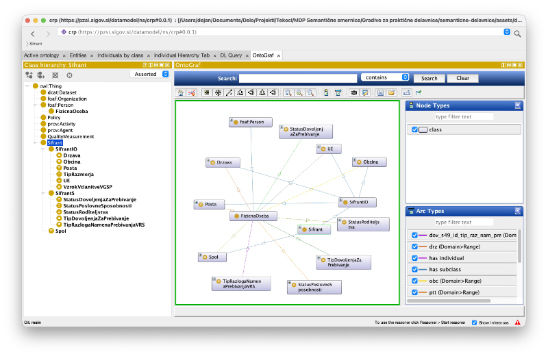
:::
::::

## Uporabniški vmesnik Podatkovnega zemljevida

- Prototip aplikacije ponuja naslednje **osrednje funkcionalnosti**
  - pregled **globalne sheme** podatkovnega zemljevida,
  - pregled **sheme** posameznega/zibranih **vira**/ov,
  - predogled **podatkov** posameznega/izbranih **vira**/ov,
- ter **podporne funkcionalnosti**:
  - **večjezičnost** (sl in en),
  - **iskanje** (koncepti, povezava, vsi metapodatki),
  - **skrivanje konceptov** (za bolj fokusiran pregled),
  - **fokusiranje** na **izbran koncept** in prikaz konteksta.

## 🧑‍💻 DEMO: Pregled globalne sheme (1/7)

:::: columns
::: column

- Izpostavljeni osrednji **koncepti**,
  - npr. Katalog, Nabor podatkov, Distribucija, Shema,
- izpostavljene pomembne **povezave**,
  - med osrednjimi koncepti.

:::
::: column


:::
::::

## 🧑‍💻 DEMO: Pregled globalne sheme (2/7)

:::: columns
::: column

- **Prehod z miško** povzroči **osredotočenost na izbrani koncept**,
  - izpostavljenost konteksta sosednosti,
    - prikazani zgolj odvisni koncepti in medsebojne povezave,
  - dodatno se prikažejo nazivi povezav.

:::
::: column

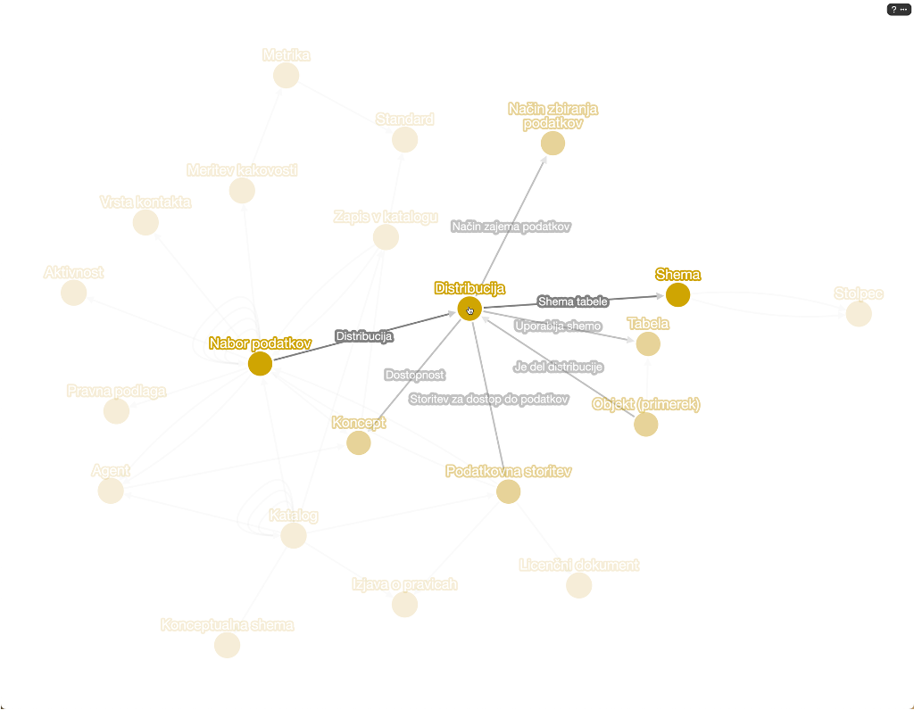

:::
::::

## 🧑‍💻 DEMO: Pregled globalne sheme (3/7)

:::: columns
::: column

- **Klik z miško** omogoči **prikaz podrobnosti izbranega koncepta**,
  - identifikator (URI),
  - definicija (skos:definition),
  - opisni podatki,
    - ragnirane podatkovne in objektne lastnosti,
    - tip podatka,
    - prikaz zgolj najpomembnejših podatkov,

:::
::: column

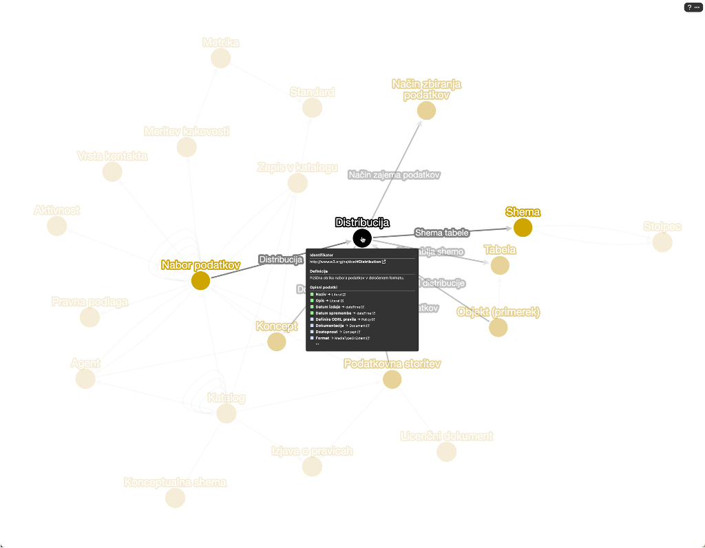

:::
::::

## 🧑‍💻 DEMO: Pregled globalne sheme (4/7)

:::: columns
::: column

- **Klik z miško** omogoči **prikaz podrobnosti izbranega koncepta**,
  - identifikator (URI),
  - definicija (skos:definition),
  - opisni podatki,
    - ragnirane podatkovne in objektne lastnosti,
    - tip podatka,
    - prikaz zgolj najpomembnejših podatkov,
      - možnost prikaza vseh.

:::
::: column

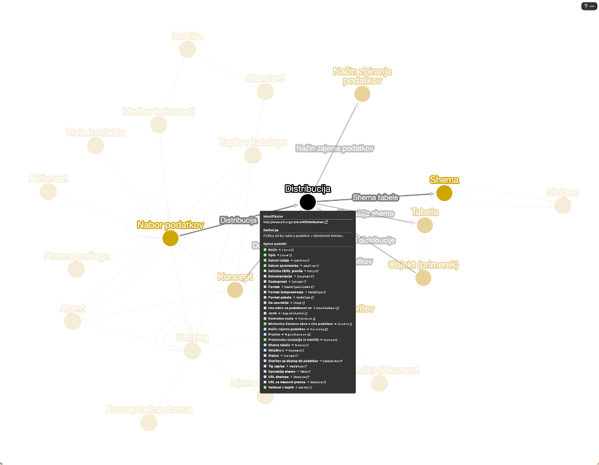

:::
::::

## 🧑‍💻 DEMO: Pregled globalne sheme (5/7)

:::: columns
::: column

- Vse **dodatne funkcionalnosti** so na voljo preko **desnega klika z miško** na izbrani koncept,
  - fokus,
  - pregled,
  - skrij,
  - podrobnosti,
  - razišči podatke.

:::
::: column

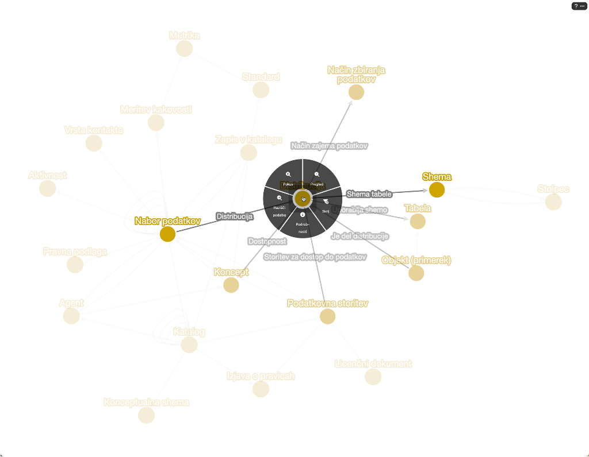

:::
::::

## 🧑‍💻 DEMO: Pregled globalne sheme (6/7)

:::: columns
::: column

- Podpora za večjezičnost vključuje **uporabniški vmesnik** in vse **metapodatke**,
  - nazivi, podatkovne in objektne lastnosti.

:::
::: column

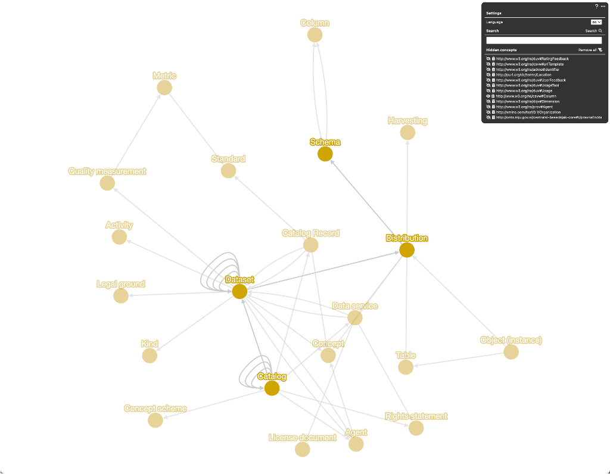

:::
::::

## 🧑‍💻 DEMO: Pregled globalne sheme (7/7)

:::: columns
::: column

- Podpora za večjezičnost vključuje **uporabniški vmesnik** in vse **metapodatke**,
  - nazivi, podatkovne in objektne lastnosti.

:::
::: column

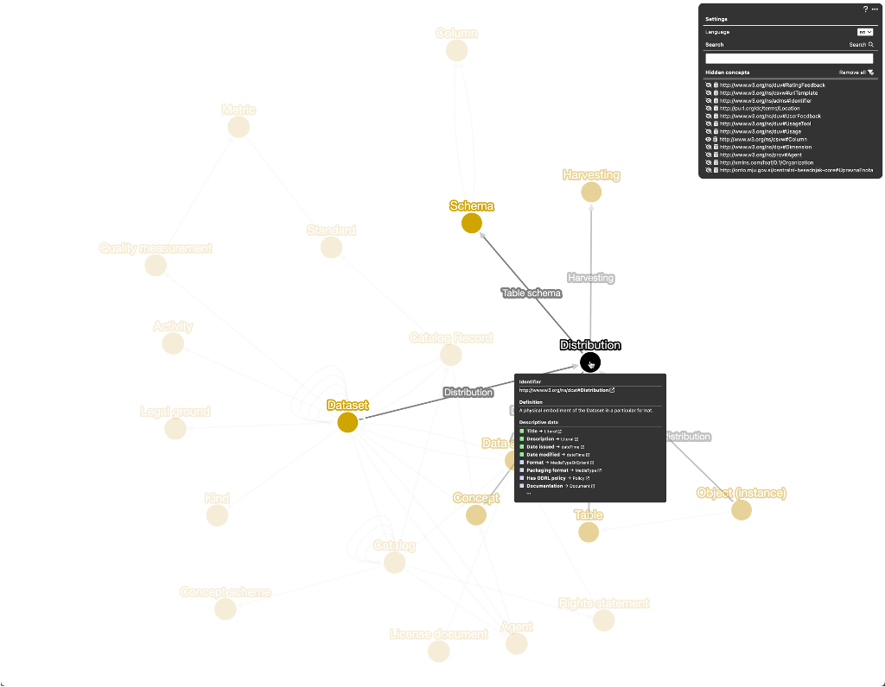

:::
::::

## 🧑‍💻 DEMO: Pregled sheme posameznega vira (1/5)

:::: columns
::: column

- Za posamezen nabor podatkov je na voljo
  - distribucija,
  - shema,
    - s pripadajočimi metapodatki (atributi, zaloge vrednosti, omejitve).

:::
::: column

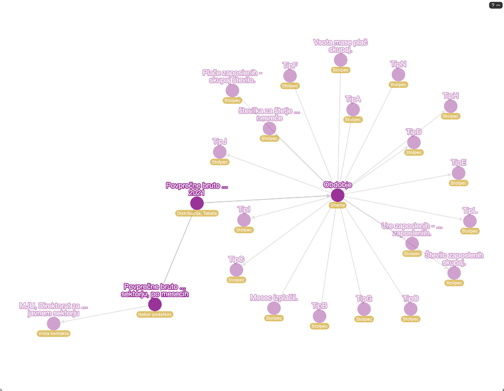

:::
::::

## 🧑‍💻 DEMO: Pregled sheme posameznega vira (2/5)

:::: columns
::: column

- Za posamezen **nabor podatkov** je na voljo
  - distribucija,
  - shema,
    - s pripadajočimi metapodatki (atributi, zaloge vrednosti, omejitve).

:::
::: column

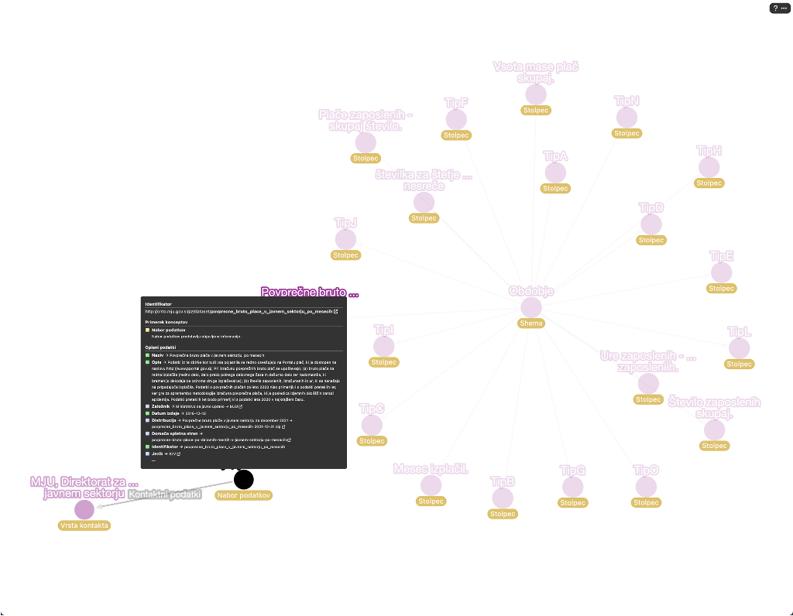

:::
::::

## 🧑‍💻 DEMO: Pregled sheme posameznega vira (3/5)

:::: columns
::: column

- Za posamezen nabor podatkov je na voljo
  - **distribucija**,
  - shema,
    - s pripadajočimi metapodatki (atributi, zaloge vrednosti, omejitve).

:::
::: column

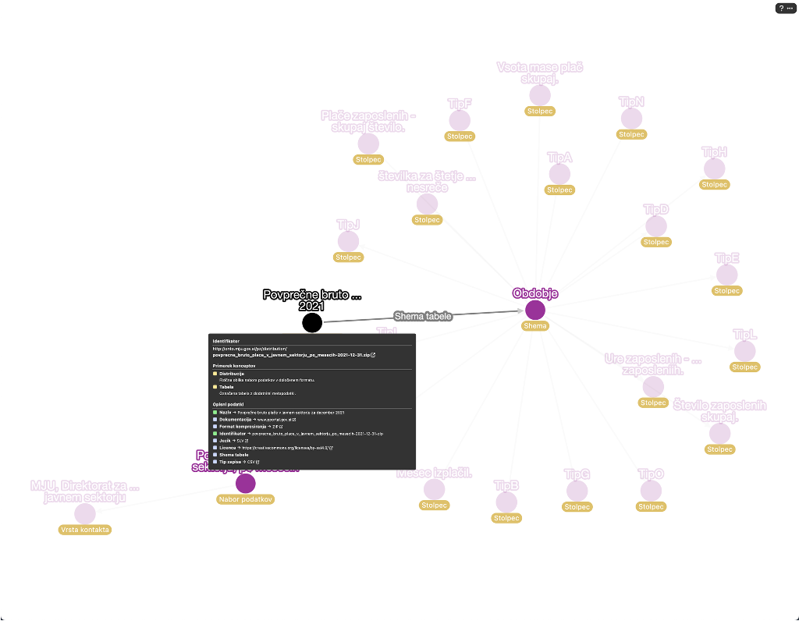

:::
::::

## 🧑‍💻 DEMO: Pregled sheme posameznega vira (4/5)

:::: columns
::: column

- Za posamezen nabor podatkov je na voljo
  - distribucija,
  - **shema**,
    - s pripadajočimi metapodatki (atributi, zaloge vrednosti, omejitve).

:::
::: column

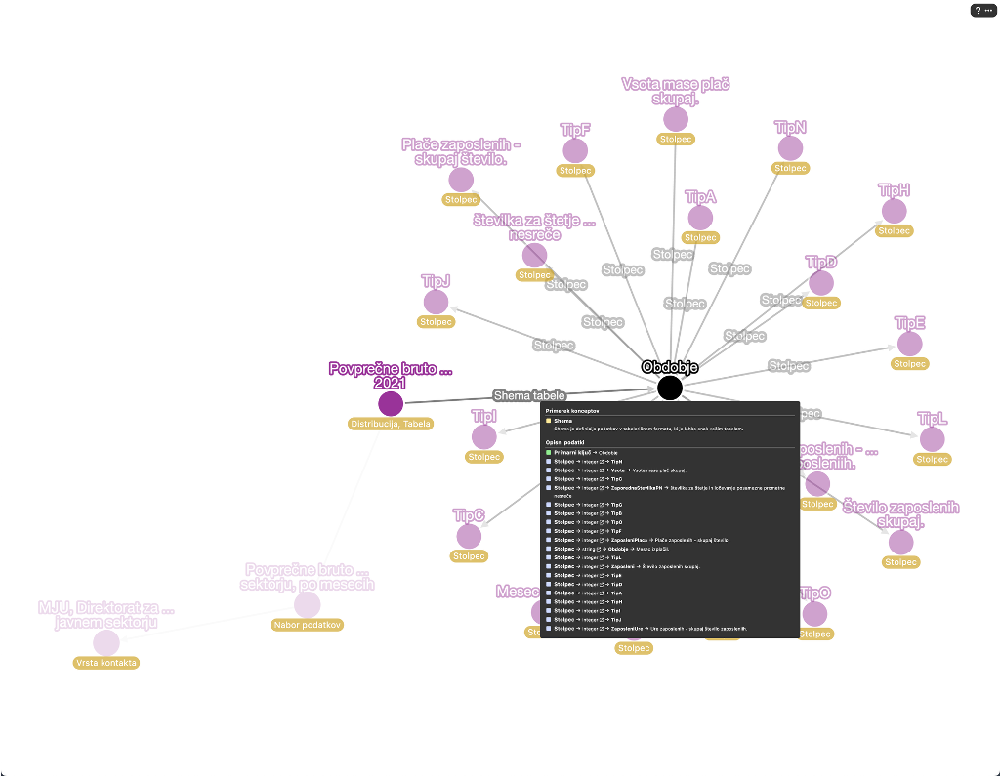

:::
::::

## 🧑‍💻 DEMO: Pregled sheme posameznega vira (5/5)

:::: columns
::: column

- Za posamezen nabor podatkov je na voljo
  - distribucija,
  - shema,
    - s pripadajočimi **metapodatki** (atributi, zaloge vrednosti, omejitve).

:::
::: column

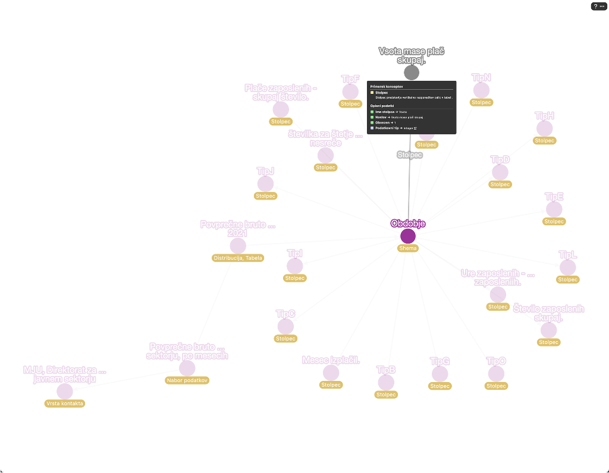

:::
::::

## 🧑‍💻 DEMO: Pregled sheme in podatkov izbranih virov (1/6)

:::: columns
::: column

- Sheme in podatki izbranih 5 virov,
  - vladna gradiva,
  - prometne nesreče,
  - evidenca registriranih vozil,
  - ERAR,
  - povprečne bruto plače.

:::
::: column

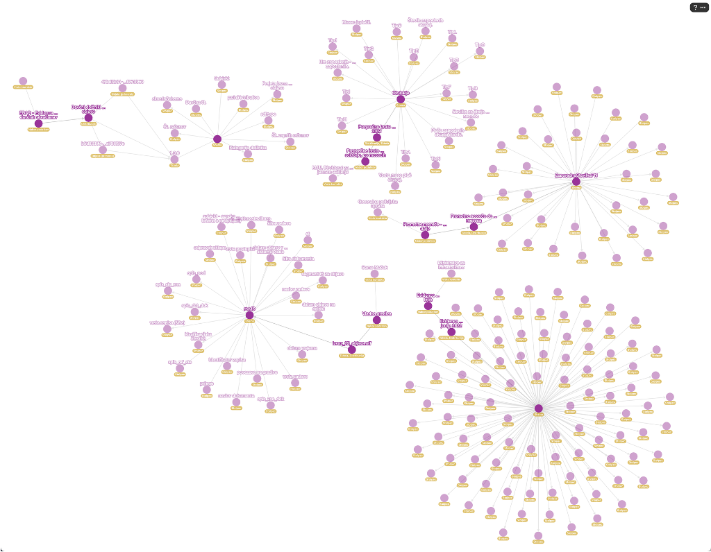

:::
::::

## 🧑‍💻 DEMO: Pregled sheme in podatkov izbranih virov (2/6)

:::: columns
::: column

- Po podatkih lahko **iščemo**,
  - v modalnem oku lahko vnesemo **iskalni niz**,

:::
::: column


:::
::::

## 🧑‍💻 DEMO: Pregled sheme in podatkov izbranih virov (3/6)

:::: columns
::: column

- Po podatkih lahko iščemo,
  - v modalnem oku lahko vnesemo iskalni niz,
    - npr. **Primorje**,
  - **zadetki** se v tem primeru izpostavijo (črna barva),

:::
::: column

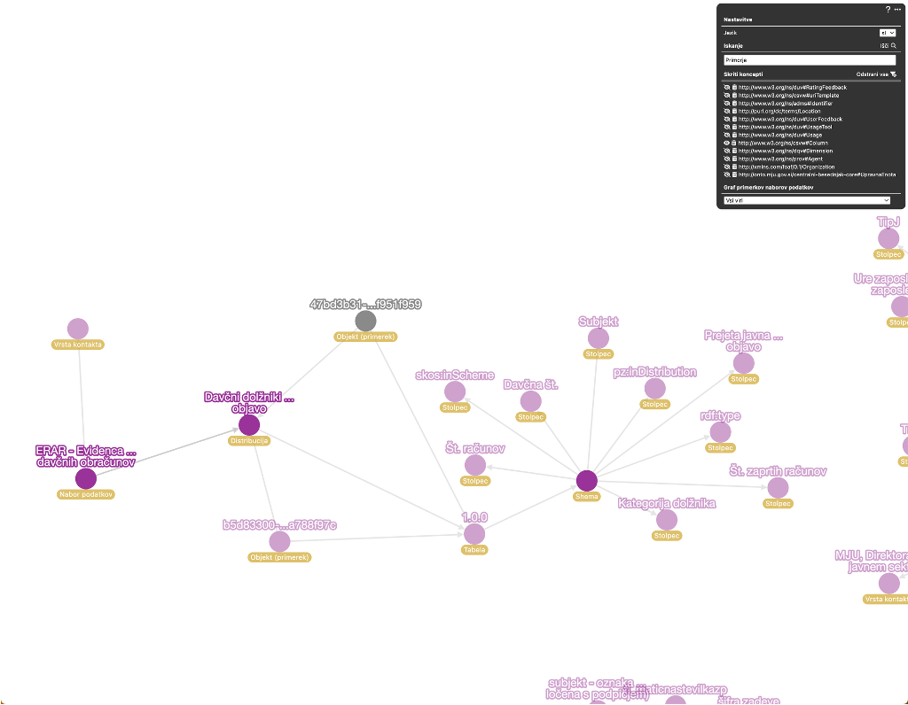

:::
::::

## 🧑‍💻 DEMO: Pregled sheme in podatkov izbranih virov (4/6)

:::: columns
::: column

- Po podatkih lahko iščemo,
  - v modalnem oku lahko vnesemo iskalni niz,
    - npr. Primorje,
  - zadetki se v tem primeru izpostavijo (črna barva),
  - po pregledu podrobnosti, opazimo, da se iskalni niz **Primorje** pojavlja v vrednosti atributa **dolžnik**,

:::
::: column

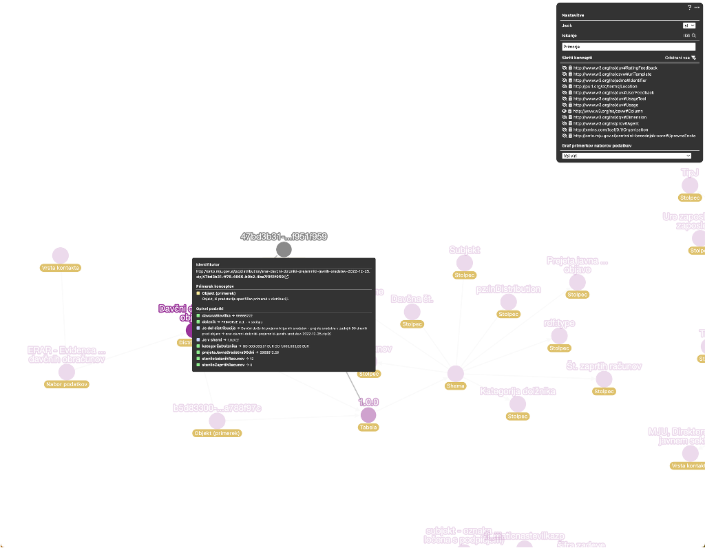

:::
::::

## 🧑‍💻 DEMO: Pregled sheme in podatkov izbranih virov (5/6)

:::: columns
::: column

- **Raziskujemo** lahko tudi **kontekst** najdenega podatka,
  - je del del distribucije davčni dolžniki prejemniki javnih sredstev,
  - ki spada v nabor podatkov ERAR,

:::
::: column

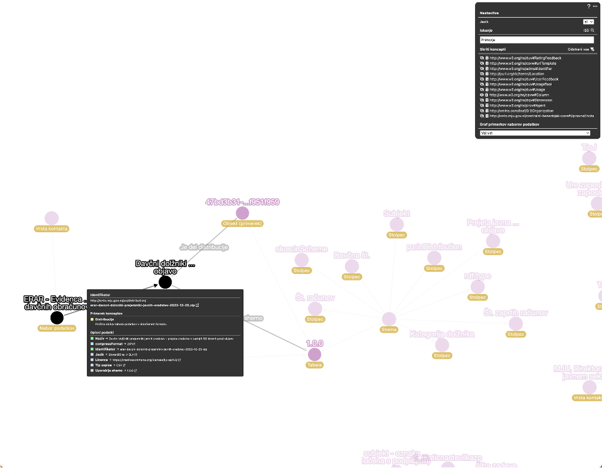

:::
::::

## 🧑‍💻 DEMO: Pregled sheme in podatkov izbranih virov (6/6)

:::: columns
::: column

- Raziskujemo lahko tudi kontekst najdenega podatka,
  - je del del distribucije davčni dolžniki prejemniki javnih sredstev,
  - ki spada v nabor podatkov ERAR,
  - podatki so zajeti v skladu z opredeljeno s **shemo**,
    - **v1.0.0** in
    - zahtevanimi **metapodatki**.

:::
::: column

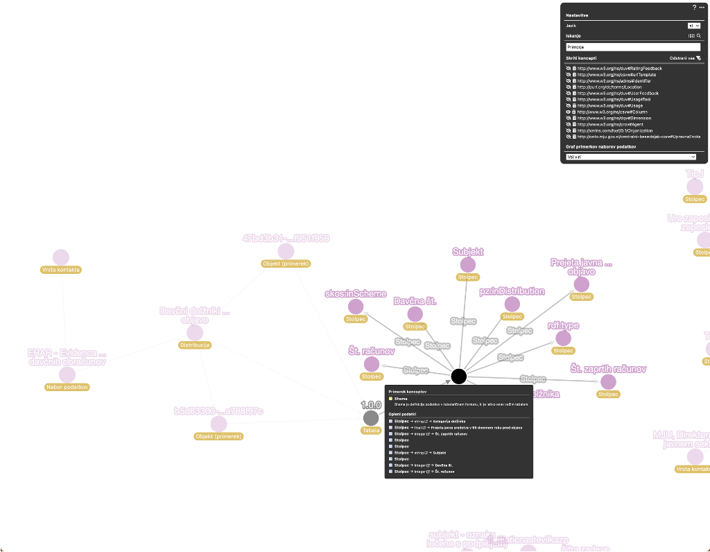

:::
::::

## Prototip Podatkovnega zemljevida

- 🌐 https://fri-mdp.github.io/Podatkovni-zemljevid-2023/pz-viewer/
